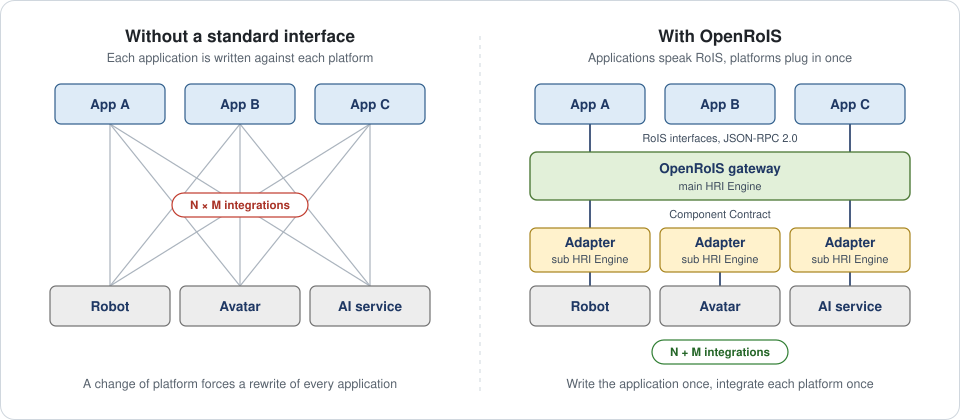
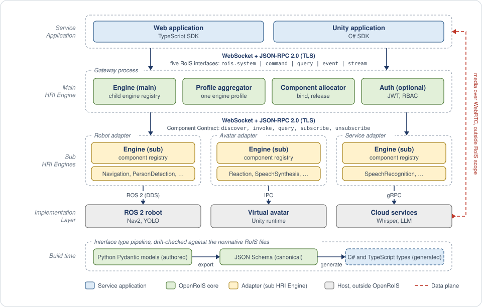
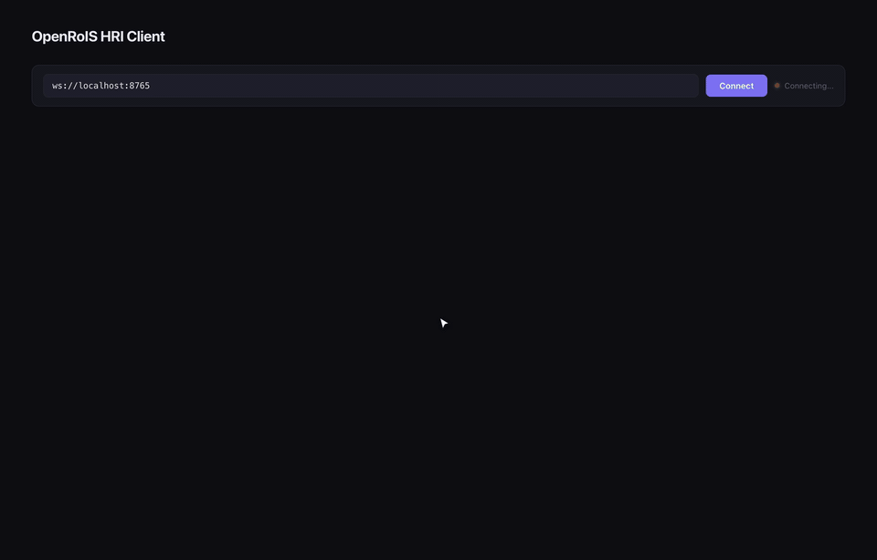

<p align="center">
  <a href="https://openrois.org/">
    
  </a>
</p>

<h1 align="center">OpenRoIS</h1>

<p align="center">
  <strong>Open-source middleware implementing the OMG Robotic Interaction Service (RoIS) Framework 2.0</strong><br>
  Write a service application once. Run it on physical robots, virtual avatars, and AI services.
</p>

<p align="center">
  <a href="https://www.omg.org/spec/RoIS/2.0"></a>
  
  <a href="LICENSE"></a>
  <a href="#project-status"></a>
  
  
  
  
</p>

<p align="center">
  <a href="https://openrois.org/">Website</a> ·
  <a href="https://github.com/openrois">OpenRoIS GitHub Organization</a> ·
  OpenRoIS arXiv Preprint (coming soon) ·
  <a href="https://www.omg.org/spec/RoIS/2.0">OMG RoIS Specification</a> ·
  <a href="#quickstart">Quickstart</a> ·
  <a href="docs/white-paper.md">White Paper</a> ·
  <a href="docs/architecture.md">Architecture</a> ·
  <a href="docs/roadmap.md">Roadmap</a> ·
  <a href="CONTRIBUTING.md">Contributing</a>
</p>

---

## Overview

Service applications for human-robot interaction are usually written against the
hardware-specific interface of one platform, so a change of hardware forces a rewrite
of the application. The [OMG RoIS Framework 2.0](https://www.omg.org/spec/RoIS/2.0)
addresses this fragmentation with a platform-independent model: applications talk to
HRI Engines through five standard interfaces and exchange symbolic messages such as
"a person was detected" or "navigate to the kitchen", never raw sensor data or motor
commands.

A specification alone does not provide the maintained implementation, SDKs, and
adapters that adoption requires. **OpenRoIS is an openly developed implementation of
RoIS 2.0** that carries the standard from specification to practice, for physical
robots and virtual agents alike.

<p align="center">
  <picture>
    <source media="(prefers-color-scheme: dark)" srcset="docs/assets/openrois-concept-dark.svg">
    
  </picture>
</p>

## Key Features

- **Recursive engine.** A single `Engine` class realizes both the main and the sub HRI
  Engine roles defined by RoIS. The gateway and every adapter share one dispatch
  implementation.
- **Five-method Component Contract.** The engine depends only on `discover`, `invoke`,
  `query`, `subscribe`, and `unsubscribe`. ROS 2, gRPC, game engines, and cloud APIs
  stay inside adapters, so adding a paradigm never touches the core.
- **JSON-RPC 2.0 over WebSocket.** Every operation of the five RoIS interfaces maps to
  a namespaced method (`rois.system.*`, `rois.command.*`, `rois.query.*`,
  `rois.event.*`, `rois.stream.*`). The control plane works from browsers and across
  the internet. The Streaming Interface controls streams; the media stays on its own
  data plane.
- **Single source of truth for types.** RoIS types are authored once as Python
  Pydantic models, exported to JSON Schema, and generated into TypeScript and C#.
  Tests check the models against the normative RoIS XML profiles and schema.
- **Profile-driven applications.** Clients discover components, queries, commands, and
  events from the engine profile at runtime, so one application works with any robot
  behind the gateway.
- **Decorator-based components.** Adapter authors declare a component with
  `@component`, `@query`, `@invoke`, and `@subscribe`, and write only the code that
  talks to their robot.

## Architecture

<p align="center">
  <picture>
    <source media="(prefers-color-scheme: dark)" srcset="docs/assets/openrois-architecture-dark.svg">
    
  </picture>
</p>

| RoIS concept | OpenRoIS realization |
|--------------|----------------------|
| Service Application | Your application, built with the TypeScript or C# SDK |
| Main HRI Engine | The gateway process: `Engine` with child engines, behind a WebSocket server |
| Sub HRI Engine | An adapter process: `Engine` with local components, connected to the gateway |
| HRI Component | A class decorated with `@component`, hosted by an adapter |
| RoIS interfaces | JSON-RPC 2.0 methods in the `rois.*` namespaces |

Read the [white paper](docs/white-paper.md) for the design rationale and the full wire
protocol, and the [architecture document](docs/architecture.md) for implementation
details.

## Quickstart

Run a RoIS engine with simulated components and inspect it from the browser. You need
[Node.js](https://nodejs.org/) 22 or later.

```bash
git clone https://github.com/openrois/openrois.git
cd openrois

# Build the generated TypeScript types and the TypeScript SDK.
(cd interfaces/typescript && npm install && npm run build)
(cd sdk/typescript && npm install && npm run build)

# Terminal 1: start a RoIS engine with simulated components on ws://127.0.0.1:8765.
cd examples/mock-engine && npm install && npm start
```

```bash
# Terminal 2: start the web inspector, then open http://localhost:5173 and click Connect.
cd examples/hri-client && npm install && npm run dev
```

The inspector reads the engine profile and renders every component it finds, with its
queries, commands, and events. Nothing in the client is specific to the components on
the other side.

<p align="center">
  
</p>

<p align="center"><sub>Recorded from this quickstart, with no robot attached. A <a href="https://openrois.org/#see-it-run">higher-resolution version</a> is on the website.</sub></p>

## Usage

### Write a Service Application

The TypeScript SDK exposes the RoIS interfaces with typed responses and runtime
validation.

```ts
import { RoISClient } from "@openrois/sdk";

const client = await RoISClient.connect("ws://localhost:8765");

// Discover the components offered by every connected robot, then pick one by type.
const refs = await client.search();
const nav = refs.find((ref) => ref.includes("Navigation"))!;

// Query state synchronously.
const status = await client.query(nav, "component_status");

// Subscribe to events.
client.on("reached_target", (notification) => console.log(notification.params));
await client.subscribe(nav, "reached_target");

// Reserve an actuation component, command it, then release it.
await client.bind(nav);
await client.setParameter(nav, [
  { name: "target_positions", data_type_ref: "string[]", value: '["kitchen"]' },
]);
await client.execute(nav, { command_type: "start" });
await client.release(nav);

await client.disconnect();
```

### Write a Component for Your Robot

A component translates RoIS operations into calls to your platform, whether that is a
ROS 2 action, a gRPC service, or an HTTP API. The adapter hosts it in a sub HRI Engine
and connects it to the gateway.

```python
from openrois.interfaces.bus import InvokeResponse
from openrois.interfaces.hri import ReturnCode
from openrois_components_core import component, invoke, query, results, subscribe


@component("Navigation", function="actuation")
class Navigation:
    def __init__(self, config: dict) -> None:
        self._robot_url = config["robot_url"]

    async def connect(self) -> None:
        self._robot = await MyRobotClient.open(self._robot_url)

    @query("component_status")
    async def status(self):
        return results.status("BUSY" if self._robot.moving else "READY")

    @invoke("start")
    async def start(self, parameters):
        await self._robot.go_to(parameters)
        return InvokeResponse(return_code=ReturnCode.OK, command_id="nav-1")

    @subscribe("reached_target")
    async def on_reached_target(self):
        """Registers the event. Emit it with self.parent.emit_async(...)."""
```

```python
from openrois_core import Engine, WsClient
from openrois_components_core import meta_from_decorators

config = {"robot_url": "http://192.168.0.10:8080"}
engine = Engine(engine_id="robot_1", platform="my_robot")
engine.register_component("Navigation", Navigation(config), meta_from_decorators(Navigation))
WsClient(engine, "ws://gateway.example.com:8765").run()
```

See [`examples/adapter-template`](examples/adapter-template) for a complete starting
point and [`components/kachaka`](components/kachaka) for reference components backed by
both gRPC and ROS 2.

## Project Status

OpenRoIS is **alpha, pre-1.0, with an unstable API**. The foundations are in place and
demonstrated with a physical robot. The rest of the RoIS surface is being built in the
open.

| Area | Status |
|------|--------|
| RoIS interface types (Python, JSON Schema, TypeScript, C#) | Available |
| Recursive engine, gateway process, WebSocket server and client, and adapter SDK (Python) | Available |
| TypeScript client SDK and web inspector | Available |
| Reference components for the Preferred Robotics Kachaka (gRPC and ROS 2) | Available |
| C# client SDK for Unity | Available |
| Open reference platform based on the Pollen Robotics Reachy Mini | In progress, simulated first |
| Authentication (JWT), authorization (RBAC), and TLS at the gateway | Available, off by default |
| Streaming Interface control plane (`rois.stream.*`) | Available |
| WebRTC media on the data plane (signaling through streaming components) | Planned |
| Packages on PyPI, npm, NuGet, and the Unity Package Manager | Planned |
| All 17 basic RoIS HRI Components (v1.0) | Planned |

The [roadmap](docs/roadmap.md) describes each phase and its exit criteria.

## Repository Layout

```
openrois/
├── interfaces/          RoIS types: Python models, JSON Schema, generated TypeScript and C#
├── core/                Recursive Engine, WebSocket server and client, gateway process (openrois-core)
├── components/
│   ├── core/            Component decorators and result helpers (openrois-components-core)
│   ├── common/          Platform-independent components
│   └── kachaka/         Preferred Robotics Kachaka components (gRPC and ROS 2)
├── sdk/
│   ├── typescript/      Client SDK for web and Node.js (@openrois/sdk)
│   └── csharp/          Client SDK for Unity and .NET (org.openrois.sdk)
├── examples/
│   ├── mock-engine/     RoIS engine test double with simulated components
│   ├── hri-client/      Profile-driven web inspector for any RoIS engine
│   ├── mock-adapter/    Adapter with simulated components
│   ├── avatar-adapter/  Virtual agent behind the same interfaces
│   ├── mixed-paradigm/  One application driving a robot and an avatar through one gateway
│   └── adapter-template/  Starting point for a new robot adapter
├── apps/hub/            Management dashboard (planned)
└── docs/                White paper, architecture, roadmap, RoIS reference
```

## Documentation

| Document | Contents |
|----------|----------|
| [White paper](docs/white-paper.md) | Motivation, design decisions, wire protocol, deployment topologies |
| [Architecture](docs/architecture.md) | Engineering design of the engine, adapters, and components |
| [RoIS reference](docs/rois-reference.md) | Summary of the OMG RoIS Framework 2.0 specification |
| [Roadmap](docs/roadmap.md) | Phases, status, and exit criteria |
| [openrois.org](https://openrois.org/) | The same documentation as a website |

## Development

The RoIS types flow in one direction: **Python models, then JSON Schema, then TypeScript
and C#.** Edit the Python models in `interfaces/python`, regenerate, and never edit the
generated files by hand.

| Stack | Directory | Commands |
|-------|-----------|----------|
| Python types | `interfaces/python` | `pip install -e ".[dev]"`, `pytest`, `mypy src/`, `ruff check src/` |
| TypeScript types | `interfaces/typescript` | `npm install`, `npm run build`, `npm test` |
| C# types | `interfaces/csharp` | `dotnet build`, `dotnet test` |
| TypeScript SDK | `sdk/typescript` | `npm install`, `npm run build`, `npm test` |
| Mock engine | `examples/mock-engine` | `npm install`, `npm test` |

[`AGENTS.md`](AGENTS.md) documents the conventions and the generation pipeline in
detail.

## Contributing

Contributions are welcome. Reference components for new robots are the natural entry
point, and the [roadmap](docs/roadmap.md) lists work items that can be taken up in
parallel. Please read the [contributing guide](CONTRIBUTING.md) before opening a pull
request.

## Citation

The position paper describing OpenRoIS was submitted to SII 2027 and is under review. Its
preprint has been submitted to arXiv and will be linked here once it is announced. Until
then, please cite the software using the metadata in [`CITATION.cff`](CITATION.cff), which
also carries the paper as its preferred citation.

## License

OpenRoIS is licensed under the [Apache License 2.0](LICENSE). Copyright 2026 Coarobo GK.
OpenRoIS is developed by Coarobo GK and the OpenRoIS community. OpenRoIS is a trademark
of Coarobo GK. RoIS is a trademark of the Object Management Group.
