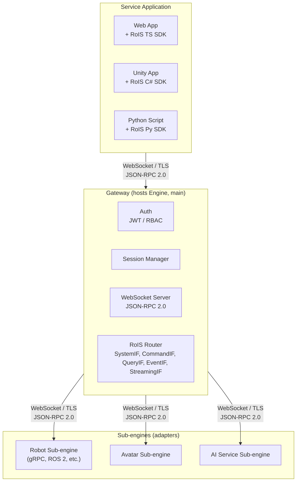
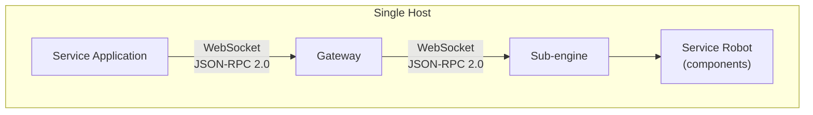
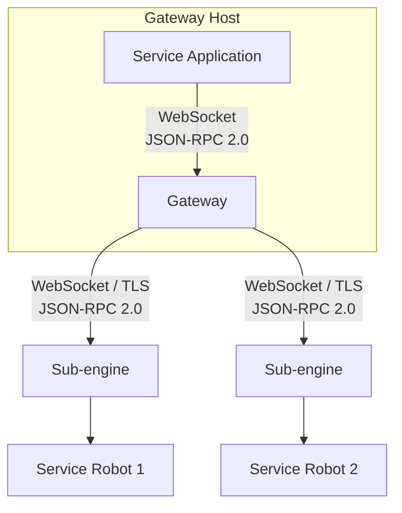
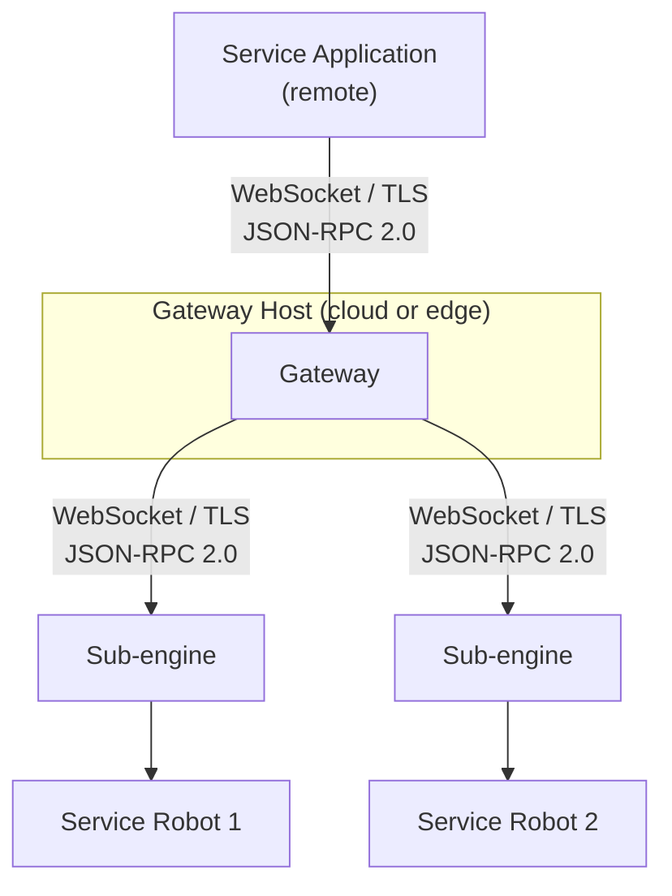
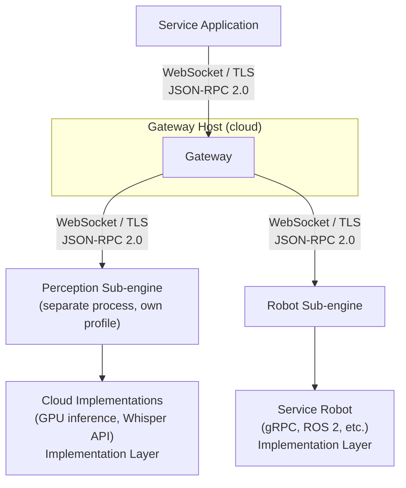

# OpenRoIS - Implementation Architecture

> A practical architecture for implementing the OMG **RoIS Framework 2.0** as an
> open-source middleware that lets service applications control **physical robots,
> virtual avatars, and digital agents** over the internet.
>
> The architecture is deliberately **paradigm-neutral**: the engine and
> client SDK never assume hardware, a world model, or any specific middleware. A
> single **Component Contract** abstraction lets the same engine drive a gRPC
> robot, a ROS 2 robot fleet, an in-process avatar, or a distributed set of
> services.
>
> A **minimum viable demonstration** exists today: a web service application
> connects to the gateway, which routes RoIS calls to a sub-engine backed by
> packaged components running against a real robot. This demonstrates all
> foundational layers working end to end. It is not the end goal, but it proves the
> architecture is sound and the mechanisms are in place.
>
> This document is the engineering companion to
> [rois-reference.md](rois-reference.md). The reference explains
> *what the specification says*. This document explains *how we build it*. For the
> milestone roadmap, see [roadmap.md](roadmap.md).

---

## Table of Contents

1. [Goals & Non-Goals](#1-goals--non-goals)
2. [RoIS Layer Hierarchy](#2-rois-layer-hierarchy)
3. [Architectural Overview](#3-architectural-overview)
4. [MVP Demonstration](#4-mvp-demonstration)
5. [Client & Service Application SDK](#5-client--service-application-sdk)
6. [Engine and Gateway](#6-engine-and-gateway)
7. [Sub-engines](#7-sub-engines)
8. [The Component Contract](#8-the-component-contract)
9. [Components](#9-components)
10. [Component Mapping: Robot vs. Avatar](#10-component-mapping-robot-vs-avatar)
11. [Deployment Topologies](#11-deployment-topologies)
12. [Transport Strategy](#12-transport-strategy)
13. [Control Plane vs. Data Plane (Streaming)](#13-control-plane-vs-data-plane-streaming)
14. [Authentication](#14-authentication)
15. [Authorization & Fleet Segmentation](#15-authorization--fleet-segmentation)
16. [Mapping RoIS Interfaces to the Stack](#16-mapping-rois-interfaces-to-the-stack)
17. [End-to-End Message Flows](#17-end-to-end-message-flows)
18. [Repository Layout](#18-repository-layout)
19. [Technology Choices](#19-technology-choices)

---

## 1. Goals & Non-Goals

### Goals

- Provide a **conformant RoIS 2.0 implementation** usable across **physical robots,
  virtual avatars, and digital agents**.
- **Demonstrate the full stack end to end**: a web service application controls a
  real robot through the gateway, sub-engine, and component layers, using only
  RoIS interfaces. This is the MVP, not the end goal.
- Keep the **interfaces paradigm-neutral**: the engine and SDK must not
  assume hardware, a world model, or any specific middleware.
- Allow a **service application in a remote location** to control any RoIS host
  (robot or avatar) securely.
- Expose a **simple client SDK** (TypeScript for web first, C# and Python second)
  so a scenario can be written in a few lines, identically regardless of the host
  paradigm.
- Support **live audio/video** for both telepresence (robot) and rendered avatars.
- Enable **multi-tenant segmentation** through authentication and authorization.

### Non-Goals

- We do **not** invent a new wire protocol. RoIS defines messages, not transport. We
  use WebSocket + JSON-RPC 2.0 for the control plane and WebRTC for the data plane.
- We do **not** define media codecs. Streaming media formats are out of RoIS scope.
- We do **not** mandate any single data-plane transport. gRPC, ROS 2 / DDS, IPC, and
  WebRTC are all valid sub-engine internal transports. None is privileged in the core.
- We do **not** assume any specific deployment topology. The same code runs on a
  single host, across a LAN, or across the internet.

---

## 2. RoIS Layer Hierarchy

The RoIS specification defines a two-layer model. OpenRoIS maps directly to it.
We use the networking terms **control plane** and **data plane** as the primary
vocabulary throughout this document, and map them to the spec's terms where
conformance is discussed.

```
Logical Layer (control plane)
├── Total System (Main HRI Engine)    → Engine (recursive: routes to child engines)
│   ├── Sub System (Sub HRI Engine)   → Engine (hosts local components)
│   │   ├── Function (HRI Component)  → Component (translation layer)
│   │   │   └── Implementation Layer  → Backend (data plane)
│   │   └── Function (HRI Component)
│   │       └── Implementation Layer
│   └── Sub System (Sub HRI Engine)
│       └── ...
```

- **Logical Layer** (control plane): the engine, sub-engines, and components.
  The engine is a recursive unit: it manages local components and routes to child
  engines. Components are the translation layer that resolves RoIS function calls
  into data-plane calls. Only **symbolic data** flows here: structured messages like
  "a person was detected" or "navigate to target X". Raw sensor data (images,
  audio) never appears in RoIS messages. This is why the control plane can be
  WebSocket + JSON-RPC 2.0: the data is small and structured.
- **Implementation Layer** (data plane): the actual backends, which the spec calls
  **functional implementations**. These can be gRPC services, ROS 2 applications,
  cloud APIs, virtual avatars, sensor rooms, streaming services, or computation
  services (image annotation, TTS, STT, auto-translation). The implementation can
  be local (gRPC client on the robot) or remote (cloud GPU inference service). The
  component always runs on a sub-engine. The functional implementation can be
  anywhere.

### Terminology mapping

| Spec term | This document | Scope |
|-----------|--------------|-------|
| Logical Layer | Control plane | Engine, sub-engines, components. Symbolic data only. WebSocket + JSON-RPC 2.0. |
| Implementation Layer | Data plane | Functional implementations: gRPC, DDS, WebRTC, cloud APIs. Raw data, media streams. |
| Functional implementation | Backend / data-plane transport | The actual function behind a component (face recognition, wheel control, navigation). |
| HRI Component | Component | The translation layer between control plane and data plane. |
| Sub HRI Engine | Sub-engine (Engine hosted by an adapter) | Hosts local components, connects to the gateway via WebSocket. |
| Main HRI Engine | Engine (hosted by the gateway) | Routes to child engines, aggregates profiles. |

### How OpenRoIS maps to the spec

| RoIS concept | OpenRoIS implementation | Role |
|-------------|------------------------|-------|
| Main HRI Engine | Engine (hosted by the gateway) | Routes to child engines, aggregates profiles |
| Sub HRI Engine | Engine (hosted by an adapter) | Hosts components, owns data-plane transport |
| HRI Component | Component registered by a sub-engine | Translation layer: RoIS calls to backend calls |
| Service Application | Client SDK (TypeScript, C#, or Python) | Drives robot scenarios via RoIS interfaces |
| RoIS interfaces (SystemIF, CommandIF, QueryIF, EventIF, StreamingIF) | JSON-RPC 2.0 methods over WebSocket | Service application to gateway boundary (control plane) |
| Component Contract | WebSocket + JSON-RPC 2.0 (gateway-to-sub-engine boundary) | Gateway to sub-engine boundary |

### Engine, gateway, and adapter

The **engine** is a recursive unit, not a process. It is a Python library that
manages components and routes RoIS calls to child engines. The same engine class
is used by both the gateway and the adapter. The engine has two registries: a
`ComponentRegistry` for local components and a sub-engine registry for child
engines. Both can be populated. The difference between gateway and adapter is
what is typically populated, not what is allowed:

- **Gateway (main engine)**: typically has child engines (sub-engines connected
  over WebSocket). It routes RoIS calls to the child engine that owns the target
  component. It aggregates profiles from all child engines. It may also have
  local components (e.g., cloud perception components running in the same
  process).
- **Adapter (sub-engine)**: typically has local components (registered via
  `ComponentRegistry`). It routes RoIS calls to local component handlers. It
  registers with the parent engine (the gateway) over WebSocket. It may also
  have child engines (nested sub-engines, supported by design but not used in
  current deployments).

The design supports nesting (child engines with their own child engines), but
this is not used today. Only the main engine and one level of sub-engines are
used in current deployments.

The **gateway** is the process that hosts the main engine and faces the network.
It provides the WebSocket server that clients and sub-engines connect to.

An **adapter** is a process that hosts a sub-engine, configured with a specific
set of components for a specific robot or use case, defined by a profile YAML.
The adapter connects to the gateway over WebSocket and registers its components.

Components come from two sources:

- **Community components**: shipped in component packages (e.g.,
  `openrois_components.kachaka`). These implement commonly used functions for
  specific robot models to facilitate adoption.
- **Adapter-local components**: created by adapter authors in their adapter's
  component directory. These are for custom behavior, experimental features, or
  robot-specific functions not covered by community packages.

Additionally, **non-canonical components** (components beyond the spec's 17
basic components, e.g., `NavigationInformation`) are valid per RoIS spec
section 12.

---

## 3. Architectural Overview



The spec's "main HRI Engine" maps to the **engine** hosted by the gateway. Each
"sub HRI Engine" maps to a **sub-engine** (an adapter process hosting the same
engine class, connecting to the gateway via WebSocket). "HRI Components" map to
the components registered by each sub-engine. The service application only ever
talks to the gateway. The host topology *and paradigm* are hidden, exactly as
the spec requires.

The engine has zero media imports, zero WebRTC imports, and zero references
to ROS, DDS, gRPC, or any game engine. The control plane is WebSocket + JSON-RPC
2.0, no alternatives. Media and other data-plane traffic flows directly between
the publisher and the consumer, outside the gateway. The engine is a pure
control-plane router when acting as the main engine without local components.

---

## 4. MVP Demonstration

The MVP demonstrates all foundational layers of the architecture working end to
end. It is not the end goal, but it proves the mechanisms are in place and the
layers align with the RoIS specification.

### Layers demonstrated

| RoIS layer | What the MVP provides | What it proves |
|-----------|----------------------|----------------|
| Interfaces | Transport-independent types authored in Python, generated to TypeScript and C# | The single-source-of-truth type pipeline works across three languages |
| Engine (main) | A WebSocket server that routes JSON-RPC 2.0 calls, aggregates sub-engine profiles, broadcasts profile changes | The engine is a pure router with zero paradigm-specific imports when acting as the main engine without local components |
| Client SDK | A TypeScript SDK exposing the five RoIS interfaces over WebSocket | The SDK is paradigm-neutral: it does not know what robot is behind the gateway |
| Service application | A web application that connects to the gateway, fetches the profile, and renders a dynamic UI for every discovered component | Profile-driven discovery works: the same application works for any gateway without hardcoded component names |
| Adapter SDK | A Python framework with decorators for component, query, invoke, and subscribe handlers | The adapter pattern works: a thin container that registers components and routes JSON-RPC |
| Sub-engine (adapter) | An adapter for a real robot, connecting to the robot via gRPC and to the gateway via WebSocket | The sub-engine bridges a real robot backend to the RoIS control plane |
| Components | Packaged components (Navigation, SystemInformation) with a gRPC backend, plus a user-defined non-canonical component | The component package pattern and the non-canonical component pattern (spec section 12) both work |
| Multiple backends | The same component package ships separate classes for gRPC and ROS 2 backends | The import-time selection pattern works: no factory, no runtime dispatch |

### What the MVP proves

- The **Component Contract** decouples the engine from the robot paradigm.
  The engine has zero gRPC imports, zero ROS imports, zero robot-specific
  knowledge.
- The **component package pattern** works: packaged components are imported by
  the adapter and registered with the gateway.
- The **profile-driven service application** works: the web client renders UI for
  any gateway's components without knowing what robot is behind it.
- The **non-canonical component** pattern works: a user-defined component (per
  spec section 12) provides robot-specific data not in the 17 basic components.
- The **multiple-backend** pattern works: one component package ships classes for
  different backends. The adapter imports the one it needs.

### What the MVP does not yet demonstrate

- Authentication and RBAC.
- WebRTC media streaming.
- The full 17-component library.
- Mixed paradigm (robot and avatar on one gateway).

---

## 5. Client & Service Application SDK

The SDK mirrors the five RoIS interfaces (`SystemIF`, `CommandIF`, `QueryIF`,
`EventIF`, and `StreamingIF`) defined in the normative IDL (`RoIS_HRI.idl` and
`RoIS_Service.idl`). The Streaming Interface is layered on the others: it uses
`set_parameter` and `get_parameter` from the Command Interface for encoding and
transport negotiation, and `notify_stream_status` is delivered through the Event
Interface mechanism. But it is a first-class interface with its own operations
(`connect_stream`, `disconnect_stream`, `suspend_stream`, `resume_stream`,
`query_stream_status`).

```
RoIS Client SDK
├─ SystemClient    connect() · disconnect() · getProfile() · getErrorDetail()
├─ CommandClient   search() · bind() · bindAny() · release()
│                  getParameter() · setParameter() · execute() · getCommandResult()
├─ QueryClient     query()
├─ EventClient     subscribe() · unsubscribe() · getEventDetail()  → onNotifyEvent
└─ StreamClient    connectStream() · disconnectStream()
                   suspendStream() · resumeStream() · queryStreamStatus()
```

Target developer experience (TypeScript / web, primary client):

```ts
import { RoISClient } from "@openrois/sdk";

const client = await RoISClient.connect("wss://gateway.example.com", {
  token: await getAccessToken(),
});

// Search for available components across all sub-engines
const components = await client.search();

// Query a component's status (works for any paradigm behind the gateway)
const status = await client.query("kachaka_01/Navigation", "component_status");

// Subscribe to events
const subId = await client.subscribe("kachaka_01/Navigation", "reached_target");
client.on("rois.event.notify", (event) => {
  console.log("Navigation event:", event);
});

// Bind and execute a command
await client.bind("kachaka_01/Navigation");
await client.setParameter("kachaka_01/Navigation", [
  { name: "target_positions", data_type_ref: "string[]", value: '["home"]' },
]);
await client.execute("kachaka_01/Navigation", {
  command_type: "start",
  command_id: `cmd-${Date.now()}`,
  parameters: [],
});

await client.disconnect();
```

The callback surface comes directly from `ServiceApplicationBase` in the spec:
`notify_error`, `completed`, and `notify_event`.

### Profile-driven service applications

A service application does not hardcode component names, query types, or command
sets. It fetches the engine profile via `get_profile()`, which returns
`component_ids` and `component_profiles` aggregated from all connected sub-engines
by the gateway. The application populates its UI, command set, and query set
from the profile data. A component that does not list `suspend` in its command
profiles does not have a suspend button in the UI. This is the mechanism that
makes the same service application work across different robots, avatars, and
service sub-engines without modification.

When a sub-engine connects or disconnects, the gateway broadcasts a
`rois.system.profile_changed` notification. The service application re-fetches
the profile automatically. No polling needed.

---

## 6. Engine and Gateway

The engine is a **recursive unit**. It manages components and routes RoIS calls
to child engines. The same engine class is used by both the gateway and the
adapter. The engine has two registries: a `ComponentRegistry` for local
components and a sub-engine registry for child engines. Both can be populated.
The difference between gateway and adapter is what is typically populated,
not what is allowed:

- **Gateway**: typically has child engines (sub-engines connected over
  WebSocket). It routes RoIS calls to the child engine that owns the target
  component. It aggregates profiles from all child engines. It may also have
  local components (e.g., cloud perception components running in the same
  process).
- **Adapter**: typically has local components (registered via
  `ComponentRegistry`). It routes RoIS calls to local component handlers. It
  registers with the parent engine (the gateway) over WebSocket. It may also
  have child engines (nested sub-engines, supported by design but not used in
  current deployments).

The design supports nesting (child engines with their own child engines), but
this is not used today. Only the main engine and one level of sub-engines are
used in current deployments.

The engine handles: RoIS method dispatch, profile aggregation, bind/release
tracking, event subscription routing. The gateway provides the WebSocket server.
The adapter provides the WebSocket client. The engine itself is a library with
no network I/O of its own.

Using one engine class for both the gateway and the adapter eliminates dispatch
logic duplication and keeps the main engine and sub-engines in lockstep as the
RoIS protocol evolves.

### The gateway

The **gateway** is the process that hosts the main engine and faces the
network. It is the only internet-facing process and the single enforcement point
for security.

```
┌─────────────────────────────────────────────────────────────────┐
│  Gateway                                                         │
│                                                                  │
│  ┌──────────────────────────────────────────────────────────┐  │
│  │  Engine (main)                                            │  │
│  │  RoIS Router: SystemIF · CommandIF · QueryIF · EventIF   │  │
│  │              · StreamingIF                                │  │
│  │  Profile aggregator · Bind/release tracker               │  │
│  └──────────────────────────────────────────────────────────┘  │
│  ┌──────────────────────────────────────────────────────────┐  │
│  │  WebSocket server (JSON-RPC 2.0)                          │  │
│  │  Accepts client and adapter connections on one port       │  │
│  └──────────────────────────────────────────────────────────┘  │
│  ┌──────────────────────────────────────────────────────────┐  │
│  │  Infrastructure (auth, REST API, SFU, monitoring)       │  │
│  └──────────────────────────────────────────────────────────┘  │
└─────────────────────────────────────────────────────────────────┘
```

The gateway hosts the main engine and provides the WebSocket server. It may
also include infrastructure such as a REST API for authentication and fleet
management, a WebRTC signaling server, an SFU for larger fleets, and monitoring.
The RoIS logic lives in the engine, which is fully open source.

### Gateway responsibilities

- **Terminate the control-plane transport** (WebSocket/TLS) and authenticate
  every connection before any RoIS message is processed.
- **Route** JSON-RPC RoIS calls to the appropriate sub-engine based on
  component ref.
- **Aggregate profiles** from all authorized sub-engines into one
  `HRI_Engine_Profile` returned by `get_profile()`. The profile includes
  `sub_engine_ids`, `component_ids`, and `component_profiles` from all connected
  sub-engines.
- **Push profile-change notifications** to all connected clients via
  `rois.system.profile_changed` when a sub-engine registers or disconnects.
  Clients re-fetch the profile automatically. No polling needed.
- **Filter** `search()`/`query()` results and **guard** `bind()`/`execute()` per
  the caller's authorization scope.

The gateway accepts both adapter connections (which send
`rois.adapter.register`) and client connections (which send `rois.system.*`
etc.) on the same WebSocket port. It distinguishes them by the first message.

### What the engine does NOT do

- No media streaming. Media is handled by streaming components and WebRTC,
  outside the gateway's control plane.
- No WebRTC signaling (SDP, ICE) in the current implementation. The RoIS
  streaming interface will broker descriptor exchange in the future.
- No paradigm-specific knowledge. The engine never imports DDS, gRPC, ROS,
  or any game engine library. It sees only the `Component Contract` interface.
- No network I/O of its own. The engine is a library. The gateway provides the
  WebSocket server. The adapter provides the WebSocket client.

---

## 7. Sub-engines

A sub-engine is the engine hosted by an adapter process. The gateway talks to
sub-engines via WebSocket + JSON-RPC 2.0. This is the control plane, and it is the
only transport at this boundary. Sub-engines are standalone processes, not
in-process plugins. Each sub-engine owns its data-plane transport: gRPC for
robots with a gRPC API, DDS for ROS 2 robots, IPC for avatars, WebRTC or
WHEP/WHIP for media, or any other transport its backend requires. The engine
never imports DDS, gRPC, or any paradigm-specific library. It sees only the
Component Contract (see [§8](#8-the-component-contract)).

A robot sub-engine using gRPC connects directly to the robot's gRPC server. A
robot sub-engine using ROS 2 uses DDS internally for service/action/topic mapping,
QoS, and discovery. An avatar sub-engine uses IPC or a game engine binding. An AI
service sub-engine uses gRPC to call cloud inference APIs. The gateway does not
know or care which data-plane transport the sub-engine uses internally. The
sub-engine is the boundary where paradigm-specific code lives.

### Sub-engine registration

When a sub-engine connects to the gateway, it sends a `rois.adapter.register`
message containing its `engine_id`, `platform`, and a list of components with their
queries, commands, events, and parameters. The gateway caches this registration
and uses it for `search()`, `get_profile()`, and routing. If the sub-engine
disconnects, the gateway removes its components and broadcasts a
`profile_changed` notification to all connected clients.

### What the sub-engine does NOT do

- Media streaming (in the current architecture). No camera capture, no audio
  capture, no GStreamer. Media is a future concern for the streaming interface.
- WebRTC. No `RTCPeerConnection`, no SDP, no ICE.
- Gateway protocol knowledge. The sub-engine speaks RoIS JSON-RPC to the gateway
  over the control plane. It does not know about other sub-engines, clients, or
  the gateway's routing logic.

---

## 8. The Component Contract

The **Component Contract** is the single abstraction that decouples the engine
from any paradigm. The engine and SDK never reference ROS, DDS, gRPC, or any
data-plane transport. They depend only on this control-plane contract:

```typescript
interface ComponentContract {
  discover(request: DiscoverRequest): Promise<DiscoverResponse>;
  invoke(request: CommandRequest): Promise<InvokeResponse>;
  query(request: QueryRequest): Promise<QueryResponse>;
  subscribe(request: SubscribeRequest, sink: EventSink): Promise<SubscribeResponse>;
  unsubscribe(subscribeId: string): Promise<ReturnCode>;
}
```

| Implementation | Transport | Status |
|----------------|-----------|--------|
| **SubEngine** (remote) | WebSocket + JSON-RPC | Current. The engine's proxy for a child engine (adapter) over WebSocket. |
| **ComponentRegistry** (local) | In-process | Current. The engine's local component dispatch via decorators. |

### Method semantics

| Method | Purpose | Example |
|--------|---------|---------|
| `discover` | Find components by condition | Sub-engine registers components at startup, gateway filters by scope |
| `invoke` | Execute a command (start, stop, execute, set_parameter) | Gateway forwards JSON-RPC to sub-engine, sub-engine dispatches to component |
| `query` | Synchronous read (component_status, get_parameter) | Gateway forwards JSON-RPC to sub-engine, sub-engine returns result |
| `subscribe` | Async event push (notify_event, notify_stream_status) | Gateway subscribes, sub-engine pushes events via WebSocket |
| `unsubscribe` | Cancel an event subscription | Gateway forwards unsubscribe, sub-engine stops pushing |

### Why five methods

The contract is deliberately kept to five methods. Adding data-plane-specific knobs
(QoS policies, deadlines, reliability) to the contract would leak paradigm
assumptions into the engine. Instead, QoS, deadlines, and reliability
belong to the data plane of whichever sub-engine needs them. A ROS 2 sub-engine
needs DDS QoS. A gRPC sub-engine does not. Keeping the contract minimal means the
engine can drive a gRPC robot, a ROS 2 robot fleet, a virtual avatar, or a
set of AI services with the same control-plane code path.

Because the engine sees only `Component Contract`, accidental coupling (for
example, baking DDS QoS semantics into the engine) is structurally prevented.
The same contract test suite runs against every sub-engine, catching paradigm
leakage.

### Four contracts

OpenRoIS defines four distinct contracts at four boundaries:

1. **Service application to Gateway** (control plane): JSON-RPC 2.0 over
   WebSocket. The service application sends RoIS operations, the gateway routes
   them to the engine.
2. **Gateway to Sub-engine** (control plane): the `Component Contract` interface
   (discover, invoke, query, subscribe, unsubscribe) over WebSocket +
   JSON-RPC. The engine forwards calls to the sub-engine that owns the target
   component.
3. **Sub-engine to Component** (control plane): RoIS operations dispatched by the
   engine in the adapter to component handler methods. The framework uses
   decorators (`@component`, `@query`, `@invoke`, `@subscribe`) to route
   JSON-RPC to the right method on the right component instance.
4. **Component to backend** (data plane): the functional implementation. gRPC,
   DDS, IPC, WebRTC, cloud API, or any other transport. This is not a middleware
   boundary. The component owns this connection.

---

## 9. Components

A **host** is anything that provides components: a robot, an avatar process, or a
bank of services. Each host exposes one **sub-engine** plus its components. Most
components inherit the `Command` / `Query` / `Event` interfaces from
`RoIS_Common.idl` (`start` / `stop` / `suspend` / `resume`, `component_status`).
SystemInformation is an exception: it inherits `Query` (component_status) but not
`Command` (no start/stop/suspend/resume).

### Component interface and implementation

A component has two layers: the **interface** and the **implementation**.

The **interface** is the RoIS-facing layer. It handles the RoIS protocol:
`bind`, `execute`, `subscribe`, `notify_event`. It is the contract between the
component and the RoIS framework. The interface is defined by decorators:
`@component`, `@query`, `@invoke`, `@subscribe`.

The **implementation** is the functional implementation behind the interface (the
spec calls this the "functional implementation"). It does the actual work in the
data plane: gRPC call to a robot, Nav2 action, Whisper transcription, YOLO inference.
Each component owns its own connection to its backend, created in `connect()` and
torn down in `disconnect()`. The framework calls `connect()` on each component
after the adapter starts, and `disconnect()` before the adapter exits. Components
that do not define `connect()`/`disconnect()` are skipped (backward compatible).

The adapter is a thin container. It hosts a sub-engine (the engine with local
components), registers component classes, and routes JSON-RPC to the right
handler. It does not create shared backends, does not hold shared client
references, and does not manage connection state. This makes components truly
plug-and-play: import, configure, play. A component can be moved between
adapters without changes because it does not depend on adapter internals.

### Component-owned connections

Each component owns its state in `__init__`, read from its per-component config
dict. Each component owns its own connection to its backend, created in `connect()`
and torn down in `disconnect()`. The adapter has no shared state. Components are
plug-and-play: import, configure, play.

### Partial spec implementation

A component may implement a subset of the RoIS normative interface for its
component type. The normative IDL, XML, and HPP define the full interface, but a
robot or use case may not need all operations. For example, a robot without
pause/resume capability implements `start()` and `stop()` but returns
`UNSUPPORTED` for `suspend()` and `resume()`. The component's profile (returned by
`get_profile()`) declares exactly which queries, commands, and events it supports.

Service applications must never assume the full canonical interface. They
populate their UI, command set, and query set from the acquired engine and
sub-engine profiles. A component that does not list `suspend` in its command
profiles does not have a suspend button in the UI.

### Multiple backends via separate classes

When a component supports multiple backends (e.g., gRPC and ROS 2), the component
package ships one class per backend: `GrpcNavigation` and `Ros2Navigation`. Both
are decorated `@component("Navigation")`. The adapter imports the one it needs.
Selection happens at import time, not at runtime. No factory, no Protocol, no
runtime selection.

### Component method categories

The component method categories map to whatever data-plane transport the
sub-engine uses:

- **Command Method** → gRPC call, ROS 2 action/service, or other data-plane call.
- **Event Method** → gRPC poll loop, ROS 2 topic, or other data-plane push.
- **Query Method** → gRPC call, ROS 2 service, or other data-plane call.

The component's *logic* is the same across sub-engines. Only the data-plane binding
differs.

### Separation of concerns

| Concern | Answered by | Example |
|---|---|---|
| What RoIS contract does it expose? | Component interface | `Navigation` with `start`, `stop`, `reached_target` |
| How does it do its work? | Implementation (component-owned connection) | gRPC call to robot motion API |
| Which backend is selected? | Which adapter process runs (import-time choice) | gRPC adapter or ROS 2 adapter |
| Which operations are supported? | Component profile (returned by `get_profile`) | `start`, `stop` but not `suspend`, `resume` |

This separation is the key design decision. The interface is the RoIS contract.
The implementation is pluggable via separate classes, not runtime factories. The
adapter determines the backend by importing the appropriate class. The profile
determines which operations the service application exposes to the operator.

---

## 10. Component Mapping: Robot vs. Avatar

About **70%** of the 17 basic components are *identical* across paradigms. The
perception and speech components run the same ML models whether the input is a robot
camera or a webcam. Only actuation, world model, and stream source differ.

| RoIS Component | Physical Robot | Virtual Avatar | Shared? |
|----------------|----------------|----------------|---------|
| Person Detection | YOLO on camera | YOLO on webcam / virtual sensor | yes |
| Person Localization | depth + tracker | world position / webcam depth | diff coord system |
| Person Identification | InsightFace | InsightFace | yes |
| Face Detection | MediaPipe | MediaPipe | yes |
| Face Localization | MediaPipe face mesh | MediaPipe face mesh | yes |
| Sound Detection | mic VAD | mic VAD | yes |
| Sound Localization | mic-array DOA | mic-array DOA / virtual | diff |
| Speech Recognition | Whisper | Whisper | yes |
| Gesture Recognition | MediaPipe Holistic | MediaPipe Holistic | yes |
| Speech Synthesis | TTS to speaker | TTS to lip-sync to avatar | diff output |
| Reaction | LED / gesture | animation / expression | paradigm-specific |
| Navigation | Nav2 (physical) | NavMesh (virtual) | paradigm-specific |
| Follow | Nav2 + tracker | virtual follow | paradigm-specific |
| Move | `cmd_vel` to motors | transform to avatar | paradigm-specific |
| Audio Streaming | mic to WebRTC | TTS output to WebRTC | diff source |
| Video Streaming | camera to WebRTC | rendered frames to WebRTC | diff source |
| System Information | battery, CPU, joints | FPS, memory, avatar state | diff state |

**Legend:** `yes` = identical. `diff` = same interface, different source/output.
`paradigm-specific` = different implementation per paradigm. The paradigm-specific
rows (Reaction, Navigation, Move, Follow) are exactly the ones a Component Contract +
per-backend component design keeps cleanly separated.

---

## 11. Deployment Topologies

The control plane is always WebSocket + JSON-RPC 2.0, regardless of topology. Each
sub-engine's data-plane transport (gRPC, DDS, WebRTC, WHEP/WHIP, RTSP, IPC, or any
other) is an implementation detail of the sub-engine, not a topology choice.
Topologies differ by **where processes run**: on a single host, across a LAN,
across the internet, or with components offloaded to the cloud.

### A. Single host (local)

Everything runs on one machine: the service application, the gateway, the
sub-engine, and the robot. The service application talks to the gateway over
localhost WebSocket. The sub-engine connects to the gateway over localhost
WebSocket. This is the simplest deployment, useful for development, testing, and
single-robot scenarios where the robot's onboard computer runs everything.



### B. LAN, multiple service robots

The gateway runs on one host. Multiple service robots run on the same LAN, each
with its own sub-engine. The service application connects to the gateway, which
routes calls to the correct robot's sub-engine. This is the fleet scenario: one
gateway serves multiple robots on a local network.



### C. Distributed hosts (internet)

The service application runs on a remote host (operator's laptop, cloud service).
The gateway runs on a server or in the cloud. Each service robot runs on its own
host, connecting to the gateway over the internet. This is the full teleoperation
scenario: the operator is in one location, the gateway is in another, and the
robots are in a third.



### D. Cloud perception (separate sub-engine or local components)

Perception components (PersonDetection, SpeechRecognition) may need more compute
than the robot has. These can run in two ways:

1. **As a separate sub-engine process** with its own profile, connecting to the
gateway over WebSocket like any other sub-engine. The gateway routes RoIS calls to
this sub-engine. The components connect to cloud-based implementations (GPU
inference services, TTS/STT APIs).
2. **As local components in the gateway process**. The main engine's
`ComponentRegistry` is populated with perception components. No separate process
is needed. This is simpler for small deployments.

In both cases, the gateway routes RoIS calls to the right component. The service
application does not know or care where a component's implementation lives:
`search()` returns components from all sub-engines and local components, and
`bind()` / `execute()` work identically.



The gateway routes RoIS calls in all topologies. Cloud perception can be a
separate sub-engine process or local components in the gateway, not a `runtime`
field in a robot's profile. The service application does not know or care where
a component's implementation lives: `search()` returns components from all
sub-engines and local components, and `bind()` / `execute()` work identically.

---

## 12. Transport Strategy

RoIS deliberately separates messages from transport. OpenRoIS uses **one transport
for the control plane** and lets each sub-engine **choose its own data-plane
transport**.

| Plane | Boundary | Transport | Why |
|-------|----------|-----------|-----|
| Control plane | Service application to Gateway | **WebSocket + TLS** | NAT/firewall friendly, browser-native, easy auth, async events. Matches the spec's Annex F.2.3 WebSocket example. |
| Control plane | Gateway to Sub-engine | **WebSocket + TLS, JSON-RPC 2.0** | NAT-friendly, one protocol for all sub-engines. No alternatives at this boundary. |
| Data plane | Sub-engine to backend | **Chosen by the sub-engine** | gRPC, DDS, IPC, WebRTC, WHEP/WHIP, RTSP, or any other. The gateway never knows or cares. |
| Data plane | Media (camera/mic or rendered) | **WebRTC (SRTP/DTLS)** | Built-in NAT traversal (ICE/STUN/TURN), adaptive bitrate, encrypted, browser-native. |

The control plane is WebSocket + JSON-RPC 2.0 at every middleware boundary. No
alternatives, no exceptions. The data plane is whatever the sub-engine needs. This
is not a compromise, it is the architecture: the spec separates message from
transport, and OpenRoIS takes that separation literally by using one transport
for symbolic data (control) and letting each sub-engine choose its own transport
for raw data (data plane).

---

## 13. Control Plane vs. Data Plane (Streaming)

The Streaming Interface is the clearest example of the control plane / data plane
split. RoIS defines **only the streaming control plane**: `connect_stream`,
`suspend_stream`, `resume_stream`, `disconnect_stream`, `notify_stream_status`, and
the `Stream_Status` enum from `RoIS_Common.idl`. The media data plane is out of
scope, which makes **WebRTC** a natural fit for the data plane.

```
        RoIS Streaming Control (in scope)        WebRTC Media (out of RoIS scope)
        ───────────────────────────────         ───────────────────────────────
        set_parameter(encoding, transport)  ↔   SDP offer/answer negotiation
        set_parameter(ice candidates)       ↔   ICE / trickle ICE
        connect_stream()                    ↔   RTCPeerConnection open
        notify_stream_status(RUNNING)       ↔   iceconnectionstate = connected
        suspend_stream() / resume_stream()  ↔   RTCRtpSender.track.enabled = false/true
        disconnect_stream()                 ↔   pc.close()
```

WebRTC **signaling travels over the existing WebSocket** RoIS connection (passed as
`set_parameter` arguments), so no separate signaling server is required.

Important distinction the spec preserves:

- **Speech Synthesis** is a *command* component (text to robot speaker locally), not
  a stream.
- **Audio/Video Streaming** are *stream-control* components (live media robot to
  operator), using WebRTC.

### P2P vs. SFU

- **Fleet of 1-3 robots**: peer-to-peer WebRTC is sufficient.
- **Larger fleets**: route media through a **Selective Forwarding Unit** (mediasoup,
  LiveKit). The RoIS streaming control interface is identical either way. The SFU is
  an implementation detail of the gateway.

---

## 14. Authentication

The spec's `connect()` takes **no parameters**. It assumes a trusted LAN. For remote
access we authenticate **before** any RoIS message is processed, at the WebSocket
upgrade.

```
Client                                   Gateway
  │ 1. POST /auth/token {client_id,…}      │
  │ ─────────────────────────────────────► │
  │ ◄──── {access_token (JWT), expires} ── │
  │                                        │
  │ 2. WS upgrade  Authorization: Bearer … │
  │ ─────────────────────────────────────► │
  │ ◄──── 101 Switching Protocols ──────── │   (401 if token missing/invalid)
  │                                        │
  │ 3. RoIS connect()                      │   now inside the RoIS layer
  │ ─────────────────────────────────────► │
  │ ◄──── ReturnCode_t::OK ─────────────── │
```

Example JWT claims used downstream for authorization:

```json
{
  "sub": "operator-alice",
  "roles": ["operator"],
  "fleet_scope": ["warehouse-north", "lab-b"],
  "components": ["person_detection", "navigation", "video_streaming"],
  "iat": 1749500000,
  "exp": 1749503600
}
```

| Approach | Pros | Cons |
|----------|------|------|
| **Engine-internal JWT** | No external deps, simplest | Single trust domain |
| **OIDC provider** (Keycloak, Auth0, Dex) | SSO, federation, user mgmt | Extra infrastructure |
| **mTLS** (client certs) | Strongest auth | Cert provisioning for browsers |

Recommended path: engine-internal JWT for the prototype, then OIDC provider for
multi-tenant deployments. The current engine implementation has an auth hook point
but does not enforce authentication. This is a roadmap milestone.

---

## 15. Authorization & Fleet Segmentation

Authorization is enforced **per RoIS operation** inside the gateway. The spec's
`Condition_t` (a string carrying an ISO 19143 `QueryExpression`) and `component_ref`
are the natural enforcement points.

### RBAC Model

| Role | Fleet Scope | Component Scope |
|------|-------------|-----------------|
| **admin** | all | all |
| **operator** | assigned | assigned (incl. actuation) |
| **viewer** | assigned | detection + streaming only |
| **maintenance** | assigned | system_information |

### Enforcement Points

| Interface / Op | Enforcement |
|----------------|-------------|
| `connect()` | Verify JWT. Expose only sub-engines within `fleet_scope`. |
| `search(condition)` | Filter `component_ref_list` to authorized fleet + components. |
| `bind(component_ref)` | Reject refs outside scope (`BAD_PARAMETER` / `UNSUPPORTED`). |
| `execute(command_unit_list)` | Validate every `component_ref` in the sequence. |
| `query(query_type, condition)` | Filter results to authorized fleets (e.g. `robot_position`). |
| `subscribe(event_type, condition)` | Deliver `notify_event` only for authorized sources. Scope `subscribe_id` to the session. |
| `connect_stream()` | Require `streaming` scope. SFU enforces per-stream ACL. |

### Worked Example

```
Org: Acme Robotics
├── Fleet warehouse-north  → Robot-A1, Robot-A2
├── Fleet warehouse-south  → Robot-B1, Robot-B2
└── Fleet lab-b            → Robot-C1
```

- **Alice** (`operator`, scope `warehouse-north`): `search()` returns only A1/A2.
  `bind("Robot-B1/navigation")` is rejected.
- **Bob** (`admin`, scope `*`): sees and controls everything.
- **Carol** (`viewer`, scope `warehouse-north,south`): `search()` returns detection +
  streaming only. `bind(navigation)` is rejected. `connect_stream(video)` is allowed.

Because the gateway filters at `search()`, robots outside a caller's scope are
**invisible**. The caller cannot discover or address them.

### Defense in Depth

1. **TLS** on the remote edge.
2. **JWT/OIDC** authentication at WebSocket upgrade.
3. **RBAC** authorization per RoIS operation in the gateway.
4. **DDS-Security** (or per-fleet DDS domains) in the data plane, when using ROS 2.
5. **DTLS/SRTP** on WebRTC media (data plane).

---

## 16. Mapping RoIS Interfaces to the Stack

| RoIS Interface (IDL) | Client SDK | Gateway | Sub-engine (via Component Contract) |
|----------------------|-----------|---------|--------------------------|
| `SystemIF` | `SystemClient` | WS handler + auth | `discover()` (registry) |
| `CommandIF` | `CommandClient` | RBAC filter + router | `invoke()` (data-plane call/action) |
| `QueryIF` | `QueryClient` | result filter | `query()` (data-plane call/service) |
| `EventIF` | `EventClient` | subscription router | `subscribe()` (data-plane callback/topic/poll) |
| `StreamingIF` | `StreamClient` | stream control router | stream control (data-plane media via WebRTC) |
| `ServiceApplicationBase` (`notify_*`, `completed`) | SDK callbacks | WS push | event sink (data-plane callback/topic/poll) |

---

## 17. End-to-End Message Flows

### 17.1 Bind + Execute + Event

```
Web App            Gateway               Sub-engine (gRPC)    Robot
  │  bind(kachaka_01/Navigation) │              │                  │
  │ ───────────────────────────► │              │                  │
  │            (auth check, route to sub-engine) │                  │
  │                            │  rois.command.bind               │
  │                            │ ────────────►│                  │
  │                            │ ◄────────────│                  │
  │ ◄──────── OK ────────────── │              │                  │
  │  set_parameter + execute    │              │                  │
  │ ───────────────────────────► │  rois.command.set_parameter    │
  │                            │ ────────────►│ ───────────────► │
  │                            │  rois.command.execute (start)   │
  │                            │ ────────────►│ ───────────────► │
  │ ◄──── command_id ───────── │              │                  │
  │                            │  ◄ reached_target (event) ────── │
  │ ◄── notify_event ────────── │              │                  │
```

### 17.2 Profile-Driven Discovery

```
Web App            Gateway               Sub-engine
  │  get_profile()              │              │
  │ ───────────────────────────► │              │
  │                            │  (aggregates all sub-engine profiles)
  │ ◄── profile ─────────────── │              │
  │  { sub_engine_ids: ["kachaka_01"],
  │    component_ids: ["kachaka_01/Navigation", ...],
  │    component_profiles: [{ commands: ["start","stop"], ... }] }
  │                             │              │
  │  (sub-engine connects)      │              │
  │                            │ ◄ rois.adapter.register ────── │
  │ ◄── profile_changed ─────── │              │
  │  (re-fetch profile)         │              │
  │ ───────────────────────────► │              │
  │ ◄── updated profile ─────── │              │
```

### 17.3 Video Stream Setup (WebRTC, planned)

```
Web App                         Gateway                    Robot
  │ bind(VideoStreaming)          │                            │
  │ ────────────────────────────► │ ──────────────────────────►│
  │ set_parameter(SDP offer, ICE) │                            │
  │ ────────────────────────────► │  negotiate via webrtcbin   │
  │ ◄──── set_parameter(SDP answer)│ ◄──────────────────────────│
  │ connect_stream()              │                            │
  │ ────────────────────────────► │                            │
  │ ═══════ WebRTC media (SRTP) ══╪════════════════════════════│
  │ ◄── notify_stream_status(RUNNING) ─                         │
```

---

## 18. Repository Layout

The monorepo is organized by architectural role. Each top-level directory is a
product component, not an example or a demo.

```
openrois/
├── interfaces/    # Shared types: single source of truth (Python to JSON Schema to C#/TS)
├── engine/        # Engine library: recursive Engine class, ComponentContract, ComponentRegistry (Python, planned as openrois_core)
├── sdk/           # Client SDKs (TypeScript, Python, C#)
├── components/     # Reference HRI Component implementations (per robot platform)
├── examples/       # Reference implementations: mock gateway, mock adapter, service application, templates
├── apps/           # Product applications (Hub visualizer, reference teleop app)
└── docs/           # Architecture, white paper, roadmap, spec reference
```

| Directory | Role |
|-----------|------|
| `interfaces/` | Type pipeline. Pydantic models are the source of truth. JSON Schema is the canonical wire contract. C# and TypeScript types are generated. |
| `engine/` | Engine library. Recursive RoIS dispatch logic. One Engine class used by both gateway and adapter. Zero media, zero paradigm-specific imports. Python (TypeScript POC exists, to be replaced by Python `openrois_core` in Phase 4). |
| `sdk/` | Client SDKs in three languages (TypeScript, Python, C#). |
| `components/` | Reference HRI Component implementations. One subdirectory per robot platform. |
| `examples/` | Reference implementations and templates for testing and onboarding. |
| `apps/` | Product applications: the Hub (gateway visualizer) and future service applications. |
| `docs/` | Documentation. |

Adapters for specific robots live in separate repositories. They consume the
SDK and component packages. The adapter repository owns the profile YAML, the
adapter class, and any user-defined components. Packaged components live in the
monorepo under `components/` and are installed as dependencies.

---

## 19. Technology Choices

| Concern | Recommended | Alternatives |
|---------|-------------|--------------|
| Service application (web) | **TypeScript (React)** | Unity (C#), Godot |
| Service application (desktop) | **Unity (C#)** | Godot, Unreal |
| Robot data-plane transport | **gRPC** (direct API), **ROS 2 / DDS** (ROS ecosystem) | CORBA, RTC |
| Engine language | **Python** | TypeScript, C#/.NET |
| Interface source of truth | **Pydantic to JSON Schema to C#/TS** | Protobuf, raw IDL |
| Avatar host | Unity / Godot / Web (Three.js, Babylon.js) | Unreal, MMDAgent, Live2D |
| Data plane (robot, ROS 2) | ROS 2 / DDS | — |
| Data plane (robot, gRPC) | gRPC | — |
| Data plane (avatar/services) | IPC, WebSocket, or other | — |
| Control plane (all boundaries) | **WebSocket + TLS, JSON-RPC 2.0** | — |
| RPC envelope | JSON-RPC 2.0 | Protobuf, CBOR |
| Media | WebRTC (aiortc / GStreamer webrtcbin) | RTSP, HLS |
| SFU (large fleets) | mediasoup, LiveKit | Janus |
| Auth | Keycloak (OIDC) / engine JWT | Auth0, Dex, mTLS |
| Perception | YOLO, MediaPipe, Whisper | platform-specific |
| Navigation | robot: gRPC API or Nav2, avatar: NavMesh | custom |
| Speech synthesis | Piper, VOICEVOX, Coqui TTS | cloud TTS |

---

*This is an engineering design document for the OpenRoIS project. For the
specification summary, see [rois-reference.md](rois-reference.md).
For the milestone roadmap, see [roadmap.md](roadmap.md). For authoritative
requirements, consult the OMG specification at <https://www.omg.org/spec/RoIS/2.0/Beta2>.*