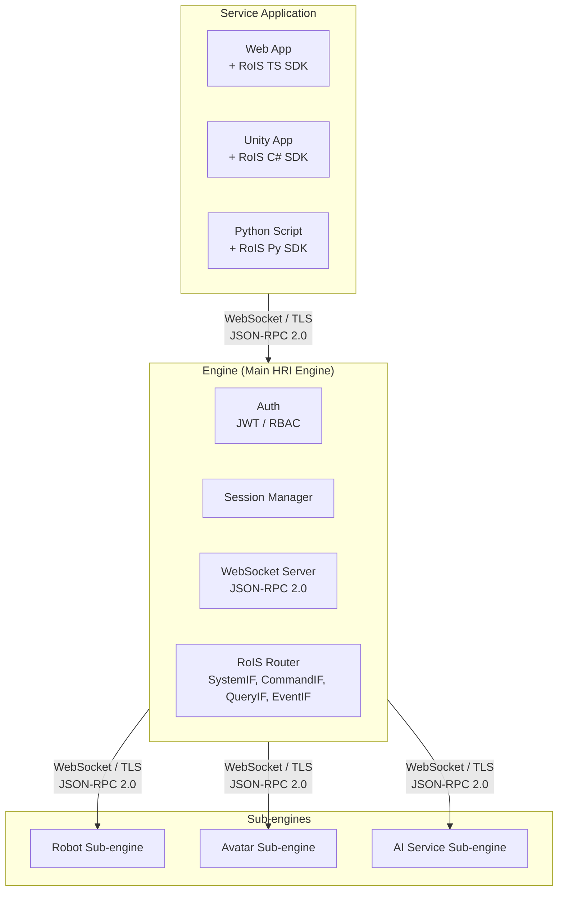
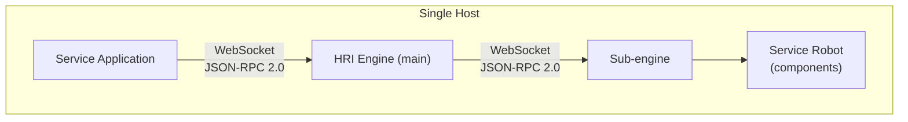
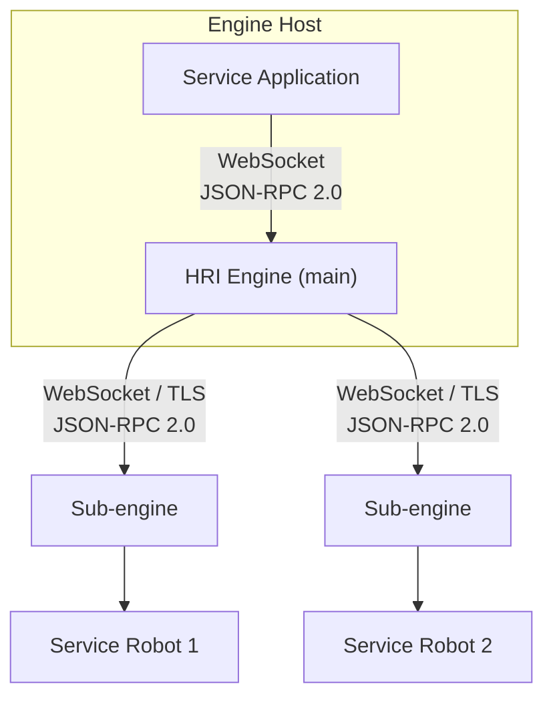
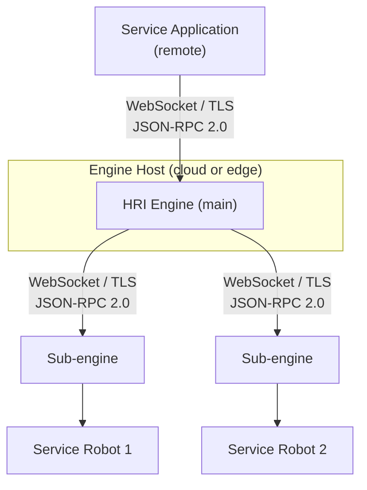
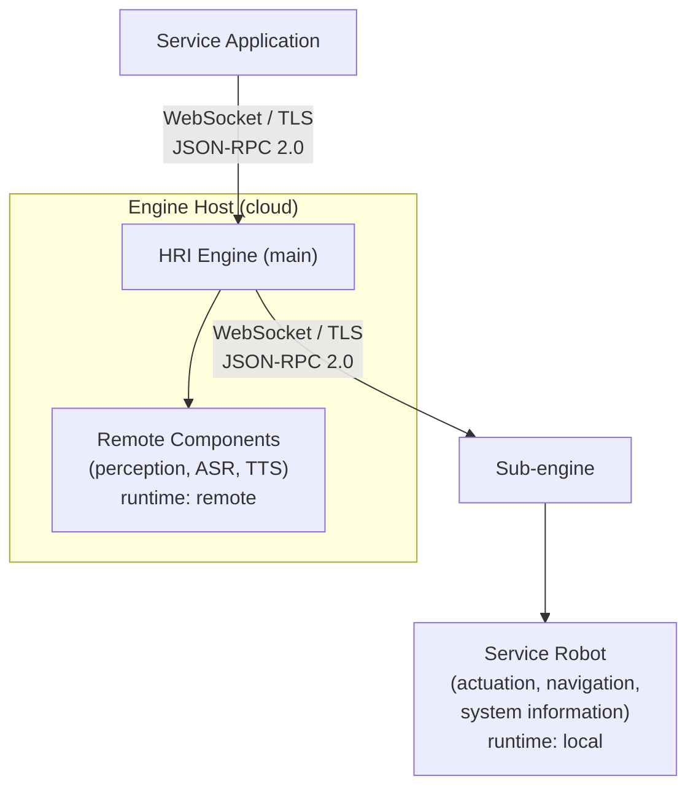

# OpenRoIS - Implementation Architecture

> A practical architecture for implementing the OMG **RoIS Framework 2.0** as an
> open-source middleware that lets operator applications control **physical robots,
> virtual avatars, and digital agents** over the internet.
>
> The **primary demonstrated path** is a **web operator application controlling a
ROS 2 robot** over the internet: a TypeScript web client talks to the
engine, which bridges to ROS 2 components on the robot. Virtual avatars and
> distributed services remain **fully supported secondary topologies** behind the
> same interfaces.
>
> The architecture is deliberately **paradigm-neutral**: the engine and client SDK
> never assume hardware, a world model, or any specific middleware. A single
> **SubEngine** abstraction lets the same core drive a ROS 2 robot fleet, an
> in-process avatar, or a distributed set of services.
>
> This document is the engineering companion to
> [rois-reference.md](rois-reference.md). The reference explains
> *what the specification says*. This document explains *how we build it*. For the
> milestone roadmap, see [roadmap.md](roadmap.md).

---

## Table of Contents

1. [Goals & Non-Goals](#1-goals--non-goals)
2. [What We Are Building](#2-what-we-are-building)
3. [Architectural Overview](#3-architectural-overview)
4. [Deployment Topologies](#35-deployment-topologies)
5. [Layer 1 - Client & Service Application SDK](#4-layer-1--client--service-application-sdk)
6. [Engine (Main HRI Engine)](#5-engine-main-hri-engine)
7. [Sub-engines](#6-sub-engines)
8. [Layer 4 - Hosts: Sub-Engines & Components](#7-layer-4--hosts-sub-engines--components)
9. [The SubEngine Interface](#75-the-subengine-interface)
10. [Component Mapping: Robot vs. Avatar](#76-component-mapping-robot-vs-avatar)
11. [Transport Strategy](#8-transport-strategy)
12. [Control Plane vs. Data Plane (Streaming)](#9-control-plane-vs-data-plane-streaming)
13. [Authentication](#10-authentication)
14. [Authorization & Fleet Segmentation](#11-authorization--fleet-segmentation)
15. [Mapping RoIS Interfaces to the Stack](#12-mapping-rois-interfaces-to-the-stack)
16. [End-to-End Message Flows](#13-end-to-end-message-flows)
17. [Repository Layout](#14-repository-layout)
18. [Technology Choices](#15-technology-choices)

---

## 1. Goals & Non-Goals

### Goals

- Provide a **conformant RoIS 2.0 implementation** usable across **physical robots,
  virtual avatars, and digital agents**.
- **Demonstrate a web operator application controlling a ROS 2 robot** over the
  internet as the primary, end-to-end reference scenario.
- Keep the **interfaces paradigm-neutral**: the engine and SDK must not assume
  hardware, a world model, or any specific middleware.
- Allow an **operator application in a remote location** to control any RoIS host
  (robot or avatar) securely.
- Expose a **simple client SDK** (TypeScript for web first) so a scenario can be
  written in a few lines, identically regardless of the host paradigm.
- Support **live audio/video** for both telepresence (robot) and rendered avatars.
- Enable **multi-tenant segmentation** through authentication and authorization.

### Non-Goals

- We do **not** invent a new wire protocol. RoIS defines messages, not transport. We
  choose existing transports (WebSocket, DDS, WebRTC).
- We do **not** define media codecs. Streaming media formats are out of RoIS scope.
- We do **not** mandate any single middleware. ROS 2 is the **primary, reference
  robot sub-engine**. The WebSocket + JSON-RPC sub-engine is the sub-engine for any non-ROS
  host (avatars, services). Neither is privileged in the core.

---

## 2. What We Are Building

The output of this effort is **not a protocol and not a single SDK**. It is a
**middleware distribution** with five cooperating artifacts:

| Artifact | Audience | Description |
|----------|----------|-------------|
| **RoIS Interfaces** | Implementers | **Transport-independent** type/interface definitions derived from the normative IDL. Authored as **Python (Pydantic)**, exported to **JSON Schema** (canonical wire format), and generated into **C#** and **TypeScript**. |
| **RoIS Engine** | Operators | The **control-plane router** that manages components and exposes them remotely. |
| **RoIS Sub-engines** | Platform integrators | Standalone processes that connect to the Engine via WebSocket + JSON-RPC. Each owns its paradigm-specific transport. |
| **RoIS Components** | Integrators | The 17 basic components backed by real perception/actuation libraries, with per-paradigm backends. |
| **RoIS Client SDK** | Application developers | The user-facing library (**TypeScript for web first**, C# and Python second). |

The **Client SDK is the adoption driver**. It is what most users will ever touch,
and it is **identical** whether the host is a robot or an avatar.

---

## 3. Architectural Overview



The spec's "main HRI Engine" maps to the **Engine**. Each "sub HRI Engine" maps to
a **sub-engine** (a standalone process that connects to the engine via WebSocket).
"HRI Components" map to the components registered by each sub-engine. The service
application only ever talks to the Engine. The host topology *and paradigm* are
hidden, exactly as the spec requires.

---

## 3.5 Deployment Topologies

The engine-to-sub-engine boundary is always WebSocket + JSON-RPC. The sub-engine's
internal transport (DDS, gRPC, animation API, or any future paradigm) is an
implementation detail of the sub-engine, not a topology choice. Topologies differ by
**where processes run**: on a single host, across a LAN, across the internet, or
with components offloaded to the cloud.

### A. Single host (local)

Everything runs on one machine: the service application, the engine, the sub-engine,
and the robot. The service application talks to the engine over localhost WebSocket.
The sub-engine connects to the engine over localhost WebSocket. This is the simplest
deployment, useful for development, testing, and single-robot scenarios where the
robot's onboard computer runs everything.



### B. LAN, multiple service robots

The engine runs on one host. Multiple service robots run on the same LAN, each with
its own sub-engine. The service application connects to the engine, which routes calls
to the correct robot's sub-engine. This is the fleet scenario: one engine serves
multiple robots on a local network.



### C. Distributed hosts (internet)

The service application runs on a remote host (operator's laptop, cloud service).
The engine runs on a server or in the cloud. Each service robot runs on its own
host, connecting to the engine over the internet. This is the full teleoperation
scenario: the operator is in one location, the engine is in another, and the
robots are in a third.



### D. Cloud-hosted components

Some components run on the engine itself, not on the robot. The sub-engine on the
robot registers components with `runtime: remote` in the profile. The engine loads
and hosts those components directly. This suits components that need more compute
than the robot has (perception models, speech recognition) or components that are
shared across multiple robots. The robot's sub-engine still owns `runtime: local`
components (actuation, navigation, system information).



In Topology C, the engine is a pure router: all components live on the robot behind
the sub-engine. In Topology D, the engine is both a router and a component runtime.
Some components run on the engine (cloud), some run on the robot (local). The
`runtime` field in the profile declares where each component runs. The service
application does not know or care where a component runs: `search()` returns
components from both locations, and `bind()` / `execute()` work identically.

---

## 4. Layer 1 - Client & Service Application SDK

The SDK mirrors the five RoIS interfaces (`SystemIF`, `CommandIF`, `QueryIF`,
`EventIF`, and the per-component streaming interface) defined in the normative IDL
(`RoIS_HRI.idl` and `RoIS_Service.idl`).

```
RoIS Client SDK
├─ SystemClient    connect() · disconnect() · getProfile() · getErrorDetail()
├─ CommandClient   search() · bind() · bindAny() · release()
│                  getParameter() · setParameter() · execute() · getCommandResult()
├─ QueryClient     query()
├─ EventClient     subscribe() · unsubscribe() · getEventDetail()  → onNotifyEvent
└─ StreamClient    connectStream() · disconnectStream()
                   suspendStream() · resumeStream() · queryStreamStatus()
```

Target developer experience (TypeScript / web, primary client):

```ts
import { RoISClient } from "@openrois/sdk";

const client = await RoISClient.connect("wss://engine.example.com", {
  token: await getAccessToken(),
});

// Control a ROS 2 robot: identical API regardless of host paradigm
const pd = await engine.bind("PersonDetection");
pd.on("person_detected", (e) => console.log(`${e.number} people`));
await pd.start();

const nav = await engine.bind("Navigation");
await nav.execute({ target_positions: ["3.0,1.5,0.0"], time_limit: 30 });

const video = await engine.bind("VideoStreaming");
const track = await video.connectStream();    // WebRTC track → <video> element
```

The callback surface comes directly from `ServiceApplicationBase` in the spec:
`notify_error`, `completed`, and `notify_event`.

---

## 5. Engine (Main HRI Engine)

The Engine is the **only internet-facing process** and the **single enforcement
point** for security. It implements the RoIS System/Command/Query/Event interfaces
toward the client and routes them to the appropriate sub-engine toward
the fleet.

```
┌─────────────────────────────────────────────────────────────────┐
│  RoIS Engine                                                     │
│                                                                  │
│  ┌──────────────┐  ┌──────────────┐  ┌────────────────────────┐ │
│  │ Auth Module   │  │ Session       │  │ WebSocket Server       │ │
│  │ • JWT verify │  │ Manager       │  │ • JSON-RPC 2.0         │ │
│  │ • RBAC eval  │  │ • conn state  │  │ • per-conn routing     │ │
│  │ • fleet ACL  │  │ • bind/sub map│  │                        │ │
│  └──────┬───────┘  └──────┬────────┘  └────────────┬───────────┘ │
│         └─────────────────┴────────────────────────┘             │
│  ┌──────────────────────────────────────────────────────────┐  │
│  │  RoIS Router                                              │  │
│  │  SystemIF · CommandIF · QueryIF · EventIF · StreamIF      │  │
│  └──────────────────────────────────────────────────────────┘  │
└─────────────────────────────────────────────────────────────────┘
```

Responsibilities:

- **Terminate the remote transport** (WebSocket/TLS) and authenticate every
  connection before any RoIS message is processed.
- **Route** JSON-RPC RoIS calls to the appropriate sub-engine.
- **Aggregate profiles** from all authorized sub-engines into one
  `HRI_Engine_Profile` returned by `get_profile()`.
- **Filter** `search()`/`query()` results and **guard** `bind()`/`execute()` per the
  caller's authorization scope.

---

## 6. Sub-engines

The engine talks to sub-engines via WebSocket + JSON-RPC. Sub-engines are standalone
processes, not in-process plugins. Each sub-engine owns its paradigm-specific
transport: DDS for ROS 2 robots, gRPC for AI services, an animation API for avatars.
The engine never imports DDS, gRPC, or any paradigm-specific library. It sees only
the SubEngine interface (see [§7.5](#75-the-subengine-interface)).

A robot sub-engine (ROS 2) uses DDS internally for service/action/topic mapping, QoS,
and discovery. An avatar sub-engine uses an animation API or game engine binding. An
AI service sub-engine uses gRPC. The engine does not know or care which transport the
sub-engine uses internally. The sub-engine is the boundary where paradigm-specific code
lives.

---

## 7. Layer 4 - Hosts: Sub-Engines & Components

A **host** is anything that provides components: a robot, an avatar process, or a
bank of services. Each host exposes one **sub-engine** plus its components. Every
component implements the `Command` / `Query` / `Event` interfaces it inherits from
`RoIS_Common.idl` (`start` / `stop` / `suspend` / `resume`, `component_status`),
*regardless of paradigm*.

```
┌──────────────────────────────────────┐
│  Sub-Engine: Robot A                  │
│                                      │
│  PersonDetection   → YOLO / OpenCV    │  person_detected(timestamp, number)
│  FaceDetection     → MediaPipe        │  face_detected(timestamp, number)
│  PersonLocalization→ depth + tracker  │  person_localized(…, position_data)
│  SpeechRecognition → Whisper          │  speech_recognized(…, recognized_text)
│  SpeechSynthesis   → espeak / Piper    │  (command: set_parameter speech_text)
│  Navigation        → Nav2             │  (command: target_position, time_limit)
│  Follow            → tracker + Nav2    │  (command: target_object_ref, distance)
│  AudioStreaming    → GStreamer webrtc  │  notify_stream_status(stream_id, status)
│  VideoStreaming    → GStreamer webrtc  │  notify_stream_status(stream_id, status)
└──────────────────────────────────────┘

  Host: Robot A (ROS 2 sub-engine)           Host: Avatar (WebSocket sub-engine)
  ─ camera/mic input, physical actuation     ─ webcam input, rendered output
  ─ components are ROS 2 nodes                ─ components are host connector objects
```

The component method categories map to whatever the sub-engine provides:

- **Command Method** → ROS 2 action/service or WS+JSON-RPC call.
- **Event Method** → ROS 2 topic or WS push notification.
- **Query Method** → ROS 2 service or WS+JSON-RPC call.

The component's *logic* is the same across sub-engines. Only the binding differs.

---

## 7.5 The SubEngine Interface

The **SubEngine** is the single abstraction that decouples the engine from any
paradigm. The engine and SDK never reference ROS, DDS, gRPC, or a game engine. They
depend only on this contract:

```typescript
interface SubEngine {
  discover(request: DiscoverRequest): Promise<DiscoverResponse>;
  invoke(request: CommandRequest): Promise<InvokeResponse>;
  query(request: QueryRequest): Promise<QueryResponse>;
  subscribe(request: SubscribeRequest, sink: EventSink): Promise<SubscribeResponse>;
  unsubscribe(subscribeId: string): Promise<ReturnCode>;
}
```

| Implementation | Transport | Status |
|----------------|-----------|--------|
| **RemoteSubEngine** | WebSocket + JSON-RPC | Current. All sub-engines connect to the engine over WebSocket. |
| **LocalSubEngine** | In-process (direct call) | Future. For embedded deployments where the sub-engine runs in the same process as the engine. |

Because the engine sees only `SubEngine`, **adding a new paradigm is an additive
sub-engine, never a rewrite**. Accidental coupling (e.g. baking DDS QoS semantics into
the engine) is structurally prevented.

---

## 7.6 Component Mapping: Robot vs. Avatar

About **70%** of the 17 basic components are *identical* across paradigms. The
perception and speech components run the same ML models whether the input is a robot
camera or a webcam. Only actuation, world model, and stream source differ.

| RoIS Component | Physical Robot | Virtual Avatar | Shared? |
|----------------|----------------|----------------|---------|
| Person Detection | YOLO on camera | YOLO on webcam / virtual sensor | yes |
| Person Localization | depth + tracker | world position / webcam depth | diff coord system |
| Person Identification | InsightFace | InsightFace | yes |
| Face Detection | MediaPipe | MediaPipe | yes |
| Face Localization | MediaPipe face mesh | MediaPipe face mesh | yes |
| Sound Detection | mic VAD | mic VAD | yes |
| Sound Localization | mic-array DOA | mic-array DOA / virtual | diff |
| Speech Recognition | Whisper | Whisper | yes |
| Gesture Recognition | MediaPipe Holistic | MediaPipe Holistic | yes |
| Speech Synthesis | TTS to speaker | TTS to lip-sync to avatar | diff output |
| Reaction | LED / gesture | animation / expression | paradigm-specific |
| Navigation | Nav2 (physical) | NavMesh (virtual) | paradigm-specific |
| Follow | Nav2 + tracker | virtual follow | paradigm-specific |
| Move | `cmd_vel` to motors | transform to avatar | paradigm-specific |
| Audio Streaming | mic to WebRTC | TTS output to WebRTC | diff source |
| Video Streaming | camera to WebRTC | rendered frames to WebRTC | diff source |
| System Information | battery, CPU, joints | FPS, memory, avatar state | diff state |

**Legend:** `yes` = identical. `diff` = same interface, different source/output.
`paradigm-specific` = different implementation per paradigm. The paradigm-specific
rows (Reaction, Navigation, Move, Follow) are exactly the ones a SubEngine +
per-backend component design keeps cleanly separated.

---

## 8. Transport Strategy

RoIS deliberately separates messages from transport, so we use **the right transport
at each boundary** rather than forcing one everywhere.

| Boundary | Transport | Why |
|----------|-----------|-----|
| Remote client to Engine | **WebSocket + TLS** | NAT/firewall friendly, browser-native, easy auth, async events. Matches the spec's Annex F.2.3 WebSocket example. |
| Engine to Sub-engine | **WebSocket + TLS, JSON-RPC 2.0** | NAT-friendly, one protocol for all sub-engines. The sub-engine's internal transport (DDS, gRPC, animation API) is chosen by the sub-engine, not the engine. |
| Media (camera/mic or rendered) | **WebRTC (SRTP/DTLS)** | Built-in NAT traversal (ICE/STUN/TURN), adaptive bitrate, encrypted, browser-native. |

The engine-to-sub-engine boundary is always WebSocket + JSON-RPC. The sub-engine's
internal transport (DDS, gRPC, animation API) is chosen by the sub-engine, not the
engine.

These are complementary, not competing: the sub-engine's internal transport solves
the *host* boundary. WebSocket solves the *remote control* boundary. WebRTC solves
*real-time media*.

---

## 9. Control Plane vs. Data Plane (Streaming)

RoIS defines **only the streaming control plane**: `connect_stream`,
`suspend_stream`, `resume_stream`, `disconnect_stream`, `notify_stream_status`, and
the `Stream_Status` enum from `RoIS_Common.idl`. The media data plane is out of
scope, which makes **WebRTC** a natural fit.

```
        RoIS Streaming Control (in scope)        WebRTC Media (out of RoIS scope)
        ───────────────────────────────         ───────────────────────────────
        set_parameter(encoding, transport)  ↔   SDP offer/answer negotiation
        set_parameter(ice candidates)       ↔   ICE / trickle ICE
        connect_stream()                    ↔   RTCPeerConnection open
        notify_stream_status(RUNNING)       ↔   iceconnectionstate = connected
        suspend_stream() / resume_stream()  ↔   RTCRtpSender.track.enabled = false/true
        disconnect_stream()                 ↔   pc.close()
```

WebRTC **signaling travels over the existing WebSocket** RoIS connection (passed as
`set_parameter` arguments), so no separate signaling server is required.

Important distinction the spec preserves:

- **Speech Synthesis** is a *command* component (text to robot speaker locally), not
  a stream.
- **Audio/Video Streaming** are *stream-control* components (live media robot to
  operator), using WebRTC.

### P2P vs. SFU

- **Fleet of 1-3 robots**: peer-to-peer WebRTC is sufficient.
- **Larger fleets**: route media through a **Selective Forwarding Unit** (mediasoup,
  LiveKit). The RoIS streaming control interface is identical either way. The SFU is
  an implementation detail of the Engine.

---

## 10. Authentication

The spec's `connect()` takes **no parameters**. It assumes a trusted LAN. For remote
access we authenticate **before** any RoIS message is processed, at the WebSocket
upgrade.

```
Client                                   Engine
  │ 1. POST /auth/token {client_id,…}      │
  │ ─────────────────────────────────────► │
  │ ◄──── {access_token (JWT), expires} ── │
  │                                        │
  │ 2. WS upgrade  Authorization: Bearer … │
  │ ─────────────────────────────────────► │
  │ ◄──── 101 Switching Protocols ──────── │   (401 if token missing/invalid)
  │                                        │
  │ 3. RoIS connect()                      │   now inside the RoIS layer
  │ ─────────────────────────────────────► │
  │ ◄──── ReturnCode_t::OK ─────────────── │
```

Example JWT claims used downstream for authorization:

```json
{
  "sub": "operator-alice",
  "roles": ["operator"],
  "fleet_scope": ["warehouse-north", "lab-b"],
  "components": ["person_detection", "navigation", "video_streaming"],
  "iat": 1749500000,
  "exp": 1749503600
}
```

| Approach | Pros | Cons |
|----------|------|------|
| **Engine-internal JWT** | No external deps, simplest | Single trust domain |
| **OIDC provider** (Keycloak, Auth0, Dex) | SSO, federation, user mgmt | Extra infrastructure |
| **mTLS** (client certs) | Strongest auth | Cert provisioning for browsers |

Recommended path: engine-internal JWT for the prototype, then OIDC provider for
multi-tenant deployments.

---

## 11. Authorization & Fleet Segmentation

Authorization is enforced **per RoIS operation** inside the Engine. The spec's
`Condition_t` (a string carrying an ISO 19143 `QueryExpression`) and `component_ref`
are the natural enforcement points.

### RBAC Model

| Role | Fleet Scope | Component Scope |
|------|-------------|-----------------|
| **admin** | all | all |
| **operator** | assigned | assigned (incl. actuation) |
| **viewer** | assigned | detection + streaming only |
| **maintenance** | assigned | system_information |

### Enforcement Points

| Interface / Op | Enforcement |
|----------------|-------------|
| `connect()` | Verify JWT. Expose only sub-engines within `fleet_scope`. |
| `search(condition)` | Filter `component_ref_list` to authorized fleet + components. |
| `bind(component_ref)` | Reject refs outside scope (`BAD_PARAMETER` / `UNSUPPORTED`). |
| `execute(command_unit_list)` | Validate every `component_ref` in the sequence. |
| `query(query_type, condition)` | Filter results to authorized fleets (e.g. `robot_position`). |
| `subscribe(event_type, condition)` | Deliver `notify_event` only for authorized sources. Scope `subscribe_id` to the session. |
| `connect_stream()` | Require `streaming` scope. SFU enforces per-stream ACL. |

### Worked Example

```
Org: Acme Robotics
├── Fleet warehouse-north  → Robot-A1, Robot-A2
├── Fleet warehouse-south  → Robot-B1, Robot-B2
└── Fleet lab-b            → Robot-C1
```

- **Alice** (`operator`, scope `warehouse-north`): `search()` returns only A1/A2.
  `bind("Robot-B1/navigation")` is rejected.
- **Bob** (`admin`, scope `*`): sees and controls everything.
- **Carol** (`viewer`, scope `warehouse-north,south`): `search()` returns detection +
  streaming only. `bind(navigation)` is rejected. `connect_stream(video)` is allowed.

Because the Engine filters at `search()`, robots outside a caller's scope are
**invisible**. The caller cannot discover or address them.

### Defense in Depth

1. **TLS** on the remote edge.
2. **JWT/OIDC** authentication at WebSocket upgrade.
3. **RBAC** authorization per RoIS operation in the Engine.
4. **DDS-Security** (or per-fleet DDS domains) on the bus.
5. **DTLS/SRTP** on WebRTC media.

---

## 12. Mapping RoIS Interfaces to the Stack

| RoIS Interface (IDL) | Client SDK | Engine | Sub-engine (via SubEngine) |
|----------------------|-----------|---------|--------------------------|
| `SystemIF` | `SystemClient` | WS handler + auth | `discover()` (registry/DDS/gRPC) |
| `CommandIF` | `CommandClient` | RBAC filter + router | `invoke()` (call/action/unary) |
| `QueryIF` | `QueryClient` | result filter | `query()` (call/service/unary) |
| `EventIF` | `EventClient` | subscription router | `subscribe()` (callback/topic/stream) |
| `ServiceApplicationBase` (`notify_*`, `completed`) | SDK callbacks | WS push | event sink (callback/topic/stream) |
| Streaming `Command`/`Query`/`Event` | `StreamClient` | WebRTC bridge | GStreamer/aiortc or rendered source |

---

## 13. End-to-End Message Flows

### 13.1 Authenticated Bind + Execute + Event

```
Web App            Engine                ROS 2 Sub-engine    Robot-A1
  │  bind(robot-a1/pd) + token │              │                  │
  │ ─────────────────────────► │              │                  │
  │            verify JWT, check fleet+role+component             │
  │                            │  /robot_a1/pd/bind              │
  │                            │ ────────────►│ ───────────────► │
  │                            │ ◄────────────│ ◄─────────────── │
  │ ◄──────── OK ───────────── │              │                  │
  │  execute(start)            │              │                  │
  │ ─────────────────────────► │  /robot_a1/pd/execute (action)  │
  │                            │ ────────────►│ ───────────────► │
  │ ◄──── command_id ───────── │              │                  │
  │                            │  ◄ person_detected (topic) ───── │
  │ ◄── notify_event(number=2) │              │                  │
```

### 13.2 Video Stream Setup (WebRTC)

```
Web App                         Engine                     Robot-A1
  │ bind(VideoStreaming)          │                            │
  │ ────────────────────────────► │ ──────────────────────────►│
  │ set_parameter(SDP offer, ICE) │                            │
  │ ────────────────────────────► │  negotiate via webrtcbin   │
  │ ◄──── set_parameter(SDP answer)│ ◄──────────────────────────│
  │ connect_stream()              │                            │
  │ ────────────────────────────► │                            │
  │ ═══════ WebRTC media (SRTP) ══╪════════════════════════════│
  │ ◄── notify_stream_status(RUNNING) ─                         │
```

---

## 14. Repository Layout

Directories use **kebab-case**. Each language package follows its own ecosystem
convention internally (Python `snake_case`, C# `PascalCase`, npm `@scope/kebab`).

```
openrois/
├── interfaces/              # Shared types: single source of truth
│   ├── schema/             #   Canonical JSON Schema (generated)
│   ├── python/             #   Pydantic models (authored here, source of truth)
│   ├── csharp/             #   Generated C# types (OpenRoIS.Interfaces)
│   └── typescript/         #   Generated TS types (@openrois/interfaces)
├── engine/                  # Engine (TypeScript): WebSocket server, JSON-RPC router
├── apps/                    # Service applications and tools
│   ├── hub/                 #   Hub (Vite + React): visualizer of the Engine
│   └── teleop/              #   Reference teleoperation service application (planned)
├── sdk/                     # Client SDKs
│   ├── typescript/          #   @openrois/sdk (npm)
│   ├── python/              #   openrois-sdk (PyPI)
│   └── csharp/              #   OpenRoIS.Sdk (NuGet/UPM)
├── components/              # Reference HRI Component implementations
│   ├── person-detection/
│   └── person-identification/
├── examples/                # Reference implementations and templates
│   ├── mock-engine/
│   ├── mock-adapter/
│   ├── adapter-template/
│   └── hri-client/
└── docs/                    # Documentation
```

Each top-level directory is a product component of the OpenRoIS middleware, not
an example or a demo.

| Directory | Role | Notes |
|-----------|------|-------|
| `interfaces/` | Type pipeline | Pydantic models are the source of truth. JSON Schema is the canonical wire contract. C# and TypeScript types are generated, never hand-written. All other layers depend on these types. |
| `engine/` | Main HRI Engine | Pure control-plane router. Routes RoIS JSON-RPC calls between service applications and sub-engines (adapters). Zero media imports, zero WebRTC imports, zero KVS imports. TypeScript (Node.js). Packaged as `@openrois/engine`. Can run standalone (Docker, systemd) or embedded (vendored into a host application's main process). |
| `apps/` | Service applications and tools | Product applications, not examples. `hub/` is a visualizer of the Engine, not a service application. `teleop/` is a reference teleoperation service application (planned, not yet implemented). |
| `sdk/` | Client SDKs | Three SDKs (TypeScript, Python, C#) that expose the five RoIS interfaces (System, Command, Query, Event, Streaming) over WebSocket + JSON-RPC 2.0. The same SDK calls drive a ROS 2 robot, a virtual avatar, or a distributed service. Only the host behind the Engine changes. |
| `components/` | Reference HRI Component implementations | Formal RoIS spec term: an abstract object that uses sensors/actuators to provide a specific HRI function (person detection, navigation, speech synthesis). The spec defines 17 basic components. About 70% are shared across paradigms (same ML models). Product deliverables (roadmap milestones M4, M8, M11), not examples. |
| `examples/` | Reference implementations and templates | Demonstrate how to use the middleware. Contains `mock-engine` (mock HRI Engine for testing), `mock-adapter` (mock BusAdapter), `adapter-template` (scaffolding for new adapters), and `hri-client` (generic browser-based component inspector). These exist to teach and test, not to ship as products. The boundary: `examples/` holds things you look at to understand how the middleware works. `components/` holds real implementations that ship with the project. |
| `docs/` | Documentation | Architecture, white paper, roadmap, spec reference. |

---

## 15. Technology Choices

| Concern | Recommended | Alternatives |
|---------|-------------|--------------|
| Operator client | **Web (TypeScript)** | Unity (C#), Godot |
| Robot middleware | **ROS 2 (Humble/Jazzy) over DDS** | CORBA, RTC |
| Engine language | **TypeScript (Node.js)** | Python (rclpy), C++ (rclcpp) |
| Interface source of truth | **Pydantic to JSON Schema to C#/TS** | Protobuf, raw IDL |
| Avatar host | Unity / Godot / Web (Three.js, Babylon.js) | Unreal, MMDAgent, Live2D |
| Internal bus (robot) | ROS 2 / DDS | — |
| Internal bus (avatar/services) | WebSocket + JSON-RPC | — |
| Remote transport | WebSocket + TLS | gRPC-web, MQTT |
| RPC envelope | JSON-RPC 2.0 | Protobuf, CBOR |
| Media | WebRTC (aiortc / GStreamer webrtcbin) | RTSP, HLS |
| SFU (large fleets) | mediasoup, LiveKit | Janus |
| Auth | Keycloak (OIDC) / engine JWT | Auth0, Dex, mTLS |
| Perception | YOLO, MediaPipe, Whisper | platform-specific |
| Navigation | robot: Nav2, avatar: NavMesh | custom |
| Speech synthesis | Piper, VOICEVOX, Coqui TTS | cloud TTS |

---

*This is an engineering design document for the OpenRoIS project. For the
specification summary, see [rois-reference.md](rois-reference.md).
For the milestone roadmap, see [roadmap.md](roadmap.md). For authoritative
requirements, consult the OMG specification at <https://www.omg.org/spec/RoIS/2.0/Beta2>.*