# RealSense アダプタ実装 最終報告書

**日付**: 2026-09-11（初版 2026-09-10、デモ動作確認済み）
**対象**: OpenRoIS リポジトリ（`~/openrois`）への RealSense 知覚パイプライン統合
**前提**: ROS2 側（`~/ros2_ws`）の知覚パイプラインは稼働済み（`person-topics-spec.md` のトピック契約に従う）
**デモ状況**: `./run_demo.sh --rviz` による一括起動デモが **2026-09-11 に実機で動作確認済み**

---

## 目次

1. [成果物の全体像](#1-成果物の全体像)
2. [実装フェーズと成果物](#2-実装フェーズと成果物)
3. [コード変更詳細 — 新規作成](#3-コード変更詳細--新規作成)
4. [コード変更詳細 — 既存ファイルへの修正](#4-コード変更詳細--既存ファイルへの修正)
5. [openrois コアに発見・修正したバグ（上流PR候補）](#5-openrois-コアに発見修正したバグ上流pr候補)
6. [疎通確認結果（実測）](#6-疎通確認結果実測)
7. [RoIS を使った Segmentation デモの実行方法](#7-rois-を使った-segmentation-デモの実行方法)
8. [残作業](#8-残作業)
9. [ファイル一覧](#9-ファイル一覧)

---

## 1. 成果物の全体像

既存の ROS2 知覚パイプライン（`realsense2_camera` + `yolo_person_perception`）の出力を、OpenRoIS の標準コンポーネントとして公開するアダプタを実装した。

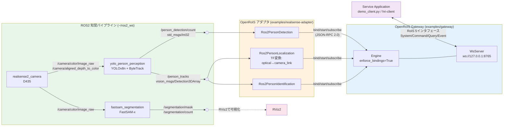

### コンポーネントとトピックの対応

| RoIS コンポーネント | 購読トピック | 発行イベント | イベントペイロード |
|---|---|---|---|
| `PersonDetection` | `/person_detection/count` | `person_detected` | `timestamp`, `number` |
| `PersonLocalization` | `/person_tracks` | `person_localized` | `timestamp`, `number`, `positions[]` |
| `PersonIdentification` | `/person_tracks` | `person_identified` | `timestamp`, `number`, `identifiers[]` |

`PersonLocalization` と `PersonIdentification` は同一トピックを購読する。`Detection3D` が位置とIDを同じ構造体に保持するため、両者の対応は構造的に保証される。

### 1イベントのデータフロー（person_localized の例）

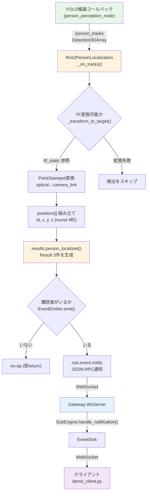

---

## 2. 実装フェーズと成果物

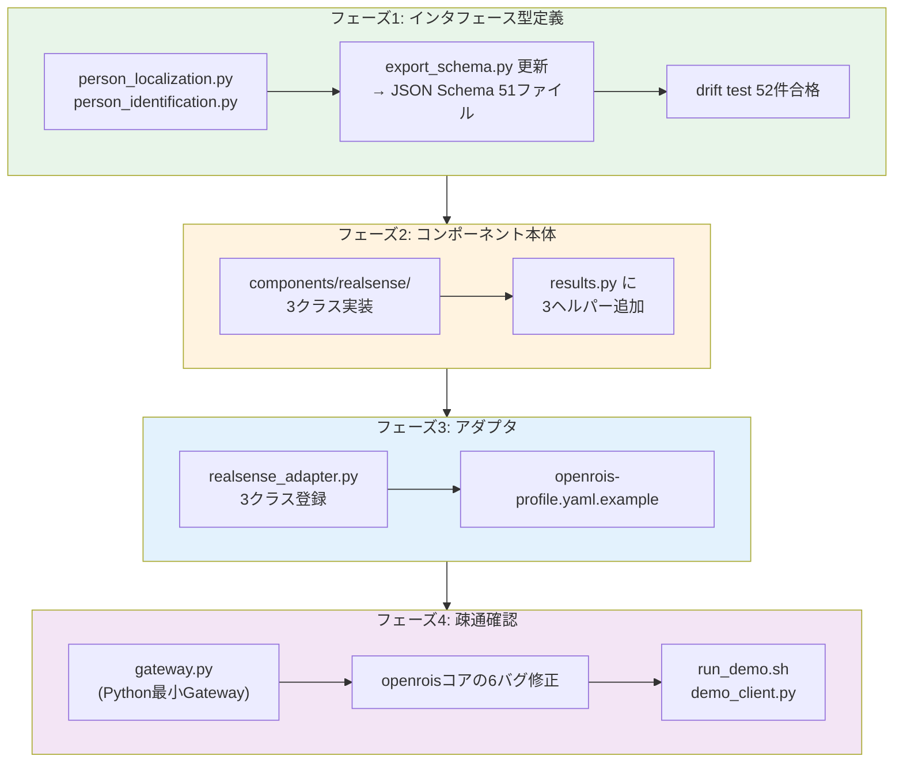

### フェーズ1: インタフェース型定義（`interfaces/python`）

| ファイル | 内容 |
|---|---|
| `src/openrois/interfaces/components/person_localization.py` | `PERSON_LOCALIZATION_URN`、`PersonLocalizedEvent`、`PersonPosition`（id, x, y, z）、`PersonLocalizationStatusResult` |
| `src/openrois/interfaces/components/person_identification.py` | `PERSON_IDENTIFICATION_URN`、`PersonIdentifiedEvent`、`PersonIdentifier`（id, name）、`PersonIdentificationStatusResult` |
| `src/openrois/interfaces/components/__init__.py` | import と `__all__` に追記 |
| `scripts/export_schema.py` / `tests/test_schema_drift.py` | インベントリに6モデル追記 |

**検証結果**: JSON Schema 51ファイル生成（新規6ファイル含む）、drift test **52件合格**。

座標系は RoIS 契約（REP-103: +x前方・+y左・+z上、メートル）を型定義のフィールド説明に明記。追跡IDの非永続性（計画書2.2節）も `PersonIdentifier` の docstring とフィールド説明に明記した。

### フェーズ2: コンポーネント本体（`components/realsense`）

3クラスとも `components/kachaka` の `system_information_ros2.py` の構造（`connect()` でrclpyノード生成→購読、ROSコールバックでemit、`@subscribe` は空実装）を踏襲。`@component("PersonDetection")` のようにコンポーネント名のみを渡し、`function=sensing` は ontology 表から自動分類される（計画書1.1節どおり）。

**座標変換（案B）**: `Ros2PersonLocalization` は `tf2_ros.Buffer` + `TransformListener` で `/tf_static` を参照し、`camera_color_optical_frame`（+x右・+y下・+z前方）から `camera_link`（REP-103）へ変換してからイベントを組み立てる。ROS2側は無変更。

### フェーズ3: アダプタ（`examples/realsense-adapter`）

`examples/adapter-template/my_adapter.py` を土台に `realsense_adapter.py` を作成。`COMPONENT_CLASSES` に3クラスを登録。`openrois-profile.yaml.example` で `engine_id: realsense-1`、トピック名・TFフレーム名はすべてコンポーネント設定として外部注入（ハードコードなし）。

### フェーズ4: 疎通確認

Node.js 未導入環境のため、`openrois_core` の `Engine` + `WsServer` を組み合わせた **Python 最小Gateway**（`examples/gateway/gateway.py`）を作成（roadmap Phase 6「Gateway Process」の先行実装に相当）。疎通の過程で openrois コアの6つのバグを発見・修正した（第5章）。最後に一括起動スクリプト `run_demo.sh` とクライアントデモ `demo_client.py` を作成し、**2026-09-11 にユーザー実機で `./run_demo.sh --rviz` の動作を確認**した。

---

## 3. コード変更詳細 — 新規作成

### 3.1 `interfaces/python/src/openrois/interfaces/components/person_localization.py`（新規）

PersonLocalization コンポーネントの型定義。`person_detection.py` の構造を踏襲し、実行時ロジックを持たない純粋な Pydantic モデル。

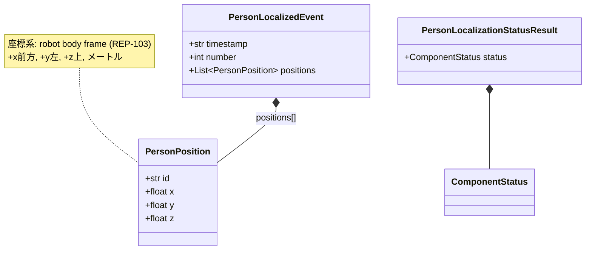

**定義した要素**:

| 要素 | 行 | 説明 |
|---|---|---|
| `PERSON_LOCALIZATION_URN` | 32行目 | `urn:x-rois:def:component:OMG::PersonLocalization` |
| `PersonPosition` | 41行目 | 1人物の3D位置。`id`（追跡ID）、`x`/`y`/`z`（float、メートル）。フィールド説明に座標系を明記 |
| `PersonLocalizedEvent` | 62行目 | イベントペイロード。`timestamp`（DateTime）、`number`（Integer）、`positions`（`list[PersonPosition]`） |
| `PersonLocalizationStatusResult` | 97行目 | `component_status` クエリの結果。`status`（ComponentStatus） |

すべてのモデルに `model_config = {"frozen": True, "extra": "forbid"}` を設定（既存コンポーネント型と同一の不変・追加拒否ポリシー）。

### 3.2 `interfaces/python/src/openrois/interfaces/components/person_identification.py`（新規）

PersonIdentification コンポーネントの型定義。

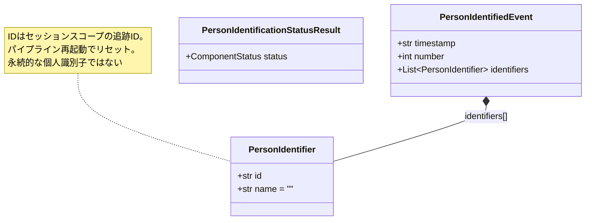

**定義した要素**:

| 要素 | 行 | 説明 |
|---|---|---|
| `PERSON_IDENTIFICATION_URN` | 33行目 | `urn:x-rois:def:component:OMG::PersonIdentification` |
| `PersonIdentifier` | 42行目 | 1人物の識別子。`id`（追跡ID、**非永続**である旨を説明に明記）、`name`（デフォルト `""`） |
| `PersonIdentifiedEvent` | 58行目 | イベントペイロード。`timestamp`、`number`、`identifiers`（`list[PersonIdentifier]`） |
| `PersonIdentificationStatusResult` | 94行目 | `component_status` クエリの結果 |

モジュールdocstringに「Identifier semantics」節を設け、IDの非永続性（再起動でリセット、オクルージョンでスイッチ）を明記した。

### 3.3 `components/realsense/` パッケージ（新規）

```
components/realsense/
├── pyproject.toml              # openrois-components-realsense（optional-deps: ros2=["rclpy"]）
├── README.md
└── openrois_components/realsense/
    ├── __init__.py                    # 3クラスをエクスポート
    ├── person_detection_ros2.py       # Ros2PersonDetection
    ├── person_localization_ros2.py   # Ros2PersonLocalization（TF変換つき）
    └── person_identification_ros2.py # Ros2PersonIdentification
```

3クラスの共通構造:

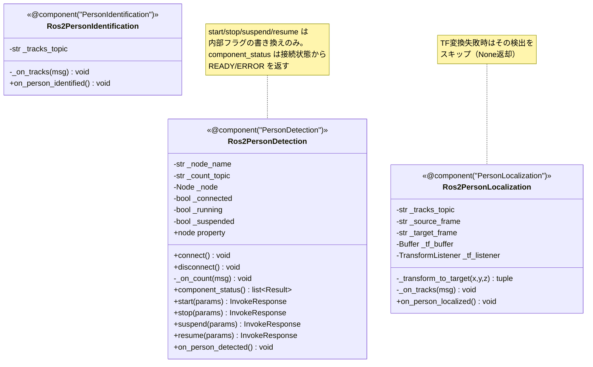

**各クラスの実装詳細**:

#### `person_detection_ros2.py` — `Ros2PersonDetection`

| 要素 | 行 | 実装内容 |
|---|---|---|
| `@component("PersonDetection")` | 25行目 | コンポーネント名のみ。`function=sensing` は ontology 表から自動分類 |
| `__init__(config)` | 29行目 | `ros2_node_name`（デフォルト `openrois_realsense`）、`person_count_topic`（デフォルト `/person_detection/count`）を config から読む。`_running=False`、`_suspended=False` |
| `connect()` | 39行目 | `rclpy.init()`（未初期化時）→ `Node(f"{node_name}_person_detection")` 生成 → `Int32` 購読（QoS: BEST_EFFORT/VOLATILE/depth5、`ReentrantCallbackGroup`）→ `_connected=True`、`_running=True` |
| `disconnect()` | 70行目 | `destroy_node()` して `_node=None` |
| `node` プロパティ | 77行目 | **バグ5修正で追加**。`WsClient.get_rclpy_nodes()` が `handler.node` を参照するため、`_node` を公開する |
| `_on_count(msg)` | 82行目 | ROSコールバック。`_running` かつ `_suspended` でなければ `self.parent.emit("PersonDetection", "person_detected", results.person_detected(...))` を呼ぶ（スレッドセーフ emit、購読者なしなら no-op） |
| `component_status` | 93行目 | `@query`。未接続なら ERROR、それ以外 READY |
| `start/stop/suspend/resume` | 101〜119行目 | `@invoke`。内部フラグの書き換えのみ（`_running`/`_suspended`） |
| `on_person_detected` | 122行目 | `@subscribe`。空実装（実体はROSコールバック内のemit。フレームワークに購読を登録させるためのハンドラ） |

#### `person_localization_ros2.py` — `Ros2PersonLocalization`

| 要素 | 行 | 実装内容 |
|---|---|---|
| `@component("PersonLocalization")` | 33行目 | 同上 |
| `__init__(config)` | 37行目 | `person_tracks_topic`（`/person_tracks`）、`person_tracks_frame`（`camera_color_optical_frame`）、`person_position_frame`（`camera_link`）を config から読む |
| `connect()` | 46行目 | `Detection3DArray` 購読に加え、**`tf2_ros.Buffer()` + `TransformListener(buffer, node)`** を生成（`/tf_static` の受信を開始） |
| `node` プロパティ | 98行目 | バグ5修正で追加 |
| `_transform_to_target(x,y,z)` | 103行目 | `PointStamped` を作り `tf_buffer.transform(point, target_frame, timeout=None)` で変換。**変換できない場合は None を返し、呼び出し側でその検出をスキップ**。ソース==ターゲットならそのまま通す |
| `_on_tracks(msg)` | 130行目 | 各 `Detection3D` の `bbox.center.position` をTF変換 → `{"id": det.id, "x": round(...,4), "y": ..., "z": ...}` のリストを組み立て → `results.person_localized(timestamp, positions)` を emit |
| `start/stop/suspend/resume` | 161〜179行目 | 他クラスと同一 |
| `on_person_localized` | 182行目 | 空実装 |

#### `person_identification_ros2.py` — `Ros2PersonIdentification`

| 要素 | 行 | 実装内容 |
|---|---|---|
| `@component("PersonIdentification")` | 31行目 | 同上 |
| `__init__(config)` | 35行目 | `person_tracks_topic` を config から読む |
| `connect()` | 43行目 | `Detection3DArray` 購読（QoSは他と同一） |
| `node` プロパティ | 79行目 | バグ5修正で追加 |
| `_on_tracks(msg)` | 84行目 | 各 `Detection3D` から `[{"id": det.id, "name": ""}]` を組み立て → `results.person_identified(timestamp, identifiers)` を emit |
| `on_person_identified` | 127行目 | 空実装 |

### 3.4 `examples/gateway/gateway.py` + `README.md`（新規）

Python最小Gateway。roadmap Phase 6「Gateway Process」の先行実装。

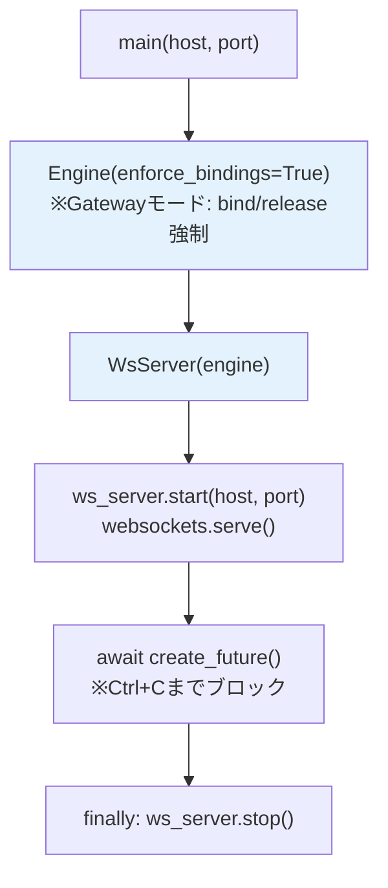

**実装詳細**（gateway.py）:

| 要素 | 行 | 実装内容 |
|---|---|---|
| `main(host, port)` | 30行目 | `Engine(enforce_bindings=True)` — Gatewayモードでは bind/release を強制する（アダプタモードはデフォルト False） |
| 待受ループ | 41行目 | `await asyncio.get_running_loop().create_future()` でCtrl+Cまでブロック |
| `finally` | 43行目 | `ws_server.stop()` でサブエンジン登録解除・サーバ停止 |
| CLI | 50〜61行目 | `--host`（デフォルト `0.0.0.0`、環境変数 `ENGINE_HOST`）、`--port`（デフォルト `8765`、`ENGINE_PORT`） |

### 3.5 `examples/realsense-adapter/realsense_adapter.py`（新規）

アダプタ本体。`adapter-template/my_adapter.py` の `main()` 構造を踏襲。

**実装詳細**:

| 要素 | 行 | 実装内容 |
|---|---|---|
| `COMPONENT_CLASSES` | 35行目 | `Ros2PersonDetection`、`Ros2PersonLocalization`、`Ros2PersonIdentification` の3クラスをリスト登録 |
| `main()` | 47行目 | `read_profile(args.config)` → `Engine(engine_id, platform)` → 各クラスの `meta_from_decorators(cls)` でメタデータ抽出 → `engine.register_component(meta.ref, cls(component_config(profile, meta.ref)), meta)` → `WsClient(engine, gateway_url).run()` |
| 設定注入 | 65行目 | `component_config(profile, meta.ref)` で profile の `components.PersonDetection` 等のセクションを各コンポーネントの `config` として注入（トピック名・フレーム名のハードコードなし） |

### 3.6 `examples/realsense-adapter/demo_client.py`（新規）

RoISクライアントデモ。探索→bind→start→subscribeを自動実行し、3イベントをライブ表示する。

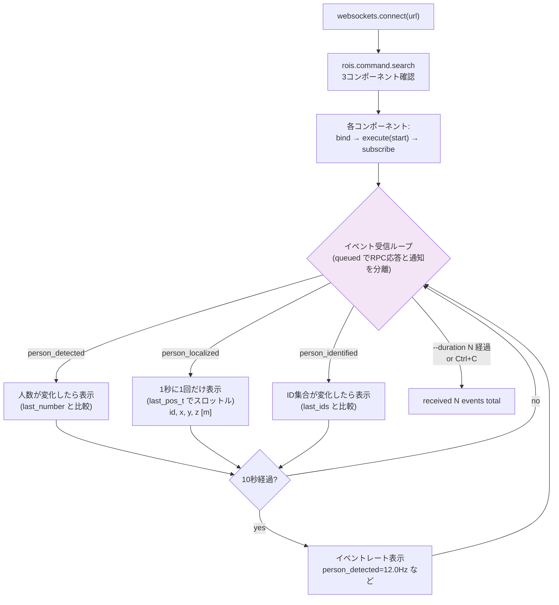

**実装詳細**:

| 要素 | 行 | 実装内容 |
|---|---|---|
| `ENGINE` / `COMPONENTS` | 32〜37行目 | `realsense-1` と3コンポーネント×イベントの対応を定数化 |
| `next_msg(timeout)` | 45行目 | `ws.recv()` をタイムアウト付きでラップ |
| `rpc(rid, method, params)` | 48行目 | JSON-RPCリクエスト送信→応答待ち。**待機中に届いたイベント通知は `queued` に退避**し、後でメインループが処理する（RPC応答とイベント通知の混在を吸収） |
| 探索と確認 | 67〜71行目 | `search` の結果に3コンポーネントが無ければ `SystemExit`（アダプタ未起動を早期検出） |
| bind/start/subscribe | 74〜86行目 | 3コンポーネントそれぞれに `bind` → `execute(start)` → `subscribe` を発行。失敗すれば `SystemExit` |
| 表示制御 | 96〜99行目 | `last_number`（人数変化時のみ表示）、`last_ids`（ID集合変化時のみ表示）、`last_pos_t`（位置は1秒に1回）、`last_rate_t`（レートは10秒に1回） |
| `--duration` | 92行目 | `duration > 0` なら deadline を設定し自動終了。デフォルト0はCtrl+Cまで実行 |
| エラー処理 | 159〜162行目 | `KeyboardInterrupt` は正常終了扱い、接続失敗は「Gatewayは起動しているか」のヒント付きで終了 |

### 3.7 `examples/realsense-adapter/run_demo.sh`（新規）

一括起動スクリプト。Gateway→アダプタ→ROS2パイプライン→クライアントデモを順次起動し、Ctrl+Cで全停止する。

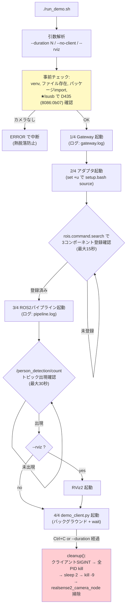

**実装詳細**:

| 要素 | 行 | 実装内容 |
|---|---|---|
| `set -euo pipefail` | 21行目 | 厳密モード。ただしROS2 `setup.bash` とは非互換のため source 周辺のみ `set +u` で緩和（後述） |
| 引数解析 | 35〜51行目 | whileループで `--duration N`（値を次引数として受け取る）、`--duration=N`、裸の数値、`--no-client`、`--rviz` を処理 |
| 事前チェック | 56〜74行目 | venv Python、各ファイル存在、`import openrois_core, openrois_components.realsense`、**`lsusb` で D435 存在確認**（なければ熱脱落の可能性を示すメッセージと共に中断） |
| `cleanup()` | 84〜103行目 | `CLEANED_UP` ガードで二重実行防止。`CLIENT_PID` にSIGINT → `PIDS` を kill → 2秒待ち → kill -9 → `pkill -9 -f realsense2_camera_node`（カメラドライバ残存掃除） |
| trap | 104〜105行目 | `trap cleanup EXIT` と `trap 'cleanup; exit 130' INT TERM` を分離（EXITとINTの併記による二重実行を回避） |
| Gateway起動 | 108〜112行目 | サブシェルで `gateway.py` を起動しログを `gateway.log` へ |
| アダプタ起動 | 114〜125行目 | **`set +u` → `source /opt/ros/jazzy/setup.bash` → `set -u`**（`AMENT_TRACE_SETUP_FILES` 未定義変数参照で `set -u` 下では異常終了するため）。ログは `adapter.log` へ |
| 登録待ち | 128〜145行目 | heredoc で `rois.command.search` を送り `realsense-1/PersonDetection` が現れるまで0.5秒×30回待機 |
| パイプライン起動 | 147〜156行目 | `run_perception.sh ros2 launch perception_bringup ...` を起動。ログは `pipeline.log` へ（ターミナルがノイズで埋まるのを防止） |
| トピック待ち | 159〜167行目 | `ros2 topic list` に `/person_detection/count` が現れるまで0.5秒×60回待機（モデルロード・カメラ起動を吸収） |
| クライアント起動 | 181〜189行目 | `demo_client.py` を**バックグラウンド起動して `CLIENT_PID` を記録 → `wait`**。Ctrl+C が trap に確実に届く構造 |

### 3.8 `examples/realsense-adapter/openrois-profile.yaml.example`（新規）

```yaml
engine:
  id: realsense-1
  platform: realsense
  gateway_url: "ws://127.0.0.1:8765"

components:
  PersonDetection:
    ros2_node_name: openrois_realsense
    person_count_topic: /person_detection/count
  PersonLocalization:
    ros2_node_name: openrois_realsense
    person_tracks_topic: /person_tracks
    person_tracks_frame: camera_color_optical_frame
    person_position_frame: camera_link
  PersonIdentification:
    ros2_node_name: openrois_realsense
    person_tracks_topic: /person_tracks
```

`component_config()` が `components.<ref>` セクションを各コンポーネントの `config` にマージするため、トピック名・TFフレーム名はすべてこのYAMLから注入される。

---

## 4. コード変更詳細 — 既存ファイルへの修正

### 4.1 `interfaces/python/src/openrois/interfaces/components/__init__.py`（修正）

**変更**: `person_identification` と `person_localization` からの import を追加（22〜33行目）、`__all__` に6シンボルを追記（53〜61行目）。

```python
from openrois.interfaces.components.person_identification import (
    PERSON_IDENTIFICATION_URN,
    PersonIdentifiedEvent,
    PersonIdentificationStatusResult,
    PersonIdentifier,
)
from openrois.interfaces.components.person_localization import (
    PERSON_LOCALIZATION_URN,
    PersonLocalizedEvent,
    PersonLocalizationStatusResult,
    PersonPosition,
)
```

### 4.2 `interfaces/python/scripts/export_schema.py`（修正）

**変更**: 3箇所。

1. import 追加（57〜66行目）: `PersonIdentifiedEvent`、`PersonIdentificationStatusResult`、`PersonIdentifier`、`PersonLocalizedEvent`、`PersonLocalizationStatusResult`、`PersonPosition`
2. `MODELS` リスト追記（137〜144行目）: 上記6モデルを `# components/person_identification`、`# components/person_localization` のコメント付きで追加
3. `MODULE_MAP` 追記（214〜218行目）: 6モデルを `components/person-identification`、`components/person-localization` モジュールにマッピング（manifest.json 生成用）

### 4.3 `interfaces/python/tests/test_schema_drift.py`（修正）

**変更**: export_schema.py と同一構造の追記。import（51〜58行目）と `MODELS` リスト（130〜136行目）。これにより CI の drift test が新しい6モデルのスキーマファイル存在と内容の一致を強制する。

### 4.4 `interfaces/schema/*.schema.json`（再生成）

`export_schema.py` 実行により51ファイルを再生成。新規6ファイル: `PersonLocalizedEvent`、`PersonLocalizationStatusResult`、`PersonPosition`、`PersonIdentifiedEvent`、`PersonIdentificationStatusResult`、`PersonIdentifier` の各 `.schema.json`。`manifest.json` の `modules` に `components/person-localization`、`components/person-identification` が追加された。

### 4.5 `components/core/openrois_components_core/results.py`（修正）

**変更**: ファイル末尾（`current_grasped_object` の後）に3ヘルパーを追加。

| ヘルパー | 行 | 生成する Result |
|---|---|---|
| `person_detected(timestamp, number)` | 263行目 | `timestamp`（DateTime）、`number`（int）の2件 |
| `person_localized(timestamp, positions)` | 281行目 | `timestamp`（DateTime）、`number`（int、`len(positions)`）、`positions`（`PersonPosition[]`、JSONエンコード）の3件 |
| `person_identified(timestamp, identifiers)` | 312行目 | `timestamp`（DateTime）、`number`（int、`len(identifiers)`）、`identifiers`（`PersonIdentifier[]`、JSONエンコード）の3件 |

`positions` / `identifiers` は `json.dumps(..., ensure_ascii=False)` でシリアライズする。RoIS の `Result` は `value: str` のため、配列はJSON文字列として運ばれる（クライアント側で `json.loads` する契約）。

### 4.6 `core/src/openrois_core/engine.py`（修正）— バグ1・6対応

**変更1: `SubEngine.discover()` の新規実装**（602〜641行目）

`WsServer` がアダプタ接続時に呼ぶが、**メソッド自体が存在しなかった**（`AttributeError` で接続が即座に閉じられ、アダプタが無限再接続する状態だった）。TypeScript版 `SubEngine.discover()` を参考に、`rois.system.get_profile` を送信して応答から engine_id・platform・コンポーネント一覧を取得する実装を追加した:

```python
async def discover(self, condition: str = "") -> dict[str, Any]:
    result = await self.send_request("rois.system.get_profile", {
        "condition": condition,
    })
    profile = result.get("profile", {}) or {}
    identifier = profile.get("identifier", {}) or {}
    self.engine_id = str(identifier.get("code", ""))
    self.platform = str(identifier.get("authority", ""))
    self.components = [
        {
            "ref": str(c.get("name", c.get("identifier", {}).get("code", ""))),
            "function": c.get("function"),
            "queries": [q.get("name", "") for q in c.get("query_profiles", [])],
            "commands": [cmd.get("name", "") for cmd in c.get("command_profiles", [])],
            "events": [e.get("name", "") for e in c.get("event_profiles", [])],
            "parameters": c.get("parameter_profiles", []),
        }
        for c in profile.get("component_profiles", [])
    ]
    return {
        "return_code": result.get("return_code", ReturnCode.ERROR.value),
        "component_ref_list": [str(cid) for cid in profile.get("component_ids", [])],
    }
```

アダプタ側 `Engine._handle_get_profile()` は `identifier.code` に `engine_id`（`realsense-1`）を返すため、それを engine_id として読み取る。

**変更2: `SubEngine.remove_event_sink()` の新規追加**（560〜562行目）

```python
def remove_event_sink(self, subscribe_id: str) -> None:
    """Drop the event sink for a subscribe_id (client disconnected)."""
    self._event_sinks.pop(subscribe_id, None)
```

バグ6対応。クライアント切断時に `WsServer` から呼ばれる。

### 4.7 `core/src/openrois_core/ws_server.py`（修正）— バグ2・3・4・6対応

このファイルが最も大きく修正された。変更点は以下の6つ。

**変更1: `_ws_path()` / `_ws_is_open()` ヘルパーの新規追加**（24〜40行目）

```python
def _ws_path(ws: Any) -> str:
    """websockets >= 14 (new asyncio API) exposes the path on
    connection.request.path; the legacy API exposed ws.path."""
    request = getattr(ws, "request", None)
    if request is not None:
        return getattr(request, "path", "/")
    return getattr(ws, "path", "/")

def _ws_is_open(ws: Any) -> bool:
    state = getattr(ws, "state", None)
    if state is not None:
        return getattr(state, "name", "") == "OPEN"
    return not getattr(ws, "closed", False)
```

バグ2対応。venvの websockets は 17.1（新asyncio API）で、旧APIの `ws.path` / `ws.closed` が存在しない。`getattr(ws, "path", "/")` は黙って `"/"` を返すため、`/adapter` への接続が**クライアント接続として誤ルーティング**され、何も起きない状態だった。新旧両APIで動くフォールバック付きヘルパーを導入した。

**変更2: パス判定の置き換え**（115〜116行目）

```python
# 旧: path = getattr(ws, "path", "/")
path = _ws_path(ws)
is_adapter = "/adapter" in path
```

**変更3: discover デッドロックの解消**（123〜201行目）

`_handle_adapter_connection` を以下の構造に書き換えた:

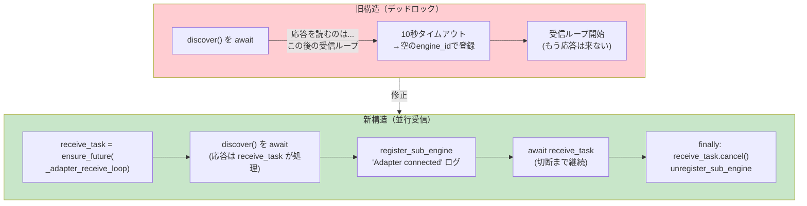

```python
# 受信ループを並行タスクとして先に起動する
receive_task = asyncio.ensure_future(self._adapter_receive_loop(ws, sub_engine))
try:
    await sub_engine.discover()          # 応答は receive_task が並行して処理
    self._sub_engines[ws] = sub_engine
    self._engine.register_sub_engine(...)
    self._notify_profile_changed()
    logger.info("Adapter %s connected with %d components", ...)
    await receive_task                    # 切断までサーブし続ける
except websockets.ConnectionClosed:
    pass
finally:
    receive_task.cancel()
    ...
```

受信ループ本体は新メソッド `_adapter_receive_loop()`（174〜201行目）として切り出した。応答（idあり/methodなし）は `sub_engine.handle_response(msg)`、イベント通知（methodあり/idなし）は `sub_engine.handle_notification(msg)` に振り分ける。

**変更4: イベント中継経路の修正**（196〜200行目）

```python
# 旧: self._relay_event_to_clients(msg.get("params", {}))
if msg["method"] == "rois.event.notify":
    # subscribe時に登録されたEventSink経由で購読クライアントに届ける
    await sub_engine.handle_notification(msg)
```

バグ4対応。旧経路 `_relay_event_to_clients` は `client_subscriptions` 辞書を参照するが、そこには何も登録されないため**イベントが永遠に届かなかった**。正規の経路は subscribe 時に `SubEngine._event_sinks[subscribe_id]` に登録された EventSink（クライアントのWebSocketへプッシュするクロージャ）である。

**変更5: クライアント切断時のシンク解放**（268〜281行目）

`_handle_client_connection` の `finally` ブロックに追加:

```python
for sub_id, subs in list(self._client_subscriptions.items()):
    subs.discard(ws)
    if not subs:
        self._client_subscriptions.pop(sub_id, None)
        # サブエンジン側のシンクも解放（切断済みWSへの送信防止）
        for sub_engine in self._sub_engines.values():
            sub_engine.remove_event_sink(sub_id)
```

バグ6対応。これがないとクライアント切断後もアダプタからのイベントが切断済みWebSocketへの `ws.send()` を試み、`Event sink error` がログに連発する。

**変更6: `ws.closed` 判定の置き換え**（105行目、294行目）

`_notify_profile_changed` と `_relay_event_to_clients` 内の `not ws.closed` を `_ws_is_open(ws)` に置き換え（バグ2の一部）。

---

## 5. openrois コアに発見・修正したバグ（上流PR候補）

疎通確認の過程で、openrois コア（Python側）に6つの問題を発見し、すべて修正した。

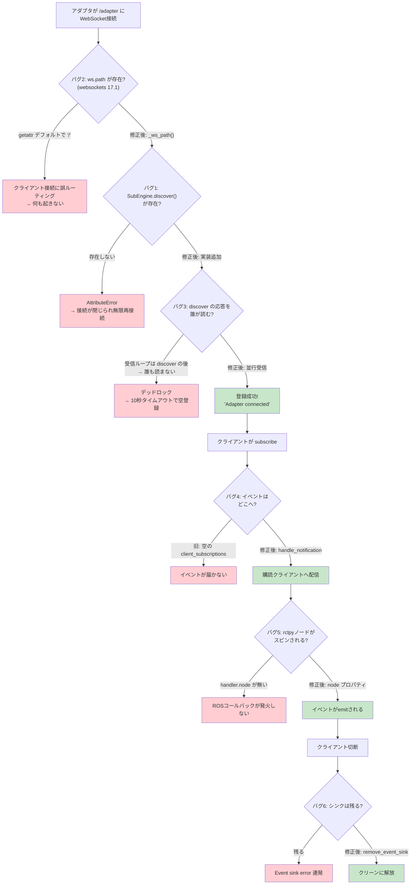

| # | 問題 | 発見の経緯 | 修正 |
|---|---|---|---|
| 1 | `SubEngine.discover()` が未実装（`WsServer` が呼ぶがメソッドが存在しない → `AttributeError`） | Gatewayログに「Adapter connected」が出ず、アダプタが再接続ループ | `rois.system.get_profile` を送り engine_id + コンポーネント一覧を取得する実装を `engine.py` に追加（4.6節） |
| 2 | websockets 17.1 新APIで `ws.path` / `ws.closed` が存在しない（`/adapter` 接続がクライアント接続に誤ルーティングされ、黙って何も起きない） | デバッグログでTEXTフレームの送受信が一切なくping/pongのみ | `_ws_path()`（`ws.request.path` フォールバック付き）と `_ws_is_open()`（`ws.state.name == "OPEN"`）ヘルパーを導入（4.7節変更1・2・6） |
| 3 | discover ハンドシェイクのデッドロック（受信ループが discover() の後でしか開始しないため、discover の応答を誰も読まない） | discover実装後も「Adapter connected」が出ず、10秒待っても空のコンポーネントリスト | 受信ループを `asyncio.ensure_future` で並走させ、応答を並行受信（4.7節変更3） |
| 4 | アダプタからのイベント通知が `SubEngine.handle_notification()`（subscribe時に登録されたEventSink）を経由せず、常に空の `client_subscriptions` を見る古い経路を呼ぶためイベントが届かない | subscribeは成功するのにイベントが1件も届かない | `rois.event.notify` を `handle_notification` 経由に変更（4.7節変更4） |
| 5 | `WsClient.get_rclpy_nodes()` は `handler.node` を参照するが、コンポーネントは `_node` に格納するだけで rclpy ノードがスピンされない（kachaka の既存実装も同じ問題を抱える） | 「Started rclpy spin」ログが出ず、ROSコールバックが発火しない | 3コンポーネントに `node` プロパティを追加（3.3節） |
| 6 | クライアント切断後も `SubEngine._event_sinks` に購読が残り、切断済みWebSocketへの送信で `Event sink error` がログに連発する | デモ終了時にGatewayログにエラーが3行連発 | `SubEngine.remove_event_sink()` を追加し、クライアント切断時に呼ぶ（4.6節変更2、4.7節変更5） |

さらにデモスクリプト開発で2つの環境固有の問題を修正した:

| # | 問題 | 修正 |
|---|---|---|
| 7 | bash の `set -u` が ROS2 `setup.bash` と非互換（`AMENT_TRACE_SETUP_FILES` 未定義変数参照で異常終了）し、アダプタが起動しない | `run_demo.sh` 内で source 周辺のみ `set +u` で緩和（3.7節） |
| 8 | RealSense D435 が連続運転・短時間の連続再起動で加熱しUSBバスから脱落する（`lsusb` から消え、`/dev/video*` も消える） | `run_demo.sh` 起動時に `lsusb` で D435（`8086:0b07`）を確認し、なければパイプラインを起動する前に中断（3.7節事前チェック） |

なお TypeScript版Gateway（`gateway/`）にも `subEngine.discoverProfile()` が未定義という同種のバグ（`ws-server.ts:114` が呼ぶが `sub-engine.ts` に定義なし）があるが、今回は Python Gateway で回避したため未修正。

---

## 6. 疎通確認結果（実測）

### 配線確認（ROS2パイプライン停止状態）

| 操作 | 結果 |
|---|---|
| `rois.command.search` | `OK` — `realsense-1/PersonDetection`, `realsense-1/PersonLocalization`, `realsense-1/PersonIdentification` |
| `rois.system.get_profile` | `OK` — 3コンポーネント、`function: sensing`、イベント3種が公開 |
| `rois.command.bind` | `OK` |
| `rois.command.execute`（start） | `OK` |
| `rois.query.query`（component_status） | `OK` — `value: 1`（READY） |
| `rois.event.subscribe` | `OK` — subscribe_id 発行 |

### イベント受信確認（ROS2パイプライン起動状態）

- 3イベント（`person_detected` / `person_localized` / `person_identified`）とも **10秒間に123回（約12Hz）** 受信 — 仕様書の実測値（~12Hz、`max_fps=15.0` の上限内）と一致
- 再検証でも **5秒間に54回（約11Hz）**、**12秒間で3イベント合計1336回** を確認
- 人物不在時は `number: 0`、`positions: []`、`identifiers: []`（正常動作）
- あわせて `/segmentation/mask`（FastSAM）が **約5.8Hz**、マスク数32で配信されていることを確認

### 一括起動デモ（2026-09-11、ユーザー実機で確認）

`./run_demo.sh --rviz` が正常動作することを確認（Ctrl+C による終了コード130は正常終了）。人数・3D位置・追跡IDのライブ表示と、RViz2による `/segmentation/mask` の可視化が同時に動作した。

---

## 7. RoIS を使った Segmentation デモの実行方法

`fastsam_segmentation` パッケージ（FastSAM segment-everything）は ROS2 側で `/segmentation/mask`（`sensor_msgs/Image`、カラーコードされたマスク重ね合わせ画像）と `/segmentation/count`（`std_msgs/Int32`）を配信している。RoIS 経由で人数を取得しつつ、マスク画像を RViz2 で可視化するデモを以下の手順で実行する。

### 7.1 事前準備（一度だけ）

```bash
# OpenRoIS パッケージを venv にインストール（未実施の場合）
cd ~/openrois
~/ros2_ws/.venv/bin/pip install -e interfaces/python -e core -e components/core -e components/realsense

# アダプタのプロファイルをコピー（未実施の場合、run_demo.sh が自動作成もする）
cd ~/openrois/examples/realsense-adapter
cp openrois-profile.yaml.example openrois-profile.yaml
```

### 7.2 起動手順（一括起動スクリプト — 推奨）

`examples/realsense-adapter/run_demo.sh` が Gateway・アダプタ・ROS2パイプライン・クライアントデモを一括起動し、終了時にすべて停止する（カメラドライバの残存掃除も自動実行）:

```bash
cd ~/openrois/examples/realsense-adapter
./run_demo.sh                 # Ctrl+C でクライアント終了 → 全停止
./run_demo.sh --duration 30   # 30秒で自動終了
./run_demo.sh --rviz          # RViz2（/segmentation/mask可視化）も起動
./run_demo.sh --no-client     # バックグラウンドサービスのみ
```

スクリプトは起動順序を自動制御する（3.7節のフロー図参照）: Gateway起動 → アダプタ起動 → **登録完了を `rois.command.search` で確認**（最大15秒待機）→ パイプライン起動 → **`/person_detection/count` トピック出現を確認**（最大30秒待機）→ クライアントデモ開始。クライアントは人数・3D位置・追跡IDをライブ表示し、10秒ごとにイベントレートを報告する。

**注意**: RealSense D435 は連続運転で加熱しUSBバスから脱落することがある。スクリプトは起動時に `lsusb` でカメラを確認し、なければ中断する。連続実行の間は数分の冷却時間を空けること。

### 7.3 起動手順（手動、1プロセス1ターミナル）

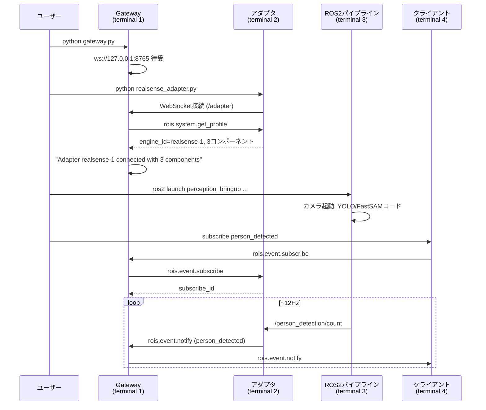

**Terminal 1 — Gateway:**

```bash
cd ~/openrois/examples/gateway
~/ros2_ws/.venv/bin/python gateway.py --host 127.0.0.1 --port 8765
# → "OpenRoIS Gateway ready on ws://127.0.0.1:8765"
```

**Terminal 2 — アダプタ（ROS2環境をsourceしてから）:**

```bash
cd ~/openrois/examples/realsense-adapter
source /opt/ros/jazzy/setup.bash
~/ros2_ws/.venv/bin/python realsense_adapter.py --config openrois-profile.yaml
# → "Connected to gateway at ws://127.0.0.1:8765"
# Gateway側に "Adapter realsense-1 connected with 3 components" が出ることを確認
```

**Terminal 3 — ROS2 知覚パイプライン（カメラ + YOLO人物検知 + FastSAM segmentation）:**

```bash
~/ros2_ws/run_perception.sh ros2 launch perception_bringup perception_bringup.launch.py
# → realsense2_camera / segmentation_node / person_perception_node が起動
```

**Terminal 4 — RoIS クライアントデモ（人数・3D位置・追跡IDをライブ表示）:**

```bash
~/ros2_ws/.venv/bin/python demo_client.py ws://127.0.0.1:8765
```

`demo_client.py` は探索 → bind → start → subscribe を自動実行し、人数の変化・3D位置（1秒ごと）・追跡ID集合の変化を表示し、10秒ごとにイベントレートを報告する。カメラ前に立つと `number=1`（以上）が表示される。

### 7.4 Segmentation マスクの可視化（RViz2）

RoIS の人数イベントと並行して、FastSAM のマスク画像を RViz2 で表示する:

```bash
# Terminal 5 — RViz2（venv→ROS2の順でsourceするラッパー経由）
~/ros2_ws/run_perception.sh rviz2
```

RViz2 上での設定:

1. **Add → By topic → `/segmentation/mask` → Image** を追加
2. 同様に **`/camera/color/image_raw` → Image** を追加（元画像との見比べ用）
3. Image 表示の **Reliability Policy を `Best Effort`** に変更（カメラ画像はBEST_EFFORT配信のため）
4. カメラ前に立つと、FastSAM が人物を含む全領域をセグメント化したカラーコード済みオーバーレイ画像が ~10Hz で表示される

CLI で確認する場合:

```bash
# マスク数（FastSAMが検出した領域数）
~/ros2_ws/run_perception.sh ros2 topic echo /segmentation/count
# → data: 32 （環境による。人物を含む全領域がセグメント化される）

# 配信レートの確認
~/ros2_ws/run_perception.sh ros2 topic hz /segmentation/mask
# → average rate: 5.8 （max_fps=10.0 の上限内、2026-09-10実測）
```

### 7.5 3イベント同時購読デモ（位置・IDつき）

人数だけでなく、各人物の3D位置（`camera_link` フレーム、メートル）と追跡IDも同時に受信するには、Terminal 4 の subscribe 部分を以下に差し替える:

```python
for i, (ref, ev) in enumerate([
    ('realsense-1/PersonDetection', 'person_detected'),
    ('realsense-1/PersonLocalization', 'person_localized'),
    ('realsense-1/PersonIdentification', 'person_identified'),
]):
    await rpc(f's{i}', 'rois.event.subscribe', {'component_ref': ref, 'event_type': ev})
```

受信側で `positions` / `identifiers` をパースする:

```python
if msg.get('method') == 'rois.event.notify':
    et = msg['params']['event_type']
    results = {r['name']: r['value'] for r in msg['params']['results']}
    if et == 'person_localized':
        positions = json.loads(results['positions'])
        for p in positions:
            print(f"  person id={p['id']} at x={p['x']:.2f} y={p['y']:.2f} z={p['z']:.2f} [m]")
    elif et == 'person_identified':
        ids = json.loads(results['identifiers'])
        print(f"  tracking ids: {[i['id'] for i in ids]}")
```

カメラの前で左右に動いたり、隠れたり再登場したりすると、`person_localized` の座標が変化し、`person_identified` のIDが付け替わる（30フレーム以内の再登場なら同一IDを維持）様子が観察できる。

### 7.6 終了手順

一括起動スクリプトの場合は **Ctrl+C で全プロセスが停止する**（カメラドライバの掃除も自動）。手動起動の場合は各ターミナルで Ctrl+C。カメラデバイスが次回起動時に `VIDIOC_S_FMT` エラーで占有される場合は、残存プロセスを掃除する:

```bash
pkill -9 -f realsense2_camera_node
```

**運用上の注意**: RealSense D435 は連続運転で加熱し、USBバスから脱落することがある（実測: `lsusb` から `8086:0b07` が消え、`/dev/video*` も消滅）。回復には冷却とUSBケーブルの再接続が必要。デモを連続実行する場合は間に数分の冷却時間を空けること。`run_demo.sh` は起動時にカメラを確認し、なければ「冷却して再接続せよ」というメッセージと共に中断する。

---

## 8. 残作業

1. **人物検知時の実データ確認** — カメラ前に人が立った状態で `positions`（3D座標）と `identifiers`（追跡ID）の中身を確認する。経路は完全に動作済み。
2. **TypeScript/C# 型の再生成** — Node.js / .NET SDK 導入後に `npx tsx scripts/generate.ts`（TS）と `dotnet run`（C#）を実行する。JSON Schema は生成済みで drift test 合格のため、生成は機械的に完了する。
3. **ROS2側への軽微な修正提案**（計画書第6章、未実施）:
   - `bbox.size.z` に距離が入っている問題（RViz2での3D表示が伸びる）
   - READMEの実測値（~24Hz）と `max_fps=15.0` の矛盾の解消
   - 位置算出をバウンディングボックス中心の単一depth画素から中央値方式へ変更（ジッタ低減）
4. **TS Gatewayの `discoverProfile()` 未定義バグ** の修正（上流PR候補）
5. **openroisコア修正の上流PR化** — 第5章の6バグ修正（`engine.py`、`ws_server.py`）は openrois 本体に還元すべき内容。

---

## 9. ファイル一覧（本実装で新規作成・修正したもの）

**新規作成:**

| パス | 役割 |
|---|---|
| `interfaces/python/src/openrois/interfaces/components/person_localization.py` | PersonLocalization 型定義（3.1節） |
| `interfaces/python/src/openrois/interfaces/components/person_identification.py` | PersonIdentification 型定義（3.2節） |
| `components/realsense/pyproject.toml` | パッケージ定義（`openrois-components-realsense`） |
| `components/realsense/README.md` | パッケージREADME |
| `components/realsense/openrois_components/realsense/__init__.py` | 3クラスのエクスポート |
| `components/realsense/openrois_components/realsense/person_detection_ros2.py` | Ros2PersonDetection（3.3節） |
| `components/realsense/openrois_components/realsense/person_localization_ros2.py` | Ros2PersonLocalization、TF変換つき（3.3節） |
| `components/realsense/openrois_components/realsense/person_identification_ros2.py` | Ros2PersonIdentification（3.3節） |
| `examples/gateway/gateway.py` | Python 最小Gateway（3.4節） |
| `examples/gateway/README.md` | Gateway README |
| `examples/realsense-adapter/realsense_adapter.py` | アダプタ本体（3.5節） |
| `examples/realsense-adapter/demo_client.py` | RoISクライアントデモ（3.6節） |
| `examples/realsense-adapter/run_demo.sh` | 一括起動スクリプト（3.7節） |
| `examples/realsense-adapter/openrois-profile.yaml.example` | プロファイル雛形（3.8節） |
| `examples/realsense-adapter/README.md` | アダプタREADME |

**修正:**

| パス | 内容 |
|---|---|
| `interfaces/python/.../components/__init__.py` | import / `__all__` 追記（4.1節） |
| `interfaces/python/scripts/export_schema.py` | インベントリ追記（4.2節） |
| `interfaces/python/tests/test_schema_drift.py` | インベントリ追記（4.3節） |
| `interfaces/schema/*.schema.json`（51ファイル）+ `manifest.json` | 再生成（4.4節） |
| `components/core/.../results.py` | 3ヘルパー追加（4.5節） |
| `core/src/openrois_core/engine.py` | `SubEngine.discover()` 追加、`remove_event_sink()` 追加（4.6節） |
| `core/src/openrois_core/ws_server.py` | websockets 17.1対応、デッドロック解消、イベント中継修正、シンク解放（4.7節） |
| `examples/realsense-adapter/README.md` | 一括起動手順の追記 |
| `docs/realsense-adapter-report.md` | 本報告書 |