# OpenRoIS: An Open-Source Middleware for the OMG RoIS Framework 2.0

> **White paper for the R&D community.** This document presents the architecture,
> design decisions, developer experience, wire protocol, and deployment topologies
> of OpenRoIS, an open-source middleware implementing the OMG Robotic Interaction
> Service (RoIS) Framework 2.0. It is written for robotics researchers, HRI
> engineers, and platform integrators evaluating or adopting the RoIS standard.
>
> **Companion documents:**
>
> - [architecture.md](architecture.md) is the engineering design document
>   (how the system is designed, with implementation detail).
> - [rois-reference.md](rois-reference.md) is the OMG RoIS specification summary
>   and reference (what the specification says).
> - [roadmap.md](roadmap.md) is the phase roadmap (what is built and in what
>   order).
>
> **Status:** Alpha, pre-1.0, unstable API. The type pipeline, engine, adapter
> framework, reference components, and client SDKs are built and working against
> a real robot. The recursive core refactor (migration to Python `openrois_core`)
> is the next phase. The OMG RoIS
> Framework is at version 2.0-beta2 and may change.

---

## Table of Contents

1. [Introduction](#1-introduction)
2. [Background: The RoIS Framework](#2-background-the-rois-framework)
3. [Architectural Decisions](#3-architectural-decisions)
4. [The Recursive Engine](#4-the-recursive-engine)
5. [Layered Architecture](#5-layered-architecture)
6. [The Component Contract](#6-the-component-contract)
7. [Interface Type Pipeline](#7-interface-type-pipeline)
8. [Developer Experience: Three SDKs](#8-developer-experience-three-sdks)
9. [The Wire Protocol: JSON-RPC 2.0](#9-the-wire-protocol-json-rpc-20)
10. [Deployment Topologies](#10-deployment-topologies)
11. [Transport Strategy](#11-transport-strategy)
12. [Control Plane vs. Data Plane](#12-control-plane-vs-data-plane)
13. [Security Architecture](#13-security-architecture)
14. [Component Library and Package Management](#14-component-library-and-package-management)
15. [Roadmap and Maturity](#15-roadmap-and-maturity)
16. [Long-Term Vision: Hub and Marketplace](#16-long-term-vision-hub-and-marketplace)
17. [Related Work and Positioning](#17-related-work-and-positioning)
18. [Conclusion](#18-conclusion)

---

## 1. Introduction

Controlling robots from software applications has long suffered from a
fragmentation problem. Each robot platform exposes its own hardware-specific API
(`find face`, `wheel control`, `read battery`). Any hardware change forces an
application rewrite, which kills reusability and slows research transfer from
simulation to deployment.

The OMG Robotic Interaction Service (RoIS) Framework addresses this by defining a
**platform-independent model** for human-robot interaction (HRI) at the **symbolic
level**. Instead of raw sensor data and motor commands, applications exchange
structured messages: "a person was detected", "approach the person", "say this
message". All hardware-specific concerns are hidden behind standardized interfaces.

A specification alone does not drive adoption. Researchers and engineers need a
usable implementation: a clean SDK, reference adapters for real robotics
ecosystems, a gateway that bridges the spec's interfaces to the network, and a
component library that demonstrates the full stack working end to end.

**OpenRoIS** is that implementation. It is an open-source, Apache-2.0 licensed
middleware that implements the OMG RoIS Framework 2.0 and lets service applications
control **physical robots, virtual avatars, and digital agents** over the internet
through a single, paradigm-neutral SDK.

### 1.1 Contributions

This white paper describes the following contributions:

1. A **paradigm-neutral architecture** for RoIS 2.0 that decouples the engine
   and client SDK from any specific middleware through a five-method
   `Component Contract` (section 6).
2. A **recursive engine model** where one `Engine` class is used by both the
   gateway and adapters, eliminating duplicate dispatch implementations across
   languages (section 4).
3. A **single-source-of-truth type pipeline** that authors interfaces as Python
   Pydantic models and generates C# and TypeScript types from a canonical JSON
   Schema, keeping three language stacks consistent without manual
   synchronization (section 7).
4. A **JSON-RPC 2.0 wire protocol** mapping of the five RoIS interfaces over
   WebSocket, with full message examples for every interface operation
   (section 9).
5. Three **client SDKs** (TypeScript for web, C# for Unity, Python for scripting)
   that expose identical behavior regardless of the host paradigm behind the
   gateway (section 8).
6. A **package management boundary** that keeps the engine pure while
   allowing adapters to load component packages from local or remote sources
   (section 14).

### 1.2 Target audience

This document is written for:

- **Robotics researchers** evaluating RoIS 2.0 as a standard for HRI scenarios.
- **HRI engineers** building service applications for robots or avatars.
- **Platform integrators** connecting existing robotics stacks (ROS 2, Unity,
  gRPC services) to a standard interface.
- **Standards participants** interested in how a beta specification translates to a
  working implementation.

---

## 2. Background: The RoIS Framework

### 2.1 What RoIS is

RoIS defines a **platform-independent model (PIM)** of a framework that handles the
messages and data exchanged between HRI service components and service
applications. The central idea: a service application interacts with robots on the
**symbolic level** rather than the **physical level**. Messages carry only symbolic
data. Raw sensor data (image buffers, audio streams) is never carried in RoIS
messages. Symbolic results can be fed directly into conditional logic in a robot
scenario.

RoIS is developed by JARA, ETRI, KAR, and the Object Management Group (OMG). The
current version is **2.0-beta2** (OMG document dtc/2025-09-22). The normative
machine-readable files include IDL/HPP headers, component XML profiles, an
XML-Profiles schema, and an OWL ontology.

### 2.2 Framework structure

The framework is organized in three conceptual layers:

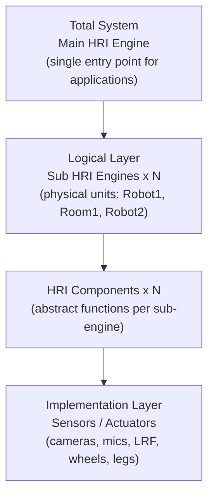
```mermaid
flowchart TB
    Total["Total System<br/>Main HRI Engine<br/>(single entry point for applications)"]
    Logical["Logical Layer<br/>Sub HRI Engines x N<br/>(physical units: Robot1, Room1, Robot2)"]
    Components["HRI Components x N<br/>(abstract functions per sub-engine)"]
    Impl["Implementation Layer<br/>Sensors / Actuators<br/>(cameras, mics, LRF, wheels, legs)"]

    Total --> Logical --> Components --> Impl
```

Key rules from the specification:

- A system may consist of **multiple physical units**. Each is a sub HRI Engine. The
  whole system is the main HRI Engine that contains them.
- The application talks to **only the main HRI Engine**. Selection and switching
  between sub-engines and components happens engine-side and is invisible to the
  application.
- One physical unit can host more than one function, so physical units and
  functional units are defined separately (no one-to-one mapping).

### 2.3 The five interfaces

RoIS exposes one System interface plus three information-exchange interfaces, plus a
Streaming interface layered on the others.

| Interface | Direction and style | Key operations |
|-----------|---------------------|----------------|
| System | Connection management, synchronous | `connect`, `disconnect`, `get_profile`, `get_error_detail` |
| Command | App to Engine, async execution | `search`, `bind`, `bind_any`, `release`, `get_parameter`, `set_parameter`, `execute`, `get_command_result` |
| Query | App to Engine, synchronous | `query` |
| Event | Engine to App, async notifications | `subscribe`, `unsubscribe`, `get_event_detail`, `notify_event` |
| Streaming | Two-way stream control | `connect_stream`, `disconnect_stream`, `suspend_stream`, `resume_stream`, `query_stream_status`, `notify_stream_status` |

### 2.4 Command execution model

Because a component may be shared by multiple applications, command usage follows a
three-step reservation pattern:

1. **Bind**: `search(condition)` returns candidate `component_ref`s, then
   `bind(component_ref)` reserves one. Optionally `get_parameter` / `set_parameter`.
2. **Execute**: `execute(command_unit_list)` sends a command message and returns a
   `command_id` immediately. The operation runs asynchronously. Completion arrives
   via `completed(command_id, status)`. Detailed results via
   `get_command_result(command_id)`.
3. **Release**: `release(component_ref)` frees the component.

The `command_unit_list` can express **sequential and parallel** command operations
through `CommandUnitSequence` containing `CommandMessage` and `ConcurrentCommands`
entries.

### 2.5 What RoIS does not define

RoIS defines messages, not transport. The C++ and CORBA platform-specific models
(PSMs) define method signatures only. RoIS messages can run over CORBA, RTC,
ROS/ROS 2 (DDS), WebSocket, or any transport. Interoperability is scoped to within a
single transport. RoIS also does not define media codecs. Streaming media formats are
out of scope. This separation of message from transport is central to the OpenRoIS
architecture.

---

## 3. Architectural Decisions

OpenRoIS is shaped by a set of deliberate architectural decisions. Each one is
designed to keep the core paradigm-neutral, the SDK simple, and the system
extensible without rewrites.

### 3.1 Paradigm-neutral core

The engine and client SDK never assume hardware, a world model, or any
specific middleware. A single `Component Contract` decouples the engine from ROS 2,
virtual avatars, AI services, or any future paradigm. Adding a new paradigm is
an additive sub-engine, never a rewrite.

This decision is enforced structurally, not by convention. The engine has zero
references to ROS, DDS, gRPC, or any game engine. The same contract test suite runs
against every sub-engine, catching paradigm leakage.

### 3.2 Spec-first, symbolic data only

Every interface traces back to the normative IDL in the OMG machine-readable files
at <https://www.omg.org/spec/RoIS/2.0/Beta2#docs-normative-machine>.
Messages carry only symbolic data ("person detected, count: 2"), never raw sensor
buffers. This keeps the control plane lightweight and lets scenario logic use simple
conditional branching on structured results.

### 3.3 Single source of truth for types

Types flow in one direction:

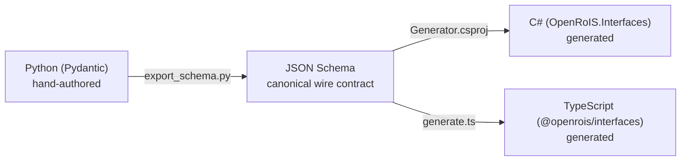
```mermaid
flowchart LR
    A["Python (Pydantic)<br/>hand-authored"] -->|export_schema.py| B["JSON Schema<br/>canonical wire contract"]
    B -->|Generator.csproj| C["C# (OpenRoIS.Interfaces)<br/>generated"]
    B -->|generate.ts| D["TypeScript (@openrois/interfaces)<br/>generated"]
```

Python Pydantic models are the source of truth. JSON Schema is the canonical wire
format. C# and TypeScript types are **generated, never hand-written**, so all three
language stacks stay consistent. A schema-drift test in CI verifies that committed
schemas match Pydantic output. This eliminates an entire class of bugs: type
mismatches between the SDK and the engine.

### 3.4 Transport-appropriate, not transport-uniform

OpenRoIS does not invent a new wire protocol. All middleware boundaries (service
application to gateway, gateway to sub-engine) use WebSocket + JSON-RPC 2.0. Each
sub-engine's internal transport (DDS, gRPC, WebRTC, WHEP/WHIP, RTSP, IPC, or any
other) is chosen by the sub-engine based on what its backend requires. The gateway
never knows or cares which transport a sub-engine uses internally. This respects
the spec's separation of message from transport while choosing a concrete, proven
technology for the middleware boundaries.

### 3.5 Recursive engine, not a monolithic gateway

The engine is a recursive unit, not a single process. It is a Python library
(`openrois_core`) that manages components and routes RoIS calls to child engines.
The same `Engine` class is used by both the gateway and the adapter. The difference
is what is populated: the gateway has child engines (sub-engines connected over
WebSocket), the adapter has local components (registered via `ComponentRegistry`).
The gateway composes `Engine` + `WsServer`. The adapter composes `Engine` +
`WsClient` + a backend bridge.

This decision eliminates the duplicate dispatch implementation problem. The
adapter IS an engine (a sub-engine), not a separate kind of process. There is one
`Engine` class, one dispatch implementation. See section 4 for the full model.

**Current state:** a TypeScript engine POC exists and works. Phase 4 of the roadmap
replaces it with the Python `openrois_core` package.

### 3.6 Package management is a process feature, not engine logic

The engine stays pure. It routes, aggregates profiles, tracks binds. It never
installs packages, resolves dependencies, or manages component lifecycle setup.
Package management lives in the `Api` (gateway process) and the
`ComponentRegistry` loader (adapter process). This keeps the engine reusable and
testable in isolation. See section 14 for the package management boundary.

### 3.7 The SDK is the product

Adoption is driven by how easy it is to write a scenario. The SDK is identical
whether the host is a physical robot, a virtual avatar, or a distributed service.
The host paradigm is hidden behind the gateway. A researcher who writes a scenario
against the SDK does not need to know whether the target is a ROS 2 robot or a
Unity avatar. Only the adapter configuration changes.

---

## 4. The Recursive Engine

The core architectural contribution of OpenRoIS is the recursive `Engine` class. The
engine is a recursive unit: it manages local components and routes RoIS calls to
child engines. The same `Engine` class is used by both the gateway and the adapter.
The difference is what is populated, not whether it is an engine.

### 4.1 The engine class

The `Engine` class is a Python library in `openrois_core`. It has:

- A `ComponentRegistry` for local components (populated when acting as a sub-engine).
- A sub-engine registry for child engines (populated when acting as the main engine).
- A bindings map for bind/release tracking (always present).
- A profile aggregator that combines local component profiles and child engine
  profiles.

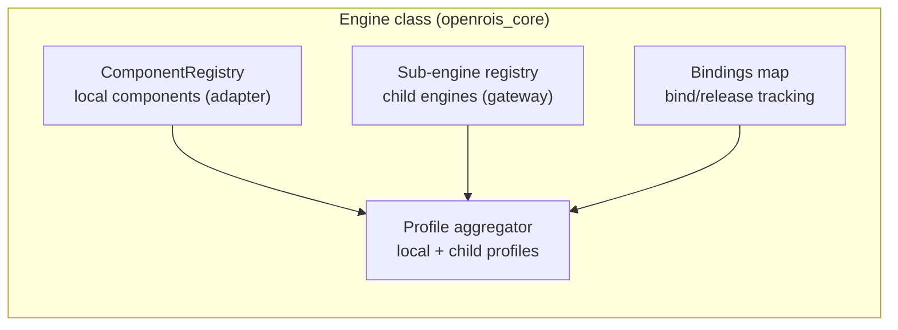
```mermaid
flowchart TB
    subgraph Engine["Engine class (openrois_core)"]
        direction TB
        CR["ComponentRegistry<br/>local components (adapter)"]
        SR["Sub-engine registry<br/>child engines (gateway)"]
        Bind["Bindings map<br/>bind/release tracking"]
        Profile["Profile aggregator<br/>local + child profiles"]
        CR --> Profile
        SR --> Profile
        Bind --> Profile
    end
```

When acting as the **main engine** (gateway), the `ComponentRegistry` is empty and
the sub-engine registry holds child engines connected over WebSocket. When acting
as a **sub-engine** (adapter), the sub-engine registry is empty and the
`ComponentRegistry` holds local components. The design supports nesting (child
engines with their own child engines), but this is not used today.

### 4.2 Processes are compositions

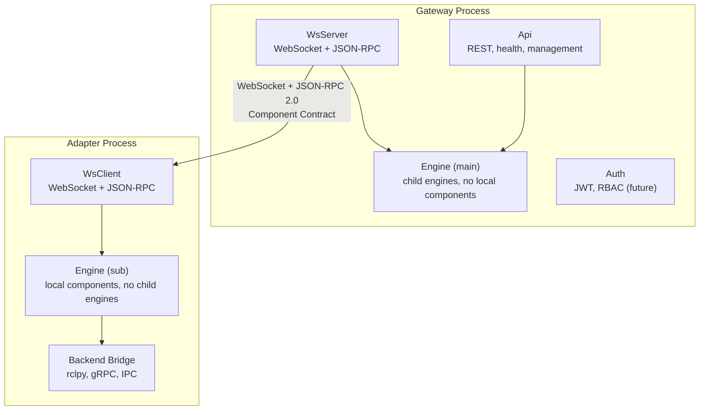
```mermaid
flowchart TB
    subgraph Gateway["Gateway Process"]
        direction TB
        EngineG["Engine (main)<br/>child engines, no local components"]
        WsServer["WsServer<br/>WebSocket + JSON-RPC"]
        Api["Api<br/>REST, health, management"]
        Auth["Auth<br/>JWT, RBAC (future)"]
        WsServer --> EngineG
        Api --> EngineG
    end

    subgraph Adapter["Adapter Process"]
        direction TB
        EngineA["Engine (sub)<br/>local components, no child engines"]
        WsClient["WsClient<br/>WebSocket + JSON-RPC"]
        Backend["Backend Bridge<br/>rclpy, gRPC, IPC"]
        WsClient --> EngineA
        EngineA --> Backend
    end

    WsServer -->|"WebSocket + JSON-RPC 2.0<br/>Component Contract"| WsClient
```

The gateway process composes `Engine` + `WsServer` + `Api` (and future `Auth`,
`Signaling`). The adapter process composes `Engine` + `WsClient` + a backend
bridge (rclpy, gRPC, IPC). Both use the same `Engine` class.

### 4.3 Why this eliminates the duplicate dispatch problem

Before the recursive engine model, the TypeScript `@openrois/engine` and the Python
`AdapterFramework` both implemented RoIS JSON-RPC dispatch logic, in two languages,
with no shared core. The recursive model dissolves this problem:

- One `Engine` class, one dispatch implementation. The gateway uses it with child
  engines. The adapter uses it with local components. Both are engines.
- The `Component Contract` is the generated interface from `interfaces/`. The
  `SubEngine` proxy implements it remotely (forwarding over WebSocket to a child
  engine). The `ComponentRegistry` implements it locally (dispatching to component
  handlers via decorators). The engine calls the contract. It does not know which
  implementation it is calling.
- The adapter IS an engine (a sub-engine), not a separate kind of process. It
  hosts local components and registers with a parent engine. This matches the RoIS
  spec: the Sub HRI Engine is an engine, not a passive backend.

**Current state:** a TypeScript engine POC exists and works. Phase 4 of the roadmap
replaces it with the Python `openrois_core` package using the recursive `Engine`
class.

### 4.4 The adapter as a sub-engine

The adapter process owns three concerns:

1. **Component hosting**: the `ComponentRegistry` imports component packages,
   instantiates components, manages their lifecycle (`connect`/`disconnect`), and
   dispatches RoIS calls to component handlers via decorators (`@component`,
   `@query`, `@invoke`, `@subscribe`).
2. **Gateway connection**: the `WsClient` connects to the gateway over WebSocket,
   registers components via `rois.adapter.register`, and forwards RoIS calls to
   the local `Engine`.
3. **Backend bridge**: the adapter loads a backend (rclpy, gRPC, IPC) based on its
   profile YAML. Each component owns its own connection to its backend, created in
   `connect()` and torn down in `disconnect()`.

The adapter is an engine. It dispatches RoIS calls to its local components. It
does not route calls between sub-engines (its sub-engine registry is empty). It
registers with the parent engine over WebSocket.

---

## 5. Layered Architecture

OpenRoIS is organized in three roles: the service application, the gateway, and
adapters. The gateway is a control-plane router. Adapters are standalone processes
that own their data-plane transport. All middleware boundaries use WebSocket +
JSON-RPC 2.0.

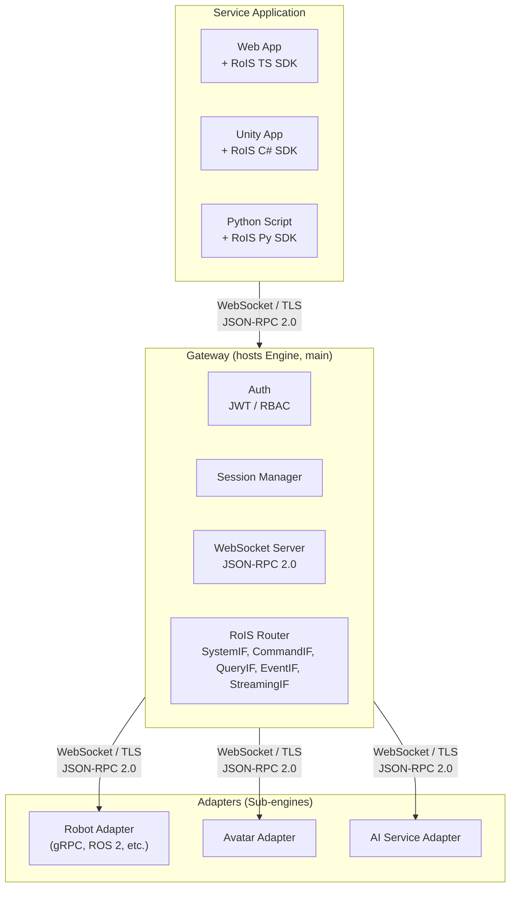
```mermaid
flowchart TB
    subgraph L1["Service Application"]
        direction LR
        WebApp["Web App<br/>+ RoIS TS SDK"]
        UnityApp["Unity App<br/>+ RoIS C# SDK"]
        PyScript["Python Script<br/>+ RoIS Py SDK"]
    end

    subgraph L2["Gateway (hosts Engine, main)"]
        direction LR
        Auth["Auth<br/>JWT / RBAC"]
        Session["Session Manager"]
        WSServer["WebSocket Server<br/>JSON-RPC 2.0"]
        Router["RoIS Router<br/>SystemIF, CommandIF, QueryIF, EventIF, StreamingIF"]
    end

    subgraph L3["Adapters (Sub-engines)"]
        direction LR
        RobotAdapter["Robot Adapter<br/>(gRPC, ROS 2, etc.)"]
        AvatarAdapter["Avatar Adapter"]
        ServiceAdapter["AI Service Adapter"]
    end

    L1 -->|"WebSocket / TLS<br/>JSON-RPC 2.0"| L2
    L2 -->|"WebSocket / TLS<br/>JSON-RPC 2.0"| RobotAdapter
    L2 -->|"WebSocket / TLS<br/>JSON-RPC 2.0"| AvatarAdapter
    L2 -->|"WebSocket / TLS<br/>JSON-RPC 2.0"| ServiceAdapter
```

The spec's "main HRI Engine" maps to the **engine** hosted by the gateway. Each
"sub HRI Engine" maps to an **adapter** (a standalone process hosting the same
`Engine` class with local components, connecting to the gateway via WebSocket).
"HRI Components" map to the components registered by each adapter. The service
application only ever talks to the gateway. The host paradigm is hidden, exactly
as the specification requires.

The engine has zero media imports, zero WebRTC imports, and zero references to
ROS, DDS, gRPC, or any game engine. The control plane is WebSocket + JSON-RPC
2.0, no alternatives. Media and other data-plane traffic flows directly between
the publisher and the consumer, outside the gateway. The engine is a pure
control-plane router when acting as the main engine.

### 5.1 Mapping RoIS concepts to OpenRoIS layers

| RoIS concept | OpenRoIS implementation | Role |
|-------------|------------------------|-------|
| Main HRI Engine | Engine (hosted by the gateway) | Routes to child engines, aggregates profiles |
| Sub HRI Engine | Engine (hosted by an adapter) | Hosts local components, owns data-plane transport |
| HRI Component | Component registered by an adapter | Translation layer: RoIS calls to backend calls |
| Service Application | Client SDK (TypeScript, C#, or Python) | Drives robot scenarios via RoIS interfaces |
| RoIS interfaces (SystemIF, CommandIF, QueryIF, EventIF, StreamingIF) | JSON-RPC 2.0 methods over WebSocket | Service application to gateway boundary (control plane) |
| Component Contract | WebSocket + JSON-RPC 2.0 (gateway-to-adapter boundary) | Gateway to adapter boundary |

### 5.2 Gateway responsibilities

The gateway is the only internet-facing process and the single enforcement point
for security. It:

- Terminates the control-plane transport (WebSocket/TLS) and authenticates every
  connection before any RoIS message is processed.
- Routes JSON-RPC RoIS calls to the appropriate adapter based on component ref.
- Aggregates profiles from all authorized adapters into one `HRI_Engine_Profile`
  returned by `get_profile()`.
- Filters `search()` and `query()` results and guards `bind()` and `execute()`
  per the caller's authorization scope.
- Brokers media descriptor exchange via the RoIS streaming interface, never
  touches media data.

---

## 6. The Component Contract

The `Component Contract` is the contract between the engine and the components it
manages. The engine and SDK depend only on this five-method contract. They never
reference ROS, DDS, gRPC, or a game engine. The `SubEngine` proxy implements it
remotely (forwarding over WebSocket to a child engine). The `ComponentRegistry`
implements it locally (dispatching to component handlers via decorators).

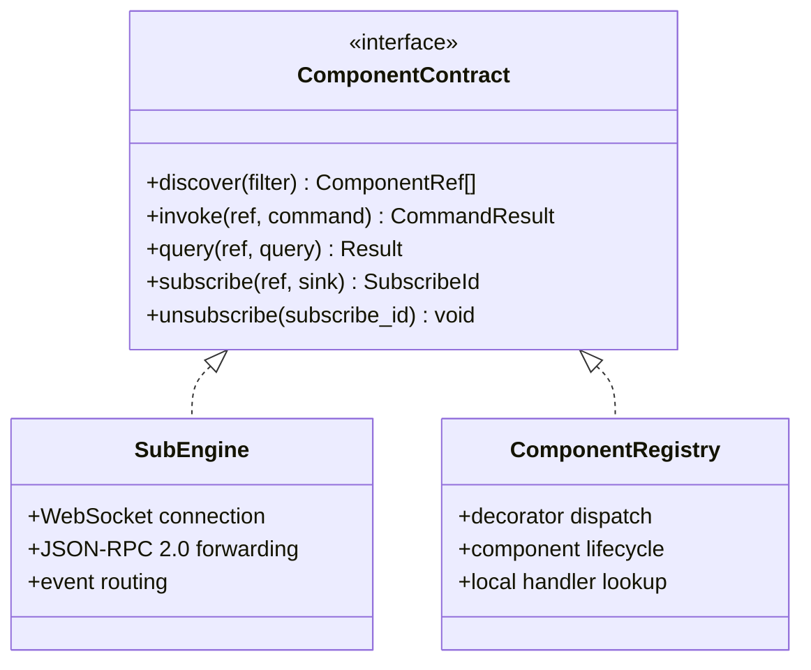
```mermaid
classDiagram
    class ComponentContract {
        <<interface>>
        +discover(filter) ComponentRef[]
        +invoke(ref, command) CommandResult
        +query(ref, query) Result
        +subscribe(ref, sink) SubscribeId
        +unsubscribe(subscribe_id) void
    }

    class SubEngine {
        +WebSocket connection
        +JSON-RPC 2.0 forwarding
        +event routing
    }

    class ComponentRegistry {
        +decorator dispatch
        +component lifecycle
        +local handler lookup
    }

    ComponentContract <|.. SubEngine
    ComponentContract <|.. ComponentRegistry
```

`SubEngine` is the remote implementation: the engine's proxy for a child engine
(an adapter) over WebSocket. `ComponentRegistry` is the local implementation: the
engine's direct dispatch to component handlers via decorators. The engine calls
the contract. It does not know which implementation it is calling.

### 6.1 Method semantics

| Method | Purpose | Example |
|--------|---------|---------|
| `discover` | Find components by condition | Adapter registers components at startup, gateway filters by scope |
| `invoke` | Execute a command (start, stop, execute, set_parameter) | Gateway forwards JSON-RPC to adapter, adapter dispatches to component |
| `query` | Synchronous read (component_status, get_parameter) | Gateway forwards JSON-RPC to adapter, adapter returns result |
| `subscribe` | Async event push (notify_event, notify_stream_status) | Gateway subscribes, adapter pushes events via WebSocket |
| `unsubscribe` | Cancel an event subscription | Gateway forwards unsubscribe, adapter stops pushing |

### 6.2 RoIS operation to Component Contract method mapping

The RoIS interface operations map to Component Contract methods as follows:

- Synchronous operations (`query`, `get_parameter`, `component_status`) map to
  `query`.
- Command and long-running operations (`execute`, `start`, `set_parameter`) map to
  `invoke`.
- Async push operations (`notify_event`, `notify_stream_status`) map to `subscribe`
  plus an event sink.

### 6.3 Why five methods

The contract is deliberately kept to five methods. Adding data-plane-specific knobs
(QoS policies, deadlines, reliability) to the contract would leak paradigm
assumptions into the engine. Instead, QoS, deadlines, and reliability belong
to the data plane of whichever adapter needs them. A ROS 2 adapter needs DDS QoS.
A gRPC adapter does not. Keeping the contract minimal means the engine can
drive a gRPC robot, a ROS 2 robot fleet, a virtual avatar, or a set of AI services
with the same control-plane code path.

Because the engine sees only `Component Contract`, accidental coupling (for example,
baking DDS QoS semantics into the engine) is structurally prevented. The same
contract test suite runs against every adapter, catching paradigm leakage.

### 6.4 Four contracts

OpenRoIS defines four distinct contracts at four boundaries:

1. **Service application to Gateway** (control plane): JSON-RPC 2.0 over WebSocket.
   The service application sends RoIS operations, the gateway routes them to the
   engine.
2. **Gateway to Adapter** (control plane): the `Component Contract` (discover,
   invoke, query, subscribe, unsubscribe) over WebSocket + JSON-RPC. The engine
   forwards calls to the adapter that owns the target component.
3. **Adapter to Component** (control plane): RoIS operations dispatched by the
   `ComponentRegistry` to component handler methods. The framework uses decorators
   (`@component`, `@query`, `@invoke`, `@subscribe`) to route JSON-RPC to the
   right method on the right component instance.
4. **Component to backend** (data plane): the functional implementation. gRPC,
   DDS, IPC, WebRTC, cloud API, or any other transport. This is not a middleware
   boundary. The component owns this connection.

---

## 7. Interface Type Pipeline

The RoIS interfaces are authored once in Python and generated into three language
stacks. This ensures type consistency without manual synchronization.

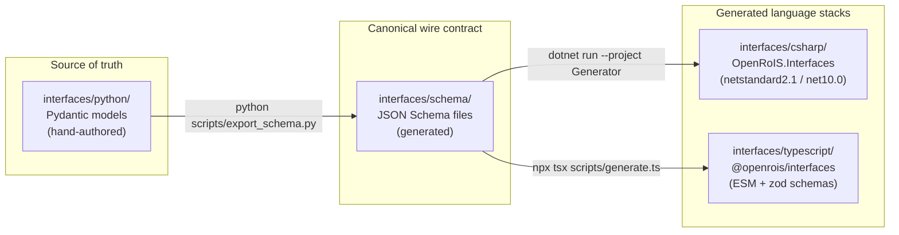
```mermaid
flowchart LR
    subgraph Source["Source of truth"]
        Py["interfaces/python/<br/>Pydantic models<br/>(hand-authored)"]
    end

    subgraph Wire["Canonical wire contract"]
        Schema["interfaces/schema/<br/>JSON Schema files<br/>(generated)"]
    end

    subgraph Generated["Generated language stacks"]
        CS["interfaces/csharp/<br/>OpenRoIS.Interfaces<br/>(netstandard2.1 / net10.0)"]
        TS["interfaces/typescript/<br/>@openrois/interfaces<br/>(ESM + zod schemas)"]
    end

    Py -->|"python scripts/export_schema.py"| Schema
    Schema -->|"dotnet run --project Generator"| CS
    Schema -->|"npx tsx scripts/generate.ts"| TS
```

### 7.1 Pipeline steps

1. **Author** Pydantic models in `interfaces/python/src/openrois/interfaces/`.
2. **Export** to JSON Schema: `cd python && python scripts/export_schema.py`.
3. **Generate** C#: `cd csharp/scripts/Generator && dotnet run -- ../../schema`.
4. **Generate** TypeScript: `cd typescript && npx tsx scripts/generate.ts`.

The pipeline runs in CI on every change to `interfaces/**`. A schema-drift test
verifies that committed JSON Schema files match the current Pydantic output. C# and
TypeScript types are never hand-written.

### 7.2 Packages

| Package | Language | Registry | Status |
|---------|----------|----------|--------|
| `openrois-interfaces` | Python 3.12+ | PyPI | Source of truth (done) |
| `OpenRoIS.Interfaces` | C# (netstandard2.1) | NuGet / UPM | Generated (done) |
| `@openrois/interfaces` | TypeScript (ESM) | npm | Generated (done) |

### 7.3 Typed message pattern

Instead of using the generic `Result(value=str)` for all event payloads, OpenRoIS
defines typed Pydantic models per component. For example, the PersonDetection
component's `person_detected` event is modeled as:

```python
class PersonDetectedEvent(BaseModel):
    timestamp: DateTime = Field(description="Time when measured")
    number: Integer = Field(description="Number of detected persons")
```

This provides compile-time safety in all three language stacks. The generic `Result`
type remains available as a JSON fallback for genuinely dynamic payloads, but the
preferred path is typed messages per component.

### 7.4 Cross-validation

Types are cross-checked against the normative XML profiles
(`PersonDetection.xml`, `Navigation.xml`, `SystemInformation.xml`) and validated
against `XML-Profiles.xsd`. This ensures the generated types agree with the
specification's machine-readable artifacts, not just with each other.

---

## 8. Developer Experience: Three SDKs

OpenRoIS ships three client SDKs, each targeting a different developer audience.
All three expose the same five RoIS interfaces (System, Command, Query, Event,
Streaming) and produce identical behavior regardless of the host paradigm behind the
gateway.

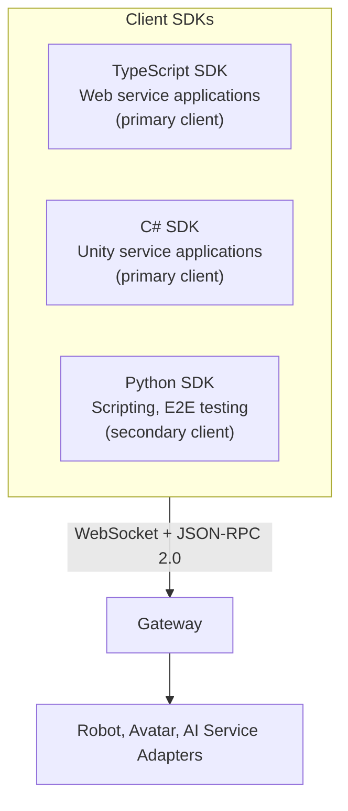
```mermaid
flowchart TB
    subgraph SDKs["Client SDKs"]
        direction LR
        TS["TypeScript SDK<br/>Web service applications<br/>(primary client)"]
        CSharp["C# SDK<br/>Unity service applications<br/>(primary client)"]
        Py["Python SDK<br/>Scripting, E2E testing<br/>(secondary client)"]
    end

    SDKs -->|"WebSocket + JSON-RPC 2.0"| Gateway["Gateway"]
    Gateway --> Adapters["Robot, Avatar, AI Service Adapters"]
```

### 8.1 TypeScript SDK for web (primary client)

The TypeScript SDK (`@openrois/sdk`) is the primary client SDK for web service
applications. It connects to the gateway over WebSocket using JSON-RPC 2.0, with
auto-reconnect, profile-driven discovery, and typed errors.

```ts
import { RoISClient } from "@openrois/sdk";

const client = await RoISClient.connect("wss://gateway.example.com", {
  token: await getAccessToken(),
});

const components = await client.search();

const status = await client.query("kachaka_01/Navigation", "component_status");

const subId = await client.subscribe("kachaka_01/Navigation", "reached_target");
client.on("rois.event.notify", (event) => {
  console.log("Navigation event:", event);
});

await client.bind("kachaka_01/Navigation");
await client.setParameter("kachaka_01/Navigation", [
  { name: "target_positions", data_type_ref: "string[]", value: '["home"]' },
]);
await client.execute("kachaka_01/Navigation", {
  command_type: "start",
  command_id: `cmd-${Date.now()}`,
  parameters: [],
});

await client.disconnect();
```

Key characteristics:

- TypeScript strict mode, no `any`, no implicit returns.
- Runtime validation via zod schemas imported from `@openrois/interfaces`.
- Dual ESM/CJS output (tsup), browser and Node.js compatible.
- Auto-reconnect with exponential backoff, typed error hierarchy.
- Ships with a mock engine (`examples/mock-engine/`) for testing.

### 8.2 C# SDK for Unity (primary client)

The C# SDK (`OpenRoIS.Sdk` / `org.openrois.sdk`) targets Unity service
applications. It connects to the gateway over WebSocket using JSON-RPC 2.0, with
async connect, auto-reconnect, token handling, and typed errors.

```csharp
var client = await RoISClient.ConnectAsync(
    "wss://gateway.example.com",
    new ConnectOptions { Token = token });

var pd = await client.BindAsync("PersonDetection");
var nav = await client.BindAsync("Navigation");

pd.On("person_detected", e => UpdateCount(e.Number));
await pd.StartAsync();

await nav.ExecuteAsync(new TargetPosition(x: 3.0f, y: 1.5f, theta: 0f));
```

Key characteristics:

- Packaged for Unity via UPM (`org.openrois.sdk`) and NuGet (`OpenRoIS.Sdk`).
- Targets `netstandard2.1` for Unity 6.3+ (Mono) through Unity 6.8 (CoreCLR).
- SDK callbacks are marshaled to the Unity main thread (documented pattern, tested
  in Play Mode).
- Typed component proxies: `client.BindAsync("PersonDetection")` returns a typed
  proxy with `.On(event)` handlers.

### 8.3 Python SDK for scripting (secondary client)

The Python SDK (`openrois-sdk`) mirrors the core API for scripting, automated
testing, and E2E validation. It also includes the `ComponentRegistry` and
`WsClient` for adapter authors.

```python
import asyncio
from openrois.sdk import RoISClient

async def main():
    client = await RoISClient.connect(
        "wss://gateway.example.com",
        token=get_access_token(),
    )

    pd = await client.bind("PersonDetection")
    pd.on("person_detected", lambda e: print(f"{e.number} people"))
    await pd.start()

    nav = await client.bind("Navigation")
    await nav.execute(target_positions=["3.0,1.5,0.0"], time_limit=30)

asyncio.run(main())
```

Key characteristics:

- Built on the same Pydantic types that are the source of truth for the entire
  project, so there is no type bridge needed.
- Used for E2E testing of the gateway and adapters.
- Async-first (asyncio), mirroring the gateway runtime.

### 8.4 SDK interface mapping

All three SDKs mirror the five RoIS interfaces defined in the normative IDL:

| RoIS Interface | SDK client | Key operations |
|----------------|-----------|----------------|
| SystemIF | `SystemClient` | `connect()`, `disconnect()`, `getProfile()`, `getErrorDetail()` |
| CommandIF | `CommandClient` | `search()`, `bind()`, `bindAny()`, `release()`, `getParameter()`, `setParameter()`, `execute()`, `getCommandResult()` |
| QueryIF | `QueryClient` | `query()` |
| EventIF | `EventClient` | `subscribe()`, `unsubscribe()`, `getEventDetail()`, callback: `onNotifyEvent` |
| StreamingIF | `StreamClient` | `connectStream()`, `disconnectStream()`, `suspendStream()`, `resumeStream()`, `queryStreamStatus()` |

The callback surface comes directly from `ServiceApplicationBase` in the
specification: `notify_error`, `completed`, and `notify_event`.

### 8.5 Paradigm transparency

The same SDK calls drive a real ROS 2 robot and a virtual avatar. Only the adapter
behind the gateway changes. This is the core value proposition for researchers: a
scenario written once can be tested against a mock robot, deployed against a real
ROS 2 robot, and reused against a virtual avatar without code changes.

---

## 9. The Wire Protocol: JSON-RPC 2.0

The remote client talks to the gateway over **WebSocket** using **JSON-RPC 2.0** as
the message envelope. Every RoIS interface operation maps to a JSON-RPC method in a
namespaced hierarchy. The gateway processes requests and sends responses, and also
pushes asynchronous notifications (events, command completions, errors) to the client
as JSON-RPC notifications (messages with no `id` field).

### 9.1 Method namespaces

```
rois.system.*     SystemIF:    connect, disconnect, get_profile, get_error_detail
rois.command.*    CommandIF:   search, bind, release, get_parameter, set_parameter, execute, get_command_result
rois.query.*      QueryIF:     query
rois.event.*      EventIF:     subscribe, unsubscribe, get_event_detail
rois.stream.*     Streaming:   connect_stream, disconnect_stream, suspend_stream, resume_stream, query_stream_status
```

Server-to-client push (no `id` field, JSON-RPC notifications):

```
rois.event.notify          notify_event(event_id, event_type, subscribe_id, expire, results)
rois.system.notify_error   notify_error(error_id, error_type)
rois.command.completed     completed(command_id, status)
rois.stream.notify_status  notify_stream_status(stream_id, status)
```

### 9.2 Full method catalog

#### System interface (`rois.system.*`)

| Method | Params | Response |
|--------|--------|----------|
| `rois.system.connect` | `{}` | `{return_code: "OK"}` |
| `rois.system.disconnect` | `{}` | `{return_code: "OK"}` |
| `rois.system.get_profile` | `{condition: string}` | `{return_code, profile: string}` |
| `rois.system.get_error_detail` | `{error_id: string}` | `{return_code, results: Result[]}` |

#### Command interface (`rois.command.*`)

| Method | Params | Response |
|--------|--------|----------|
| `rois.command.search` | `{condition: string}` | `{return_code, component_ref_list: string[]}` |
| `rois.command.bind` | `{component_ref: string}` | `{return_code}` |
| `rois.command.release` | `{component_ref: string}` | `{return_code}` |
| `rois.command.get_parameter` | `{component_ref, parameter_names: string[]}` | `{return_code, parameters: Parameter[]}` |
| `rois.command.set_parameter` | `{component_ref, parameters: Parameter[]}` | `{return_code}` |
| `rois.command.execute` | `{component_ref, command_unit_list: CommandUnitSequence}` | `{return_code, command_id: string}` |
| `rois.command.get_command_result` | `{command_id: string}` | `{return_code, results: Result[]}` |

#### Query interface (`rois.query.*`)

| Method | Params | Response |
|--------|--------|----------|
| `rois.query.query` | `{component_ref, query_type: string, condition: string}` | `{return_code, results: Result[]}` |

#### Event interface (`rois.event.*`)

| Method | Params | Response |
|--------|--------|----------|
| `rois.event.subscribe` | `{component_ref, event_type: string, condition: string}` | `{return_code, subscribe_id: string}` |
| `rois.event.unsubscribe` | `{subscribe_id: string}` | `{return_code}` |
| `rois.event.get_event_detail` | `{event_id: string}` | `{return_code, results: Result[]}` |

#### Streaming interface (`rois.stream.*`)

| Method | Params | Response |
|--------|--------|----------|
| `rois.stream.connect_stream` | `{component_ref, parameters: Parameter[]}` | `{return_code, stream_id: string}` |
| `rois.stream.disconnect_stream` | `{stream_id: string}` | `{return_code}` |
| `rois.stream.suspend_stream` | `{stream_id: string}` | `{return_code}` |
| `rois.stream.resume_stream` | `{stream_id: string}` | `{return_code}` |
| `rois.stream.query_stream_status` | `{stream_id: string}` | `{return_code, status: StreamStatus}` |

### 9.3 Core data types on the wire

All payloads use the types generated from the canonical JSON Schema. The key
structures:

**Result** (returned by `query`, `get_command_result`, `get_event_detail`):

```json
{
  "name": "number",
  "data_type_ref": "int",
  "value": "2"
}
```

**Parameter** (sent by `set_parameter`, returned by `get_parameter`):

```json
{
  "name": "target_positions",
  "data_type_ref": "string[]",
  "value": "[\"3.0,1.5,0.0\"]"
}
```

**CommandUnit** (element of a `CommandUnitSequence`):

```json
{
  "component_ref": "robot-a1/Navigation",
  "command_type": "execute",
  "command_id": "cmd-001",
  "arguments": [
    {"name": "target_positions", "data_type_ref": "string[]", "value": "[\"3.0,1.5,0.0\"]"},
    {"name": "time_limit", "data_type_ref": "int", "value": "30"}
  ]
}
```

**ReturnCode** values: `OK`, `ERROR`, `BAD_PARAMETER`, `UNSUPPORTED`,
`OUT_OF_RESOURCES`, `TIMEOUT`.

**ComponentStatus** values: `UNINITIALIZED`, `READY`, `BUSY`, `WARNING`, `ERROR`.

**CompletedStatus** values: `OK`, `ERROR`, `ABORT`, `OUT_OF_RESOURCES`, `TIMEOUT`.

**StreamStatus** values: `STREAMING_NOT_CONNECTED`, `STREAMING_NOT_RUNNING`,
`STREAMING_RUNNING`, `STREAMING_SUSPENDED`, `STREAMING_RESUMED`.

### 9.4 End-to-end message flow examples

The following examples show the actual JSON-RPC messages exchanged during a
complete service application session: connect, search, bind, subscribe, execute,
receive events, query, and disconnect.

#### Step 1: Connect

Client sends `rois.system.connect` (after WebSocket upgrade with JWT):

```json
{
  "jsonrpc": "2.0",
  "id": 1,
  "method": "rois.system.connect",
  "params": {}
}
```

Gateway responds:

```json
{
  "jsonrpc": "2.0",
  "id": 1,
  "result": {"return_code": "OK"}
}
```

#### Step 2: Search for PersonDetection components

```json
{
  "jsonrpc": "2.0",
  "id": 2,
  "method": "rois.command.search",
  "params": {
    "condition": "component_type='PersonDetection'"
  }
}
```

Gateway responds with matching component references:

```json
{
  "jsonrpc": "2.0",
  "id": 2,
  "result": {
    "return_code": "OK",
    "component_ref_list": ["robot-a1/PersonDetection"]
  }
}
```

#### Step 3: Bind the PersonDetection component

```json
{
  "jsonrpc": "2.0",
  "id": 3,
  "method": "rois.command.bind",
  "params": {
    "component_ref": "robot-a1/PersonDetection"
  }
}
```

```json
{
  "jsonrpc": "2.0",
  "id": 3,
  "result": {"return_code": "OK"}
}
```

#### Step 4: Subscribe to person_detected events

```json
{
  "jsonrpc": "2.0",
  "id": 4,
  "method": "rois.event.subscribe",
  "params": {
    "component_ref": "robot-a1/PersonDetection",
    "event_type": "person_detected",
    "condition": ""
  }
}
```

```json
{
  "jsonrpc": "2.0",
  "id": 4,
  "result": {
    "return_code": "OK",
    "subscribe_id": "sub-abc123"
  }
}
```

#### Step 5: Start the PersonDetection component

```json
{
  "jsonrpc": "2.0",
  "id": 5,
  "method": "rois.command.execute",
  "params": {
    "component_ref": "robot-a1/PersonDetection",
    "command_unit_list": {
      "command_unit_list": [
        {
          "component_ref": "robot-a1/PersonDetection",
          "command_type": "start",
          "command_id": "cmd-start-pd"
        }
      ]
    }
  }
}
```

```json
{
  "jsonrpc": "2.0",
  "id": 5,
  "result": {
    "return_code": "OK",
    "command_id": "cmd-start-pd"
  }
}
```

#### Step 6: Gateway pushes a person_detected event (notification, no id)

```json
{
  "jsonrpc": "2.0",
  "method": "rois.event.notify",
  "params": {
    "event_id": "evt-001",
    "event_type": "person_detected",
    "subscribe_id": "sub-abc123",
    "expire": "2026-06-24T12:01:00Z",
    "results": [
      {"name": "timestamp", "data_type_ref": "DateTime", "value": "2026-06-24T12:00:30Z"},
      {"name": "number", "data_type_ref": "int", "value": "2"}
    ]
  }
}
```

#### Step 7: Bind Navigation and set target position

```json
{
  "jsonrpc": "2.0",
  "id": 6,
  "method": "rois.command.bind",
  "params": {
    "component_ref": "robot-a1/Navigation"
  }
}
```

```json
{
  "jsonrpc": "2.0",
  "id": 6,
  "result": {"return_code": "OK"}
}
```

Set the navigation parameters:

```json
{
  "jsonrpc": "2.0",
  "id": 7,
  "method": "rois.command.set_parameter",
  "params": {
    "component_ref": "robot-a1/Navigation",
    "parameters": [
      {"name": "target_positions", "data_type_ref": "string[]", "value": "[\"3.0,1.5,0.0\"]"},
      {"name": "time_limit", "data_type_ref": "int", "value": "30"},
      {"name": "routing_policy", "data_type_ref": "string", "value": "time"}
    ]
  }
}
```

```json
{
  "jsonrpc": "2.0",
  "id": 7,
  "result": {"return_code": "OK"}
}
```

#### Step 8: Execute the navigation command

```json
{
  "jsonrpc": "2.0",
  "id": 8,
  "method": "rois.command.execute",
  "params": {
    "component_ref": "robot-a1/Navigation",
    "command_unit_list": {
      "command_unit_list": [
        {
          "component_ref": "robot-a1/Navigation",
          "command_type": "execute",
          "command_id": "cmd-nav-001",
          "arguments": [
            {"name": "target_positions", "data_type_ref": "string[]", "value": "[\"3.0,1.5,0.0\"]"},
            {"name": "time_limit", "data_type_ref": "int", "value": "30"}
          ]
        }
      ]
    }
  }
}
```

```json
{
  "jsonrpc": "2.0",
  "id": 8,
  "result": {
    "return_code": "OK",
    "command_id": "cmd-nav-001"
  }
}
```

#### Step 9: Gateway pushes command completion (notification)

```json
{
  "jsonrpc": "2.0",
  "method": "rois.command.completed",
  "params": {
    "command_id": "cmd-nav-001",
    "status": "OK"
  }
}
```

#### Step 10: Gateway pushes reached_target event (notification)

```json
{
  "jsonrpc": "2.0",
  "method": "rois.event.notify",
  "params": {
    "event_id": "evt-002",
    "event_type": "reached_target",
    "subscribe_id": "sub-nav-456",
    "expire": "2026-06-24T12:02:30Z",
    "results": [
      {"name": "target", "data_type_ref": "string", "value": "3.0,1.5,0.0"},
      {"name": "is_final_target", "data_type_ref": "boolean", "value": "true"}
    ]
  }
}
```

#### Step 11: Query robot position (synchronous)

```json
{
  "jsonrpc": "2.0",
  "id": 9,
  "method": "rois.query.query",
  "params": {
    "component_ref": "robot-a1/SystemInformation",
    "query_type": "robot_position",
    "condition": ""
  }
}
```

```json
{
  "jsonrpc": "2.0",
  "id": 9,
  "result": {
    "return_code": "OK",
    "results": [
      {"name": "timestamp", "data_type_ref": "DateTime", "value": "2026-06-24T12:01:15Z"},
      {"name": "robot_ref", "data_type_ref": "string[]", "value": "[\"robot-a1\"]"},
      {"name": "position_data", "data_type_ref": "string[]", "value": "[\"3.0,1.5,0.0\"]"}
    ]
  }
}
```

#### Step 12: Release components and disconnect

```json
{
  "jsonrpc": "2.0",
  "id": 10,
  "method": "rois.command.release",
  "params": {"component_ref": "robot-a1/PersonDetection"}
}
```

```json
{
  "jsonrpc": "2.0",
  "id": 10,
  "result": {"return_code": "OK"}
}
```

```json
{
  "jsonrpc": "2.0",
  "id": 11,
  "method": "rois.system.disconnect",
  "params": {}
}
```

```json
{
  "jsonrpc": "2.0",
  "id": 11,
  "result": {"return_code": "OK"}
}
```

### 9.5 Error handling

Errors use standard JSON-RPC 2.0 error objects with RoIS-specific return codes. The
gateway also pushes asynchronous error notifications via `rois.system.notify_error`.

Example: binding a component outside the caller's scope:

```json
{
  "jsonrpc": "2.0",
  "id": 3,
  "method": "rois.command.bind",
  "params": {"component_ref": "robot-b1/Navigation"}
}
```

```json
{
  "jsonrpc": "2.0",
  "id": 3,
  "error": {
    "code": -32602,
    "message": "RoIS operation failed",
    "data": {"return_code": "UNSUPPORTED"}
  }
}
```

Example: asynchronous error notification pushed by the gateway:

```json
{
  "jsonrpc": "2.0",
  "method": "rois.system.notify_error",
  "params": {
    "error_id": "err-001",
    "error_type": "COMPONENT_NOT_RESPONDING"
  }
}
```

The client can then fetch details with `rois.system.get_error_detail`:

```json
{
  "jsonrpc": "2.0",
  "id": 12,
  "method": "rois.system.get_error_detail",
  "params": {"error_id": "err-001"}
}
```

```json
{
  "jsonrpc": "2.0",
  "id": 12,
  "result": {
    "return_code": "OK",
    "results": [
      {"name": "component_ref", "data_type_ref": "string", "value": "robot-a1/Navigation"},
      {"name": "description", "data_type_ref": "string", "value": "Navigation action timed out after 30s"}
    ]
  }
}
```

### 9.6 Concurrent commands

The `CommandUnitSequence` supports both sequential and concurrent execution. A
`ConcurrentCommands` group wraps multiple `CommandMessage` entries that execute in
parallel:

```json
{
  "jsonrpc": "2.0",
  "id": 13,
  "method": "rois.command.execute",
  "params": {
    "component_ref": "robot-a1/Navigation",
    "command_unit_list": {
      "command_unit_list": [
        {
          "command_message": {
            "component_ref": "robot-a1/PersonDetection",
            "command_type": "start",
            "command_id": "cmd-pd-start"
          }
        },
        {
          "concurrent_commands": {
            "command_list": [
              {
                "component_ref": "robot-a1/Navigation",
                "command_type": "execute",
                "command_id": "cmd-nav-002",
                "arguments": [
                  {"name": "target_positions", "data_type_ref": "string[]", "value": "[\"3.0,1.5,0.0\"]"}
                ]
              },
              {
                "component_ref": "robot-a1/SpeechSynthesis",
                "command_type": "set_parameter",
                "command_id": "cmd-speech-001",
                "arguments": [
                  {"name": "speech_text", "data_type_ref": "string", "value": "Moving to target"}
                ]
              }
            ]
          }
        }
      ]
    }
  }
}
```

In this example, PersonDetection starts first (sequential), then Navigation and
SpeechSynthesis execute concurrently.

### 9.7 Complete session as a sequence diagram

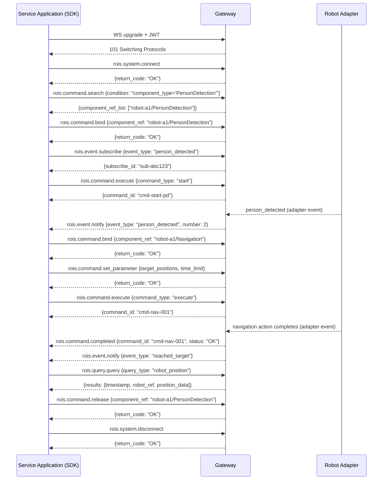
```mermaid
sequenceDiagram
    participant Client as Service Application (SDK)
    participant GW as Gateway
    participant Robot as Robot Adapter

    Client->>GW: WS upgrade + JWT
    GW-->>Client: 101 Switching Protocols

    Client->>GW: rois.system.connect
    GW-->>Client: {return_code: "OK"}

    Client->>GW: rois.command.search {condition: "component_type='PersonDetection'"}
    GW-->>Client: {component_ref_list: ["robot-a1/PersonDetection"]}

    Client->>GW: rois.command.bind {component_ref: "robot-a1/PersonDetection"}
    GW-->>Client: {return_code: "OK"}

    Client->>GW: rois.event.subscribe {event_type: "person_detected"}
    GW-->>Client: {subscribe_id: "sub-abc123"}

    Client->>GW: rois.command.execute {command_type: "start"}
    GW-->>Client: {command_id: "cmd-start-pd"}

    Robot-->>GW: person_detected (adapter event)
    GW-->>Client: rois.event.notify {event_type: "person_detected", number: 2}

    Client->>GW: rois.command.bind {component_ref: "robot-a1/Navigation"}
    GW-->>Client: {return_code: "OK"}

    Client->>GW: rois.command.set_parameter {target_positions, time_limit}
    GW-->>Client: {return_code: "OK"}

    Client->>GW: rois.command.execute {command_type: "execute"}
    GW-->>Client: {command_id: "cmd-nav-001"}

    Robot-->>GW: navigation action completes (adapter event)
    GW-->>Client: rois.command.completed {command_id: "cmd-nav-001", status: "OK"}
    GW-->>Client: rois.event.notify {event_type: "reached_target"}

    Client->>GW: rois.query.query {query_type: "robot_position"}
    GW-->>Client: {results: [timestamp, robot_ref, position_data]}

    Client->>GW: rois.command.release {component_ref: "robot-a1/PersonDetection"}
    GW-->>Client: {return_code: "OK"}

    Client->>GW: rois.system.disconnect
    GW-->>Client: {return_code: "OK"}
```

---

## 10. Deployment Topologies

The control plane is always WebSocket + JSON-RPC 2.0, regardless of topology. Each
adapter's data-plane transport (gRPC, DDS, WebRTC, WHEP/WHIP, RTSP, IPC, or any
other) is an implementation detail of the adapter, not a topology choice. Topologies
differ by **where processes run**: on a single host, across a LAN, across the
internet, or with components offloaded to the cloud.

### 10.1 Topology A: Single host (local)

Everything runs on one machine: the service application, the gateway, the adapter,
and the robot. The service application talks to the gateway over localhost WebSocket.
The adapter connects to the gateway over localhost WebSocket. This is the simplest
deployment, useful for development, testing, and single-robot scenarios where the
robot's onboard computer runs everything.

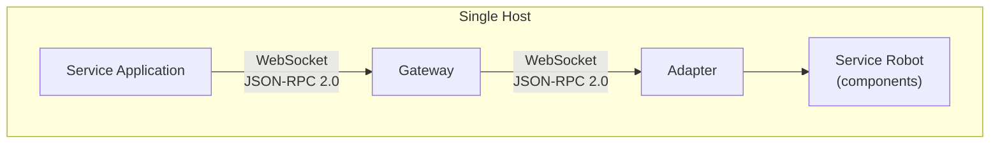
```mermaid
flowchart TB
    subgraph Host["Single Host"]
        App["Service Application"]
        GW["Gateway"]
        Adapter["Adapter"]
        Robot["Service Robot<br/>(components)"]
        App -->|"WebSocket<br/>JSON-RPC 2.0"| GW
        GW -->|"WebSocket<br/>JSON-RPC 2.0"| Adapter
        Adapter --> Robot
    end
```

### 10.2 Topology B: LAN, multiple service robots

The gateway runs on one host. Multiple service robots run on the same LAN, each
with its own adapter. The service application connects to the gateway, which routes
calls to the correct robot's adapter. This is the fleet scenario: one gateway
serves multiple robots on a local network.

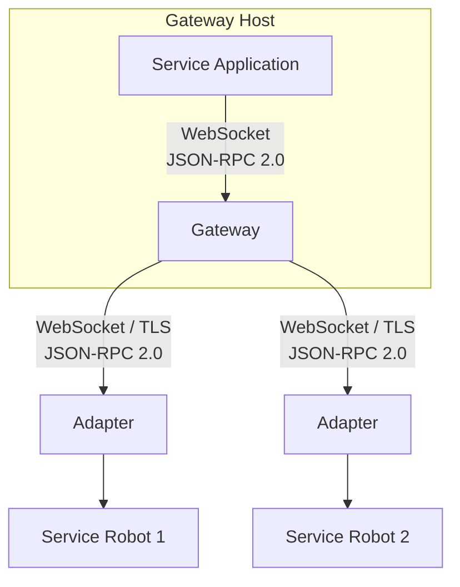
```mermaid
flowchart TB
    subgraph GatewayHost["Gateway Host"]
        App["Service Application"]
        GW["Gateway"]
        App -->|"WebSocket<br/>JSON-RPC 2.0"| GW
    end

    GW -->|"WebSocket / TLS<br/>JSON-RPC 2.0"| Adapter1["Adapter"]
    Adapter1 --> Robot1["Service Robot 1"]

    GW -->|"WebSocket / TLS<br/>JSON-RPC 2.0"| Adapter2["Adapter"]
    Adapter2 --> Robot2["Service Robot 2"]
```

### 10.3 Topology C: Distributed hosts (internet)

The service application runs on a remote host (operator's laptop, cloud service).
The gateway runs on a server or in the cloud. Each service robot runs on its own
host, connecting to the gateway over the internet. This is the full teleoperation
scenario: the operator is in one location, the gateway is in another, and the
robots are in a third.

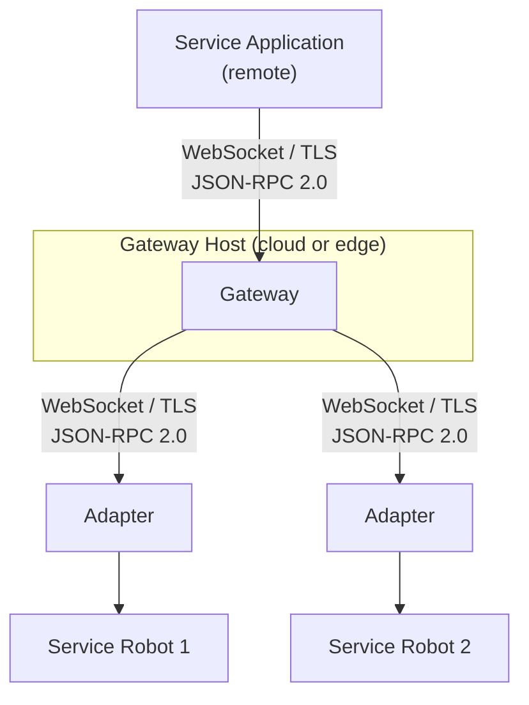
```mermaid
flowchart TB
    App["Service Application<br/>(remote)"]
    App -->|"WebSocket / TLS<br/>JSON-RPC 2.0"| GW

    subgraph Cloud["Gateway Host (cloud or edge)"]
        GW["Gateway"]
    end

    GW -->|"WebSocket / TLS<br/>JSON-RPC 2.0"| Adapter1["Adapter"]
    Adapter1 --> Robot1["Service Robot 1"]

    GW -->|"WebSocket / TLS<br/>JSON-RPC 2.0"| Adapter2["Adapter"]
    Adapter2 --> Robot2["Service Robot 2"]
```

### 10.4 Topology D: Cloud perception (separate adapter)

Perception components (PersonDetection, SpeechRecognition) may need more compute
than the robot has. These run as a **separate adapter process** with its own
profile, connecting to the gateway over WebSocket like any other adapter. The
components run on the adapter (the translation layer) and connect to cloud-based
implementations (GPU inference services, TTS/STT APIs). The gateway is always a
pure router. It never hosts components directly.

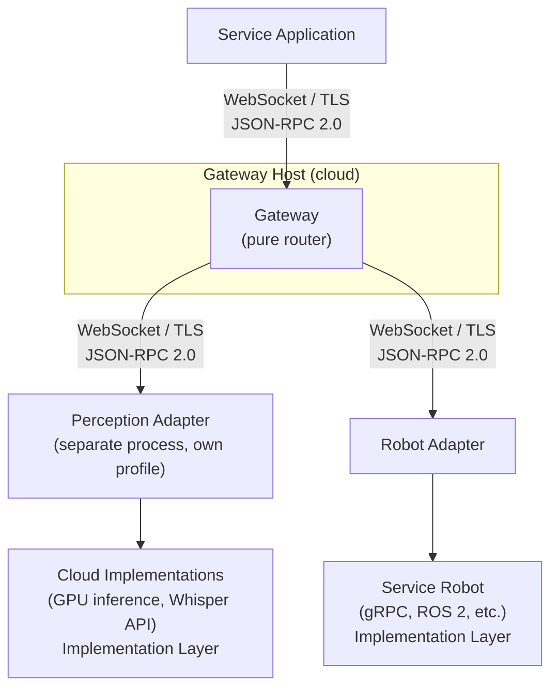
```mermaid
flowchart TB
    App["Service Application"]
    App -->|"WebSocket / TLS<br/>JSON-RPC 2.0"| GW

    subgraph Cloud["Gateway Host (cloud)"]
        GW["Gateway<br/>(pure router)"]
    end

    GW -->|"WebSocket / TLS<br/>JSON-RPC 2.0"| PerceptionAdapter["Perception Adapter<br/>(separate process, own profile)"]
    PerceptionAdapter --> CloudImpl["Cloud Implementations<br/>(GPU inference, Whisper API)<br/>Implementation Layer"]

    GW -->|"WebSocket / TLS<br/>JSON-RPC 2.0"| RobotAdapter["Robot Adapter"]
    RobotAdapter --> Robot["Service Robot<br/>(gRPC, ROS 2, etc.)<br/>Implementation Layer"]
```

The gateway is a pure router in all topologies. Cloud perception is a separate
adapter process, not a `runtime` field in a robot's profile. The service application
does not know or care where a component's implementation lives: `search()` returns
components from all adapters, and `bind()` / `execute()` work identically.

---

## 11. Transport Strategy

OpenRoIS deliberately separates messages from transport, so the right transport is
used at each boundary rather than forcing one everywhere.

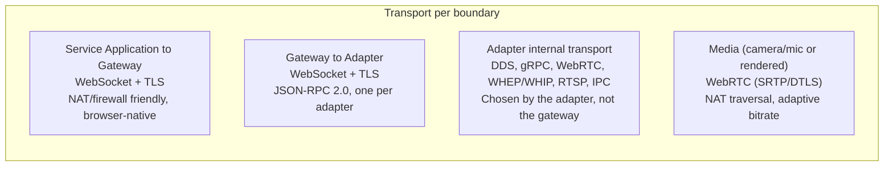
```mermaid
flowchart LR
    subgraph Boundaries["Transport per boundary"]
        direction TB
        B1["Service Application to Gateway<br/>WebSocket + TLS<br/>NAT/firewall friendly, browser-native"]
        B2["Gateway to Adapter<br/>WebSocket + TLS<br/>JSON-RPC 2.0, one per adapter"]
        B3["Adapter internal transport<br/>DDS, gRPC, WebRTC, WHEP/WHIP, RTSP, IPC<br/>Chosen by the adapter, not the gateway"]
        B4["Media (camera/mic or rendered)<br/>WebRTC (SRTP/DTLS)<br/>NAT traversal, adaptive bitrate"]
    end
```

| Boundary | Transport | Rationale |
|----------|-----------|-----------|
| Service Application to Gateway | WebSocket + TLS | NAT/firewall friendly, browser-native, easy auth, async events. Matches the spec's Annex F.2.3 WebSocket example. |
| Gateway to Adapter | WebSocket + TLS | JSON-RPC 2.0, one connection per adapter. The gateway-to-adapter boundary is always the same transport. |
| Adapter internal transport | DDS, gRPC, WebRTC, WHEP/WHIP, RTSP, IPC | Chosen by the adapter based on what its backend requires. The gateway does not know or care. |
| Media (camera/mic or rendered) | WebRTC (SRTP/DTLS) | Built-in NAT traversal (ICE/STUN/TURN), adaptive bitrate, encrypted, browser-native. |

All middleware boundaries use WebSocket + JSON-RPC 2.0. Each adapter's internal
transport (DDS, gRPC, WebRTC, WHEP/WHIP, RTSP, IPC) is chosen by the adapter, not
the gateway. WebSocket solves the remote control boundary. WebRTC solves real-time
media. The gateway never touches media data.

---

## 12. Control Plane vs. Data Plane

RoIS defines only the streaming **control plane**. The media **data plane** is out
of scope, which makes WebRTC a natural fit.

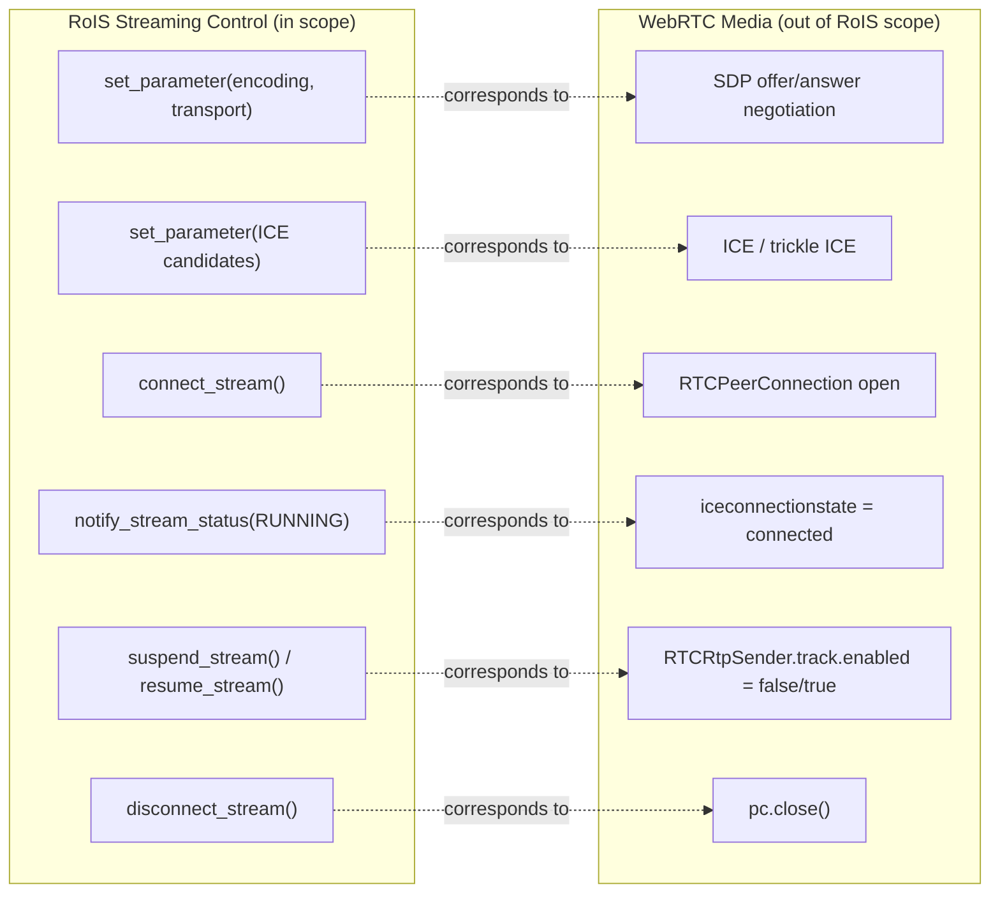
```mermaid
flowchart LR
    subgraph Control["RoIS Streaming Control (in scope)"]
        direction TB
        C1["set_parameter(encoding, transport)"]
        C2["set_parameter(ICE candidates)"]
        C3["connect_stream()"]
        C4["notify_stream_status(RUNNING)"]
        C5["suspend_stream() / resume_stream()"]
        C6["disconnect_stream()"]
    end

    subgraph Data["WebRTC Media (out of RoIS scope)"]
        direction TB
        D1["SDP offer/answer negotiation"]
        D2["ICE / trickle ICE"]
        D3["RTCPeerConnection open"]
        D4["iceconnectionstate = connected"]
        D5["RTCRtpSender.track.enabled = false/true"]
        D6["pc.close()"]
    end

    C1 -.->|"corresponds to"| D1
    C2 -.->|"corresponds to"| D2
    C3 -.->|"corresponds to"| D3
    C4 -.->|"corresponds to"| D4
    C5 -.->|"corresponds to"| D5
    C6 -.->|"corresponds to"| D6
```

WebRTC signaling is handled by the application layer. The gateway brokers media
descriptor exchange via the RoIS streaming interface but never touches media data.

An important distinction the specification preserves: Speech Synthesis is a
**command** component (text to robot speaker locally), not a stream. Audio and Video
Streaming are **stream-control** components (live media robot to operator), using
WebRTC.

### 12.1 P2P vs. SFU

- **Fleet of 1 to 3 robots**: peer-to-peer WebRTC is sufficient.
- **Larger fleets**: route media through a Selective Forwarding Unit (mediasoup,
  LiveKit). The RoIS streaming control interface is identical either way. The SFU is
  an implementation detail of the gateway, not the engine.

---

## 13. Security Architecture

Security is phased. Auth hooks exist in the engine. Full multi-tenant
enforcement is a roadmap phase.

### 13.1 Authentication flow

The specification's `connect()` takes no parameters (it assumes a trusted LAN). For
remote access, OpenRoIS authenticates before any RoIS message is processed, at the
WebSocket upgrade.

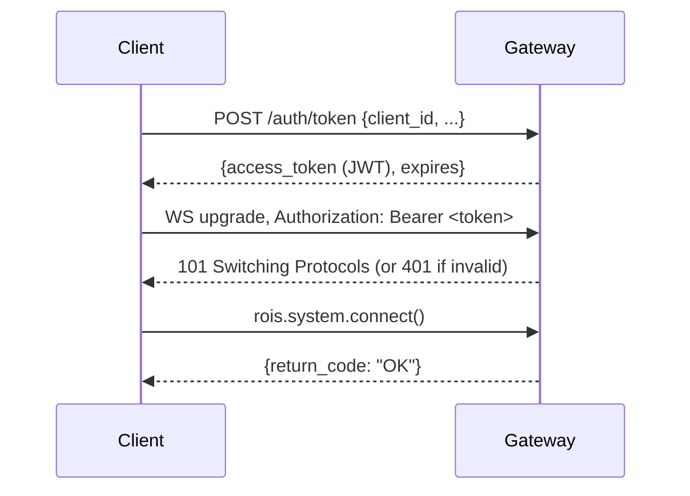
```mermaid
sequenceDiagram
    participant Client
    participant Gateway

    Client->>Gateway: POST /auth/token {client_id, ...}
    Gateway-->>Client: {access_token (JWT), expires}

    Client->>Gateway: WS upgrade, Authorization: Bearer <token>
    Gateway-->>Client: 101 Switching Protocols (or 401 if invalid)

    Client->>Gateway: rois.system.connect()
    Gateway-->>Client: {return_code: "OK"}
```

Example JWT claims used downstream for authorization:

```json
{
  "sub": "operator-alice",
  "roles": ["operator"],
  "fleet_scope": ["warehouse-north", "lab-b"],
  "components": ["person_detection", "navigation", "video_streaming"],
  "iat": 1749500000,
  "exp": 1749503600
}
```

### 13.2 Authorization model (RBAC)

Authorization is enforced per RoIS operation inside the gateway. The spec's
`Condition_t` (an ISO 19143 filter expression) and `component_ref` are the natural
enforcement points.

| Role | Fleet scope | Component scope |
|------|-------------|-----------------|
| admin | all | all |
| operator | assigned | assigned (including actuation) |
| viewer | assigned | detection + streaming only |
| maintenance | assigned | system_information |

### 13.3 Enforcement points

| Interface / operation | Enforcement |
|-----------------------|-------------|
| `connect()` | Verify JWT. Expose only adapters within `fleet_scope`. |
| `search(condition)` | Filter `component_ref_list` to authorized fleet and components. |
| `bind(component_ref)` | Reject refs outside scope. |
| `execute(command_unit_list)` | Validate every `component_ref` in the sequence. |
| `query(query_type, condition)` | Filter results to authorized fleets. |
| `subscribe(event_type, condition)` | Deliver `notify_event` only for authorized sources. |
| `connect_stream()` | Require streaming scope. SFU enforces per-stream ACL. |

Because the gateway filters at `search()`, robots outside a caller's scope are
invisible. The caller cannot discover or address them.

### 13.4 Defense in depth

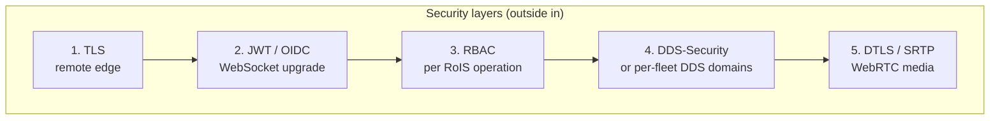
```mermaid
flowchart LR
    subgraph Layers["Security layers (outside in)"]
        direction LR
        L1["1. TLS<br/>remote edge"]
        L2["2. JWT / OIDC<br/>WebSocket upgrade"]
        L3["3. RBAC<br/>per RoIS operation"]
        L4["4. DDS-Security<br/>or per-fleet DDS domains"]
        L5["5. DTLS / SRTP<br/>WebRTC media"]
        L1 --> L2 --> L3 --> L4 --> L5
    end
```

---

## 14. Component Library and Package Management

### 14.1 The 17 basic components

RoIS defines 17 basic HRI components. Every component (except System Information)
shares the `RoIS_Common` interface: `start`, `stop`, `suspend`, `resume`, and
`component_status`. About 70% of components are identical across paradigms. The
perception and speech components run the same ML models whether the input is a robot
camera or a webcam. Only actuation, world model, and stream source differ.

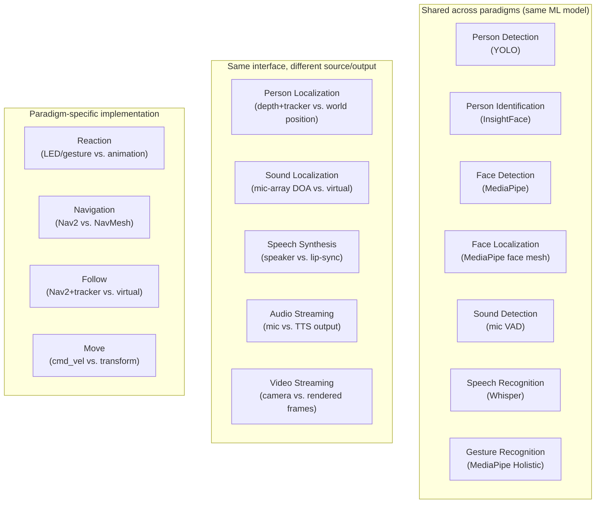
```mermaid
flowchart TB
    subgraph Shared["Shared across paradigms (same ML model)"]
        direction LR
        PD["Person Detection<br/>(YOLO)"]
        PID["Person Identification<br/>(InsightFace)"]
        FD["Face Detection<br/>(MediaPipe)"]
        FL["Face Localization<br/>(MediaPipe face mesh)"]
        SD["Sound Detection<br/>(mic VAD)"]
        SR["Speech Recognition<br/>(Whisper)"]
        GR["Gesture Recognition<br/>(MediaPipe Holistic)"]
    end

    subgraph Diff["Same interface, different source/output"]
        direction LR
        PL["Person Localization<br/>(depth+tracker vs. world position)"]
        SL["Sound Localization<br/>(mic-array DOA vs. virtual)"]
        SS["Speech Synthesis<br/>(speaker vs. lip-sync)"]
        AS["Audio Streaming<br/>(mic vs. TTS output)"]
        VS["Video Streaming<br/>(camera vs. rendered frames)"]
    end

    subgraph Specific["Paradigm-specific implementation"]
        direction LR
        React["Reaction<br/>(LED/gesture vs. animation)"]
        Nav["Navigation<br/>(Nav2 vs. NavMesh)"]
        Follow["Follow<br/>(Nav2+tracker vs. virtual)"]
        Move["Move<br/>(cmd_vel vs. transform)"]
    end
```

| Component | Robot backend | Avatar backend | Shared? |
|-----------|---------------|----------------|---------|
| Person Detection | YOLO on camera | YOLO on webcam | yes |
| Person Localization | depth + tracker | world position | diff coord system |
| Person Identification | InsightFace | InsightFace | yes |
| Face Detection | MediaPipe | MediaPipe | yes |
| Face Localization | MediaPipe face mesh | MediaPipe face mesh | yes |
| Sound Detection | mic VAD | mic VAD | yes |
| Sound Localization | mic-array DOA | mic-array DOA / virtual | diff |
| Speech Recognition | Whisper | Whisper | yes |
| Gesture Recognition | MediaPipe Holistic | MediaPipe Holistic | yes |
| Speech Synthesis | TTS to speaker | TTS to lip-sync | diff output |
| Reaction | LED / gesture | animation / expression | paradigm-specific |
| Navigation | Nav2 (physical) | NavMesh (virtual) | paradigm-specific |
| Follow | Nav2 + tracker | virtual follow | paradigm-specific |
| Move | `cmd_vel` to motors | transform to avatar | paradigm-specific |
| Audio Streaming | mic to WebRTC | TTS output to WebRTC | diff source |
| Video Streaming | camera to WebRTC | rendered frames to WebRTC | diff source |
| System Information | battery, CPU, joints | FPS, memory, avatar state | diff state |

The component's logic is the same across adapters. Only the binding differs.

### 14.2 User-defined and non-canonical components

The spec supports user-defined components beyond the basic 17, reusing
`RoIS_Common` and the profile mechanism (spec section 12). An HRI Component Profile
can include another profile via `sub_component`, so an extended component can reuse
a base component's messages and add new ones.

OpenRoIS uses this mechanism for robot-specific components that are not in the 17
basic components. For example, a `NavigationInformation` component provides
destination lists and map data for a specific robot. It is user-defined,
non-canonical, and valid per the spec.

### 14.3 Component packages and multiple backends

Components are distributed as packages (e.g., `openrois_components.kachaka`). When a
component supports multiple backends (e.g., gRPC and ROS 2), the package ships one
class per backend: `GrpcNavigation` and `Ros2Navigation`. Both are decorated
`@component("Navigation")`. The adapter imports the one it needs. Selection happens
at import time, not at runtime. No factory, no Protocol, no runtime selection.

### 14.4 Package management boundary

The engine stays pure. It routes, aggregates profiles, tracks binds. It never
installs packages, resolves dependencies, or manages component lifecycle setup.
Package management is a process feature:

- The gateway `Api` exposes management endpoints: list installed component
  packages, enable or disable a package for a fleet, configure a package,
  health-check. This is the foundation for the management surface.
- The adapter `ComponentRegistry` loads component packages from a configured source
  (local path, git URL, or a registry endpoint). The adapter imports the package,
  instantiates components, and registers them with the gateway over the
  `Component Contract`. Dependency setup (Python venv, ROS 2 workspace, model
  weights) is the adapter's job, not the engine's.

The exact mechanism is undecided, but the boundary is decided: package management
lives in the `Api` (gateway) and the `ComponentRegistry` loader (adapter), never in
the `Engine`.

---

## 15. Roadmap and Maturity

OpenRoIS is built in phases. Each phase delivers a coherent architectural shift or
a working end-to-end capability. See [roadmap.md](roadmap.md) for the full phase
details, dependency graph, and open decisions.

| Phase | Theme | Exit tag | Status |
|-------|-------|----------|--------|
| 0 | Paradigm-Neutral Interfaces | type pipeline, `Component Contract` | done |
| 1 | Engine and Sub-engine | TypeScript engine POC, `SubEngine` proxy, mock components | done |
| 2 | Adapter Framework and Components | Python `AdapterFramework`, reference components, real robot adapter | done |
| 3 | Client SDKs and MVP | `v0.1.0` | done |
| 4 | Recursive Core Refactor | one `Engine` class in Python `openrois_core`, eliminate duplicate dispatch | todo |
| 5 | Solidify the Core | harden engine, component framework, package management v0 | todo |
| 6 | Gateway Process | compose `Engine` + `WsServer` from `openrois_core` | todo |
| 7 | Adapter Process | compose `Engine` + `WsClient` from `openrois_core` + backend bridge | todo |
| 8 | Real Component and Mixed Paradigm | paradigm-neutrality proof | todo |
| 9 | Auth, Security, Media | parallelizable after Phase 7 | todo |
| 10 | Full Component Library | `v1.0` | todo |
| 11 | Hub and Component Marketplace | post-1.0, adoption-gated | parked |

The **MVP is Phase 3**: the minimum that lets a service application clone, build,
and control a real robot from a web application over WebSocket. The
**paradigm-neutrality proof is Phase 8** (mixed robot and avatar on one gateway).
The **foundation migration trigger fires after Phase 8, before Phase 10**: the
paradigm-neutrality proof is the governance milestone that initiates migration to a
neutral foundation home. The **1.0 release is Phase 10**.

### 15.1 Versioning

- `v0.1.0` (Phase 3): first pre-release. MVP demonstration. Unstable API, breaking
  changes may occur without notice.
- `v0.x` (Phases 4 to 9): incremental pre-releases. Unstable API.
- `v1.0` (Phase 10): first stable release with semantic versioning guarantees.
  All 17 basic components implemented across both paradigms.
- Phase 11: post-1.0. No version tag until the Hub and marketplace are feature
  complete and adoption-gated.

Pre-1.0 releases are Alpha, unstable API. Do not use in production until v1.0.

### 15.2 Current state

The type pipeline, TypeScript engine POC, Python adapter framework, reference
components, and all three client SDKs are built and working. The MVP demonstration
runs against a real robot via gRPC. The recursive core refactor (Phase 4) is the
next step. It migrates the TypeScript engine POC to a Python `openrois_core`
package with a single recursive `Engine` class, eliminating the duplicate dispatch
implementation.

---

## 16. Long-Term Vision: Hub and Marketplace

The Hub and component marketplace are long-term, post-1.0 goals. They build on the
package management mechanism from Phase 5, not on a monolithic engine. They are
parked until the core is solid and has real adoption.

### 16.1 Hub

The Hub is a management web app that connects to the gateway `Api` over WebSocket
and REST. It visualizes adapters, components, status, and fleet health. It is a
consumer of the gateway's management surface, not part of the engine. A
richer commercial Hub (audit trail, OTA, compliance) can be built on top of the open
gateway `Api` later.

### 16.2 Component marketplace

The component marketplace is a registry of certified components. Component vendors
publish to the registry. Adapters deploy packages through the gateway `Api` or
directly. The marketplace is a different source for the adapter's package loader and
a different backend for the gateway `Api`, not new engine logic.

### 16.3 Gating principle

The core must be solid and have real adoption before the Hub and marketplace are
built. They are features on top of the management `Api`, not prerequisites.

---

## 17. Related Work and Positioning

### 17.1 RoIS and other HRI standards

RoIS is not the only standard addressing human-robot interaction. However, it is
unique in defining a **platform-independent model** at the symbolic level, separate
from any transport. Other approaches tend to couple the interface to a specific
middleware (for example, ROS actions, gRPC services, or CORBA operations). RoIS
defines the messages and lets the implementation choose the transport, which is the
property OpenRoIS exploits through the `Component Contract`.

### 17.2 OpenRoIS and ROS 2

ROS 2 is the dominant research robotics middleware and one of the spec's approved
transports. OpenRoIS does not compete with ROS 2. It uses ROS 2 as a data-plane
transport for robot adapters. RoIS operations map to ROS 2 primitives: synchronous
operations to services, long-running operations to actions, async push to topics.
The value OpenRoIS adds is a **standardized symbolic interface** above ROS 2, so
that the same service application can also drive a virtual avatar or a distributed
service without rewriting the scenario logic.

### 17.3 OpenRoIS and Unity

Unity is a primary client platform for service applications. The C# SDK targets
Unity via UPM and runs on both Mono (Unity 6.3+) and CoreCLR (Unity 6.8). The same
SDK also works outside Unity (any .NET runtime). The gateway runs as a separate
process. A Unity application connects to the gateway over WebSocket using the C#
SDK. Adapters run as separate processes on the robot or in the cloud.

### 17.4 Conformance

An implementation claiming RoIS conformance shall:

- Provide the interfaces described in the RoIS specification section 8.2.
- Support the message data structures described in section 8.3 (RoIS Profiles).
- Support the Common Messages of section 8.4 for the basic components it implements
  (it need not implement every basic component).
- Handle component profiles described as XML files and the messages defined therein.

OpenRoIS targets full conformance. The interface types are cross-checked against the
normative XML profiles and validated against `XML-Profiles.xsd` in CI. A conformance
test suite asserts behavior against the spec's interfaces and profiles, run against
every adapter.

---

## 18. Conclusion

OpenRoIS demonstrates that the OMG RoIS Framework 2.0 can be implemented as a
practical, paradigm-neutral middleware with clean developer experience. The key
insight is that the spec's separation of message from transport enables a single
`Component Contract` to decouple the engine from ROS 2, virtual avatars, AI
services, and any future paradigm. Adding a new paradigm is an additive adapter,
never a rewrite.

The recursive engine model uses one `Engine` class for both the gateway and
adapters, eliminating duplicate dispatch implementations across languages. The
single-source-of-truth type pipeline (Python Pydantic to JSON Schema to C# and
TypeScript) keeps three language stacks consistent without manual
synchronization. The JSON-RPC 2.0 wire protocol over WebSocket provides a
browser-native, NAT-friendly control plane with full async event support. The
three SDKs (TypeScript for web, C# for Unity, Python for scripting) expose
identical behavior regardless of the host paradigm behind the
gateway.

The project is in alpha. The type pipeline, engine, adapter framework, reference
components, and client SDKs are built and working. The recursive core refactor
(migration to Python `openrois_core`) is the next phase. Researchers and engineers
evaluating RoIS 2.0 can use OpenRoIS as a reference implementation, contribute
reference components, or build applications against the SDK today.

### 18.1 Getting involved

- **Repository**: [github.com/openrois/openrois](https://github.com/openrois/openrois)
- **License**: Apache-2.0
- **Specification**: [OMG RoIS Framework 2.0](https://www.omg.org/spec/RoIS/2.0/Beta2)
- **Roadmap**: [roadmap.md](roadmap.md)
- **Architecture**: [architecture.md](architecture.md)
- **Specification reference**: [rois-reference.md](rois-reference.md)

Contributions are welcome. The phase roadmap defines clear, parallelizable work
items. Reference components are the natural entry point for new contributors.

---

*OpenRoIS is an open-source middleware for the OMG RoIS Framework 2.0. Control
robots, avatars, and digital agents from one paradigm-neutral SDK. Apache-2.0.
Alpha, pre-1.0, unstable API.*