# OpenRoIS: An Open-Source Middleware for the OMG RoIS Framework 2.0

> **White paper for the R&D community.** This document presents the architecture,
> design decisions, developer experience, wire protocol, and deployment topologies
> of OpenRoIS, an open-source middleware implementing the OMG Robotic Interaction
> Service (RoIS) Framework 2.0. It is written for robotics researchers, HRI
> engineers, and platform integrators evaluating or adopting the RoIS standard.
>
> **Companion documents:**
>
> - [architecture.md](architecture.md) is the engineering design document
>   (how the system is designed, with implementation detail).
> - [rois-reference.md](rois-reference.md) is the OMG RoIS specification summary
>   and reference (what the specification says).
> - [roadmap.md](roadmap.md) is the phase roadmap (what is built and in what
>   order).
> - [openrois.org](https://openrois.org/) hosts the living documentation, including
>   guides and a wire protocol reference with the implementation status of every method.
>
> **Status:** Alpha, pre-1.0, unstable API. The type pipeline with the RoIS method
> catalog, the recursive engine (`openrois-engine`), the gateway process
> (`openrois-gateway`), the component SDK (`openrois-components-core`), reference
> components, and the TypeScript SDK are built, and a Docker Compose stack runs the
> gateway with a simulated robot behind it. The C# client SDK, the Streaming Interface,
> authentication, and media streaming are in progress or planned. This document
> describes the target architecture and marks features that are not implemented yet.

---

## Table of Contents

1. [Introduction](#1-introduction)
2. [Background: The RoIS Framework](#2-background-the-rois-framework)
3. [Architectural Decisions](#3-architectural-decisions)
4. [The Recursive Engine](#4-the-recursive-engine)
5. [Layered Architecture](#5-layered-architecture)
6. [The Component Contract](#6-the-component-contract)
7. [Interface Type Pipeline](#7-interface-type-pipeline)
8. [Developer Experience: Three SDKs](#8-developer-experience-three-sdks)
9. [The Wire Protocol: JSON-RPC 2.0](#9-the-wire-protocol-json-rpc-20)
10. [Deployment Topologies](#10-deployment-topologies)
11. [Transport Strategy](#11-transport-strategy)
12. [Control Plane vs. Data Plane](#12-control-plane-vs-data-plane)
13. [Security Architecture](#13-security-architecture)
14. [Component Library and Package Management](#14-component-library-and-package-management)
15. [Roadmap and Maturity](#15-roadmap-and-maturity)
16. [Long-Term Vision: Hub and Marketplace](#16-long-term-vision-hub-and-marketplace)
17. [Related Work and Positioning](#17-related-work-and-positioning)
18. [Conclusion](#18-conclusion)

---

## 1. Introduction

Controlling robots from software applications has long suffered from a
fragmentation problem. Each robot platform exposes its own hardware-specific API
(`find face`, `wheel control`, `read battery`). Any hardware change forces an
application rewrite, which kills reusability and slows research transfer from
simulation to deployment.

The OMG Robotic Interaction Service (RoIS) Framework addresses this by defining a
**platform-independent model** for human-robot interaction (HRI) at the **symbolic
level**. Instead of raw sensor data and motor commands, applications exchange
structured messages: "a person was detected", "approach the person", "say this
message". All hardware-specific concerns are hidden behind standardized interfaces.

A specification alone does not drive adoption. Researchers and engineers need a
usable implementation: a clean SDK, reference adapters for real robotics
ecosystems, a gateway that bridges the spec's interfaces to the network, and a
component library that demonstrates the full stack working end to end.

**OpenRoIS** is that implementation. It is an open-source, Apache-2.0 licensed
middleware that implements the OMG RoIS Framework 2.0 and lets service applications
control **physical robots, virtual avatars, and AI services** over the internet
through a single, paradigm-neutral SDK.

### 1.1 Contributions

This white paper describes the following contributions:

1. A **paradigm-neutral architecture** for RoIS 2.0. The engine answers the RoIS
   operations and reaches every component through one component contract, which names
   no transport and no robot paradigm (section 6).
2. A **recursive engine model** where one `Engine` class serves the gateway, every
   adapter, and any tier between them, so the RoIS logic exists once (section 4).
3. A **single-source-of-truth type pipeline** that authors interfaces as Python
   Pydantic models and generates C# and TypeScript types from a canonical JSON
   Schema, keeping three language stacks consistent without manual
   synchronization (section 7).
4. A **JSON-RPC 2.0 binding of the RoIS interfaces** over WebSocket: a method catalog
   of 16 methods and 4 notifications named after the IDL, with conditions in a subset
   of CQL2-Text and a small set of documented extensions (section 9).
5. **SDKs for both sides of the system**: client SDKs for web (TypeScript) and
   Unity (C#, in progress) that behave identically regardless of the host paradigm
   behind the gateway, and a Python component SDK in which a component is a class that
   declares the profile of its RoIS component type (section 8).
6. A **package management boundary** that keeps the engine pure while allowing
   adapters to load component packages from local or remote sources (planned,
   section 14).

### 1.2 Target Audience

This document is written for:

- **Robotics researchers** evaluating RoIS 2.0 as a standard for HRI scenarios.
- **HRI engineers** building service applications for robots or avatars.
- **Platform integrators** connecting existing robotics stacks (ROS 2, Unity,
  gRPC services) to a standard interface.
- **Standards participants** interested in how a specification translates to a
  working implementation.

---

## 2. Background: The RoIS Framework

### 2.1 What RoIS Is

RoIS defines a **platform-independent model (PIM)** of a framework that handles the
messages and data exchanged between HRI service components and service
applications. The central idea: a service application interacts with robots on the
**symbolic level** rather than the **physical level**. Messages carry only symbolic
data. Raw sensor data (image buffers, audio streams) is never carried in RoIS
messages. Symbolic results can be fed directly into conditional logic in a robot
scenario.

RoIS is developed by JARA, ETRI, KAR, and the Object Management Group (OMG).
**Version 2.0** was published in June 2026 as OMG document
[formal/26-06-03](https://www.omg.org/spec/RoIS/2.0). The normative
machine-readable files include IDL/HPP headers, component XML profiles, an
XML-Profiles schema, and an OWL ontology.

### 2.2 Framework Structure

The framework is organized in three conceptual layers:

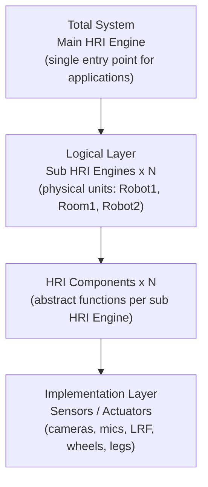
```mermaid
flowchart TB
    Total["Total System<br/>Main HRI Engine<br/>(single entry point for applications)"]
    Logical["Logical Layer<br/>Sub HRI Engines x N<br/>(physical units: Robot1, Room1, Robot2)"]
    Components["HRI Components x N<br/>(abstract functions per sub HRI Engine)"]
    Impl["Implementation Layer<br/>Sensors / Actuators<br/>(cameras, mics, LRF, wheels, legs)"]

    Total --> Logical --> Components --> Impl
```

Key rules from the specification:

- A system may consist of **multiple physical units**. Each is a sub HRI Engine. The
  whole system is the main HRI Engine that contains them.
- The application talks to **only the main HRI Engine**. Selection and switching
  between sub HRI Engines and components happens engine-side and is invisible to the
  application.
- One physical unit can host more than one function, so physical units and
  functional units are defined separately (no one-to-one mapping).

### 2.3 The Five Interfaces

RoIS exposes one System interface plus three information-exchange interfaces, plus a
Streaming interface layered on the others.

| Interface | Direction and style | Key operations |
|-----------|---------------------|----------------|
| System | Connection management, synchronous | `connect`, `disconnect`, `get_profile`, `get_error_detail` |
| Command | App to Engine, async execution | `search`, `bind`, `bind_any`, `release`, `get_parameter`, `set_parameter`, `execute`, `get_command_result` |
| Query | App to Engine, synchronous | `query` |
| Event | Engine to App, async notifications | `subscribe`, `unsubscribe`, `get_event_detail`, `notify_event` |
| Streaming | Two-way stream control | `connect_stream`, `disconnect_stream`, `suspend_stream`, `resume_stream`, `query_stream_status`, `notify_stream_status` |

### 2.4 Command Execution Model

Because a component may be shared by multiple applications, command usage follows a
three-step reservation pattern:

1. **Bind**: `search(condition)` returns candidate `component_ref`s, then
   `bind(component_ref)` reserves one. Optionally `get_parameter` / `set_parameter`.
2. **Execute**: `execute(command_unit_list)` sends a command message and returns a
   `command_id` immediately. The operation runs asynchronously. Completion arrives
   via `completed(command_id, status)`. Detailed results via
   `get_command_result(command_id)`.
3. **Release**: `release(component_ref)` frees the component.

The `command_unit_list` can express **sequential and parallel** command operations
through `CommandUnitSequence` containing `CommandMessage` and `ConcurrentCommands`
entries.

### 2.5 What RoIS Does Not Define

RoIS defines messages, not transport. The C++ and CORBA platform-specific models
(PSMs) define method signatures only. RoIS messages can run over CORBA, RTC,
ROS/ROS 2 (DDS), WebSocket, or any transport. Interoperability is scoped to within a
single transport. RoIS also does not define media codecs. Streaming media formats are
out of scope. This separation of message from transport is central to the OpenRoIS
architecture.

---

## 3. Architectural Decisions

OpenRoIS is shaped by a set of deliberate architectural decisions. Each one is
designed to keep the core paradigm-neutral, the SDK simple, and the system
extensible without rewrites.

### 3.1 Paradigm-Neutral Core

The engine and client SDK never assume hardware, a world model, or any
specific middleware. Inside the engine, one component contract separates what is the
same for every component (selection, bindings, command sequences, id routing) from where
a component lives. ROS 2, virtual avatars, AI services, and any future paradigm stay
inside components. Adding a new paradigm is an additive sub HRI Engine, never a
rewrite.

This decision is enforced structurally, not by convention. The `Engine` class and the
component contract have zero references to ROS, DDS, gRPC, or any game engine, and the
contract takes and returns only the models of the RoIS method catalog. The only ROS-aware
code in the engine package is the optional spinning of rclpy nodes in `WsClient`.

### 3.2 Spec-First, Symbolic Data Only

Every interface traces back to the normative IDL in the OMG machine-readable files
at <https://www.omg.org/spec/RoIS/2.0#docs-normative-machine>.
Messages carry only symbolic data ("person detected, count: 2"), never raw sensor
buffers. This keeps the control plane lightweight and lets scenario logic use simple
conditional branching on structured results.

### 3.3 Single Source of Truth for Types

Types flow in one direction:

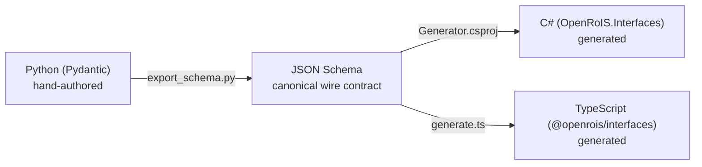
```mermaid
flowchart LR
    A["Python (Pydantic)<br/>hand-authored"] -->|export_schema.py| B["JSON Schema<br/>canonical wire contract"]
    B -->|Generator.csproj| C["C# (OpenRoIS.Interfaces)<br/>generated"]
    B -->|generate.ts| D["TypeScript (@openrois/interfaces)<br/>generated"]
```

Python Pydantic models are the source of truth. JSON Schema is the canonical wire
format. C# and TypeScript types are **generated, never hand-written**, so all three
language stacks stay consistent. A schema-drift test verifies that committed
schemas match Pydantic output. This eliminates an entire class of bugs: type
mismatches between the SDK and the engine.

### 3.4 Transport-Appropriate, Not Transport-Uniform

OpenRoIS does not invent a new wire protocol. All middleware boundaries (service
application to gateway, gateway to sub HRI Engine) use WebSocket + JSON-RPC 2.0. Each
sub HRI Engine's internal transport (DDS, gRPC, WebRTC, WHEP/WHIP, RTSP, IPC, or any
other) is chosen by the sub HRI Engine based on what its backend requires. The gateway
never knows or cares which transport a sub HRI Engine uses internally. This respects
the spec's separation of message from transport while choosing a concrete, proven
technology for the middleware boundaries.

### 3.5 Recursive Engine, Not a Monolithic Gateway

The engine is a recursive unit, not a single process. It is a Python library
(`openrois.engine`) that answers the RoIS operations for the components it hosts and
for those of its child engines. The same `Engine` class is used by both the gateway and
the adapter. The difference is what is populated: the gateway has child engines (sub
HRI Engines connected over WebSocket), the adapter has local components (added with
`Engine.add_component`). The gateway composes `Engine` + `WsServer`. The adapter
composes `Engine` + `WsClient` + its components, each of which owns its connection to
its backend.

This decision eliminates the duplicate dispatch implementation problem. The
adapter IS an engine (a sub HRI Engine), not a separate kind of process. There is one
`Engine` class, one dispatch implementation. See section 4 for the full model.

**Current state:** the `openrois-engine` package implements the recursive `Engine` on
the RoIS method catalog, and the `openrois-gateway` process and the mock adapter run on
it. The earlier TypeScript proof of concept has been removed. Its last version is at tag
`ts-gateway-final`.

### 3.6 Package Management Is a Process Feature, Not Engine Logic

The engine stays pure. It routes, aggregates profiles, tracks binds. It never
installs packages, resolves dependencies, or manages component lifecycle setup.
Package management will live in a management API of the gateway process and a
loader of the adapter process, both planned (roadmap Phase 5). This keeps the engine reusable and
testable in isolation. See section 14 for the package management boundary.

### 3.7 The SDK Is the Product

Adoption is driven by how easy it is to write a scenario. The SDK is identical
whether the host is a physical robot, a virtual avatar, or a distributed service.
The host paradigm is hidden behind the gateway. A researcher who writes a scenario
against the SDK does not need to know whether the target is a ROS 2 robot or a
Unity avatar. Only the adapter behind the gateway changes.

---

## 4. The Recursive Engine

The core architectural contribution of OpenRoIS is the recursive `Engine` class. The
engine answers the RoIS method catalog for the sessions connected to it and reaches every
component through the component contract (section 6), whether the component runs in the
engine's own process or behind a child engine. The same `Engine` class is used by the
gateway, by every adapter, and by any tier between them. The difference is what is
populated, not whether it is an engine.

### 4.1 The Engine Class

The `Engine` class is a Python library in `openrois.engine`. It has:

- `LocalComponents`, the components hosted in the engine's own process (populated when
  acting as a sub HRI Engine).
- One `ChildEngine` per child engine connected over WebSocket (populated when acting as
  the main engine).
- Sessions: each client, or the parent engine of an adapter, reaches the engine through
  a session that holds its bindings and subscriptions.
- A command table and a sequencer, which run `execute` and send every
  `rois.command.completed` to the session that started the command.
- The profile aggregation, which serves the profile of each component and lists every
  child engine as a sub profile.

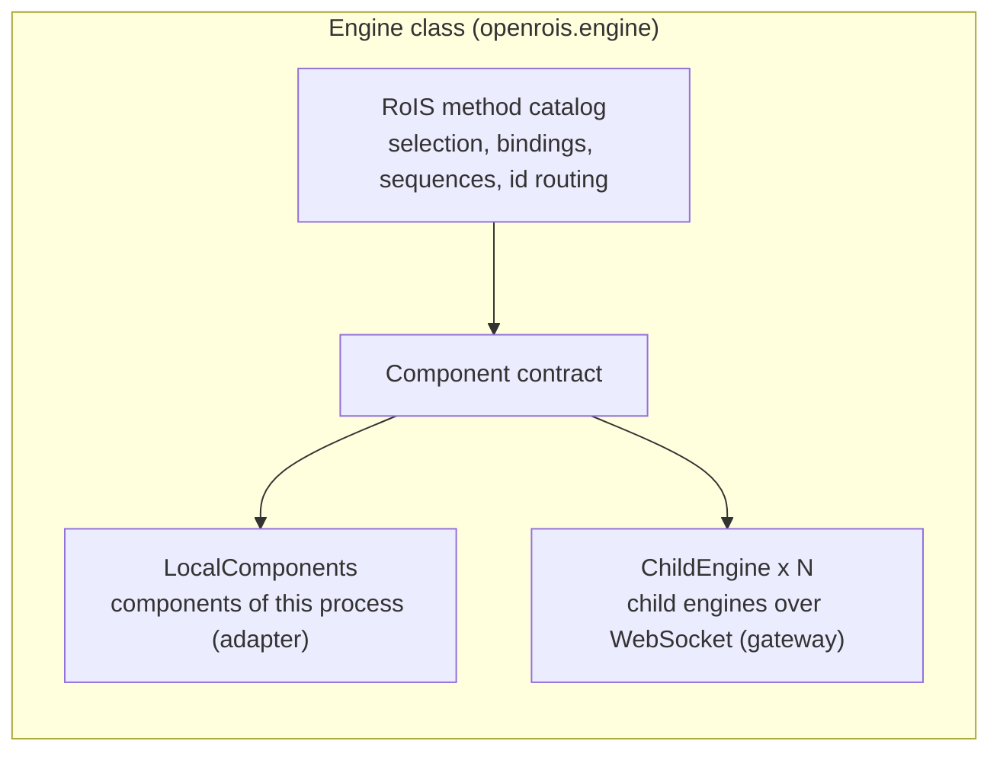
```mermaid
flowchart TB
    subgraph Engine["Engine class (openrois.engine)"]
        direction TB
        Catalog["RoIS method catalog<br/>selection, bindings, sequences, id routing"]
        Contract["Component contract"]
        Local["LocalComponents<br/>components of this process (adapter)"]
        Child["ChildEngine x N<br/>child engines over WebSocket (gateway)"]
        Catalog --> Contract
        Contract --> Local
        Contract --> Child
    end
```

When acting as the **main engine** (gateway), the engine typically holds child engines
connected over WebSocket. It may also host local components (for example, cloud
perception components running in the same process). When acting as a **sub HRI Engine**
(adapter), it typically hosts local components, and it may also have child engines of
its own. Nesting works to any depth: a middle tier is an engine with a `WsServer` for its
child engines and a `WsClient` to its parent, and the engine's test suite runs a gateway
under a gateway.

### 4.2 Processes Are Compositions

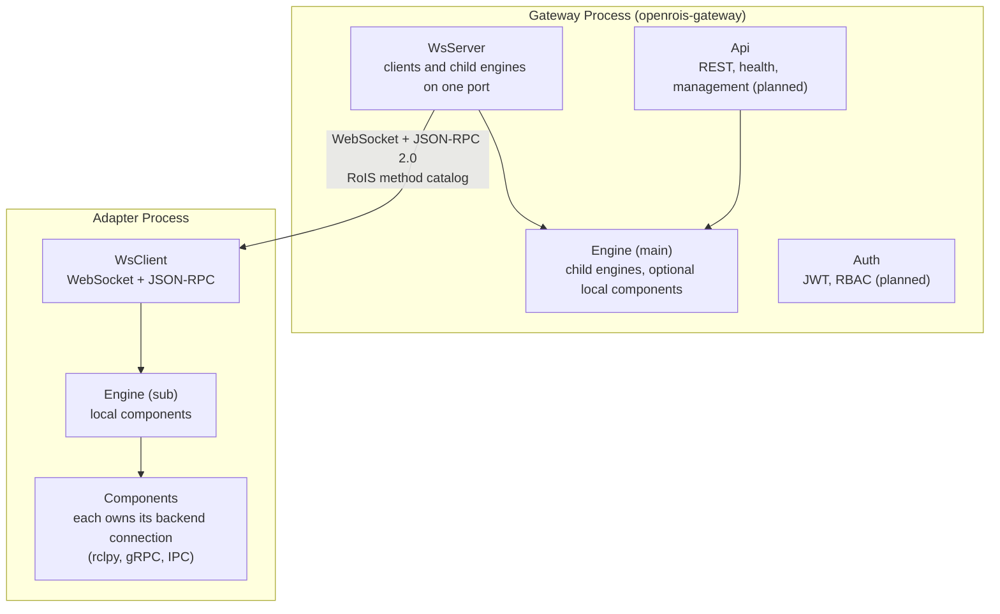
```mermaid
flowchart TB
    subgraph Gateway["Gateway Process (openrois-gateway)"]
        direction TB
        EngineG["Engine (main)<br/>child engines, optional local components"]
        WsServer["WsServer<br/>clients and child engines on one port"]
        Api["Api<br/>REST, health, management (planned)"]
        Auth["Auth<br/>JWT, RBAC (planned)"]
        WsServer --> EngineG
        Api --> EngineG
    end

    subgraph Adapter["Adapter Process"]
        direction TB
        EngineA["Engine (sub)<br/>local components"]
        WsClient["WsClient<br/>WebSocket + JSON-RPC"]
        Components["Components<br/>each owns its backend connection<br/>(rclpy, gRPC, IPC)"]
        WsClient --> EngineA
        EngineA --> Components
    end

    WsServer -->|"WebSocket + JSON-RPC 2.0<br/>RoIS method catalog"| WsClient
```

The gateway process composes `Engine` + `WsServer`, with its configuration, logging, a
graceful stop, and a container image. A management `Api`, `Auth`, and WebRTC signaling
are planned. The adapter process composes `Engine` + `WsClient` + its components. Both
use the same `Engine` class.

### 4.3 Why This Eliminates the Duplicate Dispatch Problem

Before the recursive engine model, the TypeScript `@openrois/gateway` and the Python
adapter framework both implemented RoIS JSON-RPC dispatch logic, in two languages, with
no shared core. The recursive model dissolves this problem:

- One `Engine` class, one dispatch implementation. The gateway uses it with child
  engines. The adapter uses it with local components. Both are engines.
- A parent engine reaches a child engine with the method catalog itself, the same
  methods a client sends. `ChildEngine` implements the component contract as a client of
  the child engine. `LocalComponents` implements it by calling the components of its
  process. The engine calls the contract. It does not know which implementation it is
  calling.
- The adapter IS an engine (a sub HRI Engine), not a separate kind of process. It hosts
  local components and connects to a parent engine. This matches the RoIS spec: the Sub
  HRI Engine is an engine, not a passive backend.

**Current state:** the `openrois-engine` package implements this model with a single
recursive `Engine` class, and the `openrois-gateway` process and the mock adapter run on
it. The TypeScript proof of concept has been removed, with its last version at tag
`ts-gateway-final`.

### 4.4 The Adapter as a Sub HRI Engine

The adapter process owns three concerns:

1. **Component hosting**: the adapter script creates its components, each configured
   through the arguments of its constructor, and adds them with `Engine.add_component`.
   The engine calls `connect()` on each component when it starts and `disconnect()` when
   it stops.
2. **Gateway connection**: the `WsClient` connects to the gateway on the `/adapter` path
   and sends no registration message. The gateway reads the adapter's profile with
   `rois.system.get_profile`, the same request a client sends, checks its engine ids and
   refs, and from then on forwards the calls for its components. The adapter reconnects
   with a growing delay when the connection drops.
3. **Backend bridge**: each component owns its connection to its backend (rclpy, gRPC,
   IPC, or a cloud API), created in `connect()` and closed in `disconnect()`. When a
   component keeps an rclpy node, the `WsClient` spins it in a background thread.

The adapter is an engine. It answers the RoIS calls for its local components and serves
the gateway through a trusted session: the gateway checked the bindings before it
forwarded a request, so the adapter does not check them again.

---

## 5. Layered Architecture

OpenRoIS is organized in three roles: the service application, the gateway, and
adapters. The gateway is a control-plane router. Adapters are standalone processes
that own their data-plane transport. All middleware boundaries use WebSocket +
JSON-RPC 2.0.

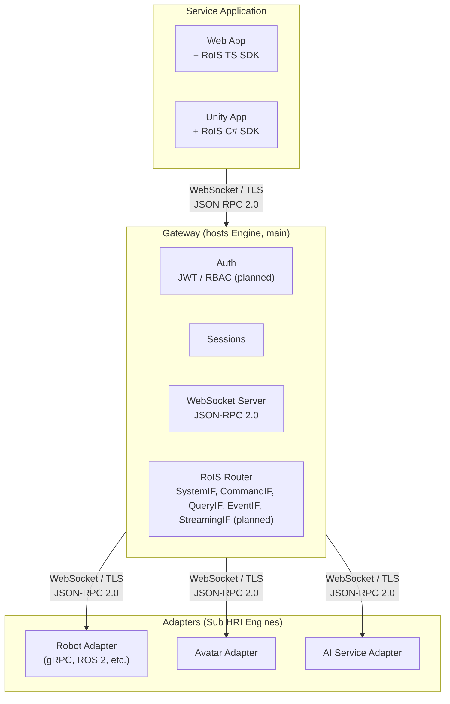
```mermaid
flowchart TB
    subgraph L1["Service Application"]
        direction LR
        WebApp["Web App<br/>+ RoIS TS SDK"]
        UnityApp["Unity App<br/>+ RoIS C# SDK"]
    end

    subgraph L2["Gateway (hosts Engine, main)"]
        direction LR
        Auth["Auth<br/>JWT / RBAC (planned)"]
        Session["Sessions"]
        WSServer["WebSocket Server<br/>JSON-RPC 2.0"]
        Router["RoIS Router<br/>SystemIF, CommandIF, QueryIF, EventIF, StreamingIF (planned)"]
    end

    subgraph L3["Adapters (Sub HRI Engines)"]
        direction LR
        RobotAdapter["Robot Adapter<br/>(gRPC, ROS 2, etc.)"]
        AvatarAdapter["Avatar Adapter"]
        ServiceAdapter["AI Service Adapter"]
    end

    L1 -->|"WebSocket / TLS<br/>JSON-RPC 2.0"| L2
    L2 -->|"WebSocket / TLS<br/>JSON-RPC 2.0"| RobotAdapter
    L2 -->|"WebSocket / TLS<br/>JSON-RPC 2.0"| AvatarAdapter
    L2 -->|"WebSocket / TLS<br/>JSON-RPC 2.0"| ServiceAdapter
```

The spec's "main HRI Engine" maps to the **engine** hosted by the gateway. Each
"sub HRI Engine" maps to an **adapter** (a standalone process hosting the same
`Engine` class with local components, connecting to the gateway via WebSocket).
"HRI Components" map to the components each adapter hosts. The service application
only ever talks to the gateway. The host paradigm is hidden, exactly as the
specification requires.

The engine has zero media imports, zero WebRTC imports, and zero references to
ROS, DDS, gRPC, or any game engine. The control plane is WebSocket + JSON-RPC
2.0, no alternatives. Media and other data-plane traffic flows directly between
the publisher and the consumer, outside the gateway. The engine is a pure
control-plane router when acting as the main engine without local components.

### 5.1 Mapping RoIS Concepts to OpenRoIS Layers

| RoIS concept | OpenRoIS implementation | Role |
|-------------|------------------------|-------|
| Main HRI Engine | Engine (hosted by the gateway) | Holds the bindings, routes to child engines, aggregates profiles |
| Sub HRI Engine | Engine (hosted by an adapter) | Hosts local components, owns data-plane transport |
| HRI Component | Component hosted by an adapter | Translation layer: RoIS calls to backend calls |
| Service Application | Client SDK (TypeScript or C#) | Drives robot scenarios via RoIS interfaces |
| RoIS interfaces (SystemIF, CommandIF, QueryIF, EventIF, StreamingIF) | JSON-RPC 2.0 methods over WebSocket | Service application to gateway boundary (control plane) |
| Main HRI Engine to sub HRI Engine | The same JSON-RPC 2.0 methods, sent by the parent engine | Gateway to adapter boundary (control plane) |
| (no spec term) | Component contract (`ComponentContract`) | Inside an engine: its own components and its child engines behind one interface |

### 5.2 Gateway Responsibilities

The gateway is the only internet-facing process and, once Phase 9 lands, the single
enforcement point for security. It:

- Terminates the control-plane transport (WebSocket, with TLS in front of it) and,
  when authentication lands (planned), authenticates every connection before any RoIS
  message is processed.
- Holds the bindings of its clients for every engine below it.
- Routes each call to the adapter that owns the target component, and runs command
  sequences across adapters.
- Aggregates the profiles of all adapters into one `HRI_Engine_Profile` returned by
  `get_profile()`, and sends `rois.system.profile_changed` to every client when an
  adapter connects, changes, or disconnects.
- Filters `search()` and `query()` results and guards `bind()` and `execute()`
  per the caller's authorization scope (planned).
- Brokers media descriptor exchange via the RoIS Streaming Interface, never
  touching media data (planned).

---

## 6. The Component Contract

The component contract is the seam inside an engine between what is the same for every
component and where a component lives. The engine answers the method catalog: it
validates requests, selects components by condition, holds the bindings, runs command
sequences, and routes ids. A source behind the contract runs what the engine hands it,
for the components it owns. Neither side references ROS, DDS, gRPC, or a game engine.

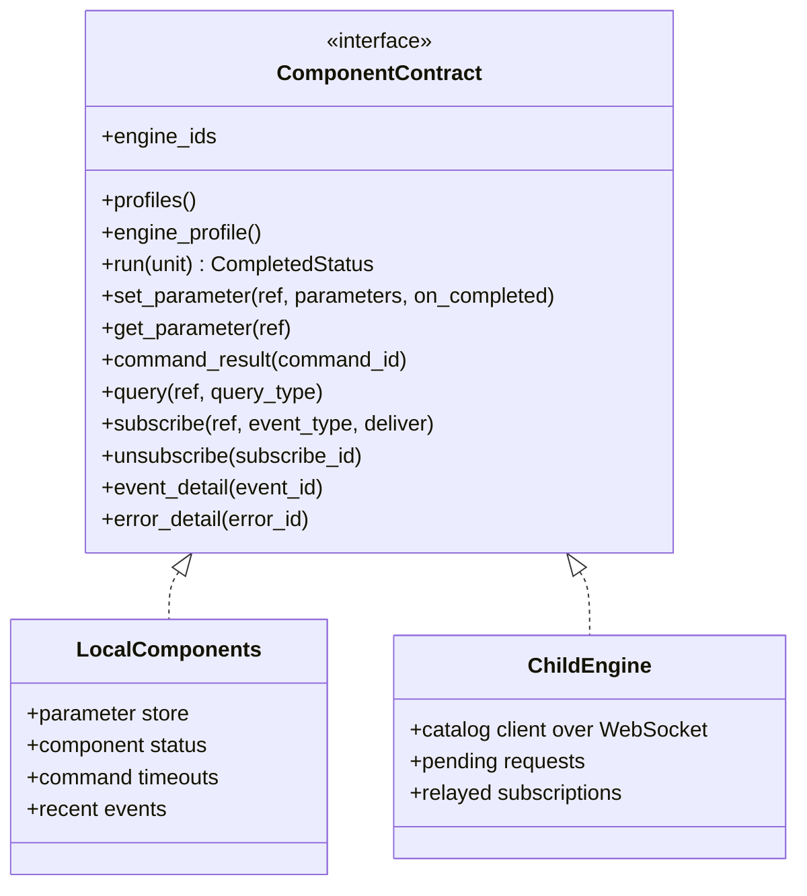
```mermaid
classDiagram
    class ComponentContract {
        <<interface>>
        +engine_ids
        +profiles()
        +engine_profile()
        +run(unit) CompletedStatus
        +set_parameter(ref, parameters, on_completed)
        +get_parameter(ref)
        +command_result(command_id)
        +query(ref, query_type)
        +subscribe(ref, event_type, deliver)
        +unsubscribe(subscribe_id)
        +event_detail(event_id)
        +error_detail(error_id)
    }

    class LocalComponents {
        +parameter store
        +component status
        +command timeouts
        +recent events
    }

    class ChildEngine {
        +catalog client over WebSocket
        +pending requests
        +relayed subscriptions
    }

    ComponentContract <|.. LocalComponents
    ComponentContract <|.. ChildEngine
```

`LocalComponents` is the local implementation. It hosts the components of the engine's
process, stores their parameters, answers `component_status` from their state, applies
the timeout of each command, and keeps recent events for `get_event_detail`.
`ChildEngine` is the remote implementation. It reaches a child engine with the same
catalog requests a client sends, and relays the child's notifications. The engine calls
the contract. It does not know which implementation it is calling. The contract lives
in `engine/src/openrois/engine/contract.py`.

### 6.1 Why the Contract Speaks the Catalog

The contract takes and returns the models of the method catalog, so a child engine is
reached with the catalog itself and a result travels up the hierarchy unchanged. The
engine hands a source only checked requests for one component: a ref it owns, a command
its profile declares, arguments of the types its profile gives. Bindings, conditions,
and sequencing stay in the engine, so no source implements them again.

### 6.2 RoIS Operations Behind the Contract

| RoIS operations | Answered by the engine | Behind the contract |
|-----------------|------------------------|---------------------|
| `search`, `bind`, `bind_any`, `release`, `get_profile` | Selection, bindings, profile aggregation | `profiles()`, `engine_profile()` |
| `execute`, `get_command_result` | Sequences, command table | `run()`, `command_result()` |
| `set_parameter`, `get_parameter` | Bindings, parameter types | `set_parameter()`, `get_parameter()` |
| `query` | Selection of one component | `query()` |
| `subscribe`, `unsubscribe`, `get_event_detail` | Selection, subscriptions per session | `subscribe()`, `unsubscribe()`, `event_detail()` |
| `get_error_detail` | Id routing | `error_detail()` |

### 6.3 What Stays Out of the Contract

Data-plane concerns stay out. QoS policies, deadlines, and reliability belong to the
data plane of whichever component needs them: a ROS 2 component needs DDS QoS, a gRPC
component does not. Keeping them out means the engine can drive a gRPC robot, a ROS 2
robot fleet, a virtual avatar, or a set of AI services with the same control-plane code
path. Because the engine sees only the contract, accidental coupling (for example,
baking DDS QoS semantics into the engine) is structurally prevented.

### 6.4 Four Contracts

OpenRoIS defines four distinct contracts at four boundaries:

1. **Service application to gateway** (control plane): the method catalog, JSON-RPC 2.0
   over WebSocket.
2. **Parent engine to child engine** (control plane): the same method catalog over the
   same transport. The parent is the child's only client, and sends it each command as
   its own one-command `execute`.
3. **Engine to component** (control plane): `LocalComponents` calls the `rois_*`
   methods of each component. A component written with `openrois-components-core` gets
   them from `Component`, and its author marks handlers with `@invoke`, `@query`,
   `@subscribe`, and `@on_set_parameter`.
4. **Component to backend** (data plane): the functional implementation. gRPC, DDS,
   IPC, WebRTC, cloud API, or any other transport. This is not a middleware boundary.
   The component owns this connection.

---

## 7. Interface Type Pipeline

The RoIS interfaces are authored once in Python and generated into three language
stacks. This ensures type consistency without manual synchronization.

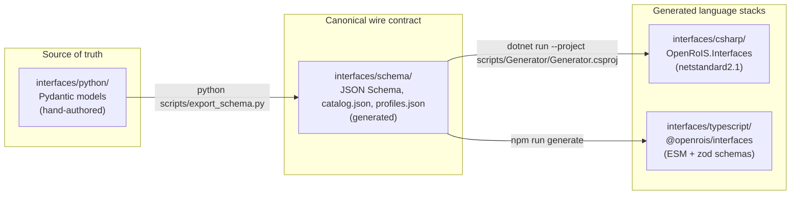
```mermaid
flowchart LR
    subgraph Source["Source of truth"]
        Py["interfaces/python/<br/>Pydantic models<br/>(hand-authored)"]
    end

    subgraph Wire["Canonical wire contract"]
        Schema["interfaces/schema/<br/>JSON Schema, catalog.json, profiles.json<br/>(generated)"]
    end

    subgraph Generated["Generated language stacks"]
        CS["interfaces/csharp/<br/>OpenRoIS.Interfaces<br/>(netstandard2.1)"]
        TS["interfaces/typescript/<br/>@openrois/interfaces<br/>(ESM + zod schemas)"]
    end

    Py -->|"python scripts/export_schema.py"| Schema
    Schema -->|"dotnet run --project scripts/Generator/Generator.csproj"| CS
    Schema -->|"npm run generate"| TS
```

### 7.1 Pipeline Steps

1. **Author** Pydantic models in `interfaces/python/src/openrois/interfaces/`.
2. **Export** to JSON Schema: `cd interfaces/python && python scripts/export_schema.py`.
   The export also writes the method catalog (`catalog.json`) and the profile constants
   of the basic components (`profiles.json`).
3. **Generate** TypeScript: `cd interfaces/typescript && npm run generate`.
4. **Generate** C#: `cd interfaces/csharp && dotnet run --project scripts/Generator/Generator.csproj`.

A schema-drift test verifies that the committed JSON Schema files match the current
Pydantic output. Continuous integration checks every link of the chain on each change
to `interfaces/**`: the schemas, the generated TypeScript, and the generated C# must
match what the pipeline produces. Generated files are never edited by hand.

### 7.2 Packages

| Package | Language | Target registry | Role |
|---------|----------|-----------------|------|
| `openrois-interfaces` | Python 3.12+ | PyPI | Source of truth |
| `OpenRoIS.Interfaces` | C# (netstandard2.1) | NuGet / UPM | Generated |
| `@openrois/interfaces` | TypeScript (ESM) | npm | Generated |

The packages are released as tagged alphas in the repository and installed from source.
Publication to the registries is planned.

### 7.3 Profiles and Values

The interfaces packages hold the full profile of each basic component type they model
as a constant, for example `NAVIGATION_PROFILE`: the XML profile with the messages of
the RoIS_Common profile it includes, listed first, and the RoSO function of the type. A
component declares the constant of its type and implements a part of it. The engine
serves only the messages the component implements, so a client never sees an operation
the component does not answer.

RoIS carries every value of a `Result`, a `Parameter`, and an `Argument` with its type
named in `data_type_ref`. OpenRoIS writes each value as a string by its type:
decimals for numbers, `true` or `false` for booleans, the enumerator name for
`Component_Status`, and a JSON array for an array type. `openrois.interfaces.values`
writes and reads these forms, and typed models of each component's messages, for
example `PersonDetectedEvent` with `number` and `timestamp`, document the payloads in
all three languages.

### 7.4 Cross-Validation

When the normative machine-readable files are available locally (they are not
redistributed in the repository), the test suite cross-checks the method catalog
against the IDL, the profile constants against the XML profiles and `OWL.ttl`, and the
profile models against `XML-Profiles.xsd`. This ensures the generated types agree with
the specification's machine-readable artifacts, not just with each other. Every field
the specification does not define must be a registered OpenRoIS extension, or the
cross-check fails.

---

## 8. Developer Experience: Three SDKs

OpenRoIS provides SDKs for three developer audiences. The client SDKs expose the
same RoIS interfaces and produce identical behavior regardless of the host paradigm
behind the gateway. The Python SDK serves component and adapter authors.

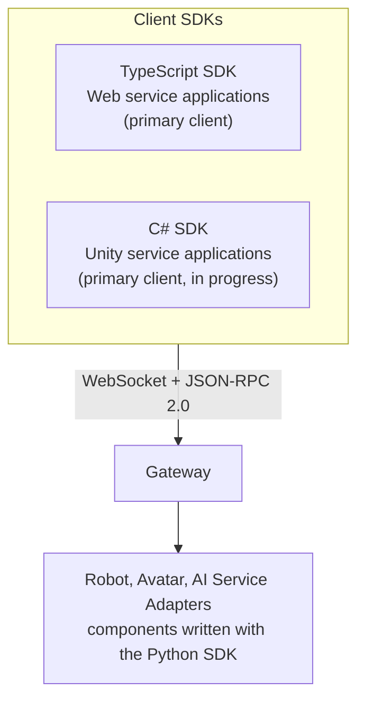
```mermaid
flowchart TB
    subgraph SDKs["Client SDKs"]
        direction LR
        TS["TypeScript SDK<br/>Web service applications<br/>(primary client)"]
        CSharp["C# SDK<br/>Unity service applications<br/>(primary client, in progress)"]
    end

    SDKs -->|"WebSocket + JSON-RPC 2.0"| Gateway["Gateway"]
    Gateway --> Adapters["Robot, Avatar, AI Service Adapters<br/>components written with the Python SDK"]
```

### 8.1 TypeScript SDK for Web (Primary Client)

The TypeScript SDK (`@openrois/sdk`) is the primary client SDK for web service
applications. `RoISClient` has one method per operation of the RoIS method catalog, each
taking the operation's IDL parameters in IDL order.

```ts
import { RoISClient, componentRef, componentType } from "@openrois/sdk";

const client = await RoISClient.connect("ws://localhost:8765");

// Find a component by type, and select it by ref in later calls.
const [nav] = await client.search(componentType({ authority: "OMG", code: "Navigation" }));
const target = componentRef(nav);

// Read state.
const status = await client.query("component_status", target);

// React to events.
client.on("reached_target", (event) => console.log(event.results));
await client.subscribe("reached_target", target);

// Reserve, configure, command, wait for the command to end, release.
await client.bind(nav);
await client.setParameter(nav, [
  { name: "target_positions", data_type_ref: "string[]", value: '["kitchen"]' },
]);
const commandId = crypto.randomUUID();
const ended = new Promise<string>((resolve) => {
  client.on("rois.command.completed", ({ command_id, status }) => {
    if (command_id === commandId) resolve(status);
  });
});
await client.execute([{ component_ref: nav, command_type: "start", command_id: commandId }]);
console.log("navigation ended:", await ended);
await client.release(nav);

await client.disconnect();
```

Key characteristics:

- TypeScript strict mode, browser and Node.js compatible, dual ESM/CJS output (tsup).
- Validation of every call against the catalog schemas of `@openrois/interfaces`:
  params before they are sent, results when they arrive. A failed return code raises
  `RoISError`, which carries the return code and the method.
- Typed notifications, each event also delivered under its own event type, for example
  `reached_target`.
- Builders for CQL2-Text conditions, such as `componentRef` and `componentType`.
- Tested against the mock engine (`examples/mock-engine/`) and, with
  `OPENROIS_GATEWAY_URL` set, against a live gateway with the mock adapter behind it.
- Reconnection is planned.

### 8.2 C# SDK for Unity (Primary Client, in Progress)

The C# SDK (`OpenRoIS.Sdk` / `org.openrois.sdk`) targets Unity service
applications. Its JSON-RPC 2.0 layer is available. The high-level client shown
below is the target API and is in progress.

```csharp
var client = await RoISClient.ConnectAsync(
    "wss://gateway.example.com",
    new ConnectOptions { Token = token });

var pd = await client.BindAsync("PersonDetection");
var nav = await client.BindAsync("Navigation");

pd.On("person_detected", e => UpdateCount(e.Number));
await pd.StartAsync();

await nav.ExecuteAsync(new TargetPosition(x: 3.0f, y: 1.5f, theta: 0f));
```

Target characteristics (the JSON-RPC 2.0 layer exists today, the rest is in progress):

- Packaged for Unity as `org.openrois.sdk` through the Unity Package Manager
  (publication planned).
- Targets `netstandard2.1`, Unity 6.5 and later.
- SDK callbacks marshaled to the Unity main thread (in progress).
- Typed component proxies: `client.BindAsync("PersonDetection")` returning a typed
  proxy with `.On(event)` handlers (planned).

### 8.3 Python SDK for Components and Adapters

The Python packages `openrois-components-core` and `openrois-engine` serve component and
adapter authors. A component is a class that declares the profile of its type and marks
the messages it implements. An adapter hosts its components in a sub HRI Engine
connected to the gateway.

```python
from openrois.components.core import CommandFailed, Component, component, invoke, subscribe
from openrois.interfaces.components import NAVIGATION_PROFILE
from openrois.interfaces.service import CompletedStatus


@component(NAVIGATION_PROFILE)
class MyNavigation(Component):
    def __init__(self, robot_url: str) -> None:
        self._robot_url = robot_url

    @invoke("start")
    async def start(self) -> None:
        targets = self.parameters.get("target_positions", [])
        if not targets:
            raise CommandFailed(CompletedStatus.ERROR, "Set target_positions first.")
        await self._drive_to(targets[0])  # Calls the robot's API.
        self.emit("reached_target", target=targets[0], is_final_target=True)

    @subscribe("reached_target")
    async def reached_target(self) -> None:
        pass  # start emits the event when the robot arrives.
```

```python
from openrois.engine import Engine, WsClient

engine = Engine("robot_1")
engine.add_component("navigation", MyNavigation("http://192.168.1.10"))
WsClient(engine, "ws://gateway.example.com:8765").run()
```

Clients then see `robot_1/navigation`. Key characteristics:

- A component declares the profile constant of its type and implements a part of it.
  The engine serves only what it implements, plus `stop` with `start` and
  `component_status`.
- A command handler runs for as long as the command lasts. A `stop`, or a new `start`,
  cancels a running `start`, which ends with ABORT. `CommandFailed` ends a command with
  another status.
- Parameter values arrive in `self.parameters`, converted from their profile types, and
  `@on_set_parameter` applies new values to the backend or refuses them.
- Built on the same Pydantic types that are the source of truth for the entire project,
  so no type bridge is needed.
- Async-first (asyncio), with ROS 2 nodes spun in a background thread by the
  `WsClient`.
- A Python client for scripting and end-to-end testing is planned.

### 8.4 SDK Interface Mapping

The client SDKs mirror the RoIS interfaces defined in the normative IDL. The C# client
will have the same methods (in progress).

| RoIS Interface | `RoISClient` methods (TypeScript) | Notifications |
|----------------|-----------------------------------|---------------|
| SystemIF | `connect(url)`, `disconnect()`, `getProfile(condition?)`, `getErrorDetail(errorId, condition?)` | `rois.system.notify_error`, `rois.system.profile_changed` |
| CommandIF | `search(condition?)`, `bind(ref)`, `bindAny(condition?)`, `release(ref)`, `getParameter(ref)`, `setParameter(ref, parameters)`, `execute(commandUnitList)`, `getCommandResult(commandId, condition?)` | `rois.command.completed` |
| QueryIF | `query(queryType, condition?)` | None |
| EventIF | `subscribe(eventType, condition?)`, `unsubscribe(subscribeId)`, `getEventDetail(eventId, condition?)` | `rois.event.notify_event` |
| StreamingIF | Planned | Planned |

The notifications come directly from `ServiceApplicationBase` in the specification:
`notify_error`, `completed`, and `notify_event`. `rois.system.profile_changed` is an
OpenRoIS extension (section 9.1).

### 8.5 Paradigm Transparency

The same SDK calls drive a real ROS 2 robot and a virtual avatar. Only the adapter
behind the gateway changes. This is the core value proposition for researchers: a
scenario written once can be tested against a mock robot, deployed against a real
ROS 2 robot, and reused against a virtual avatar without code changes.

---

## 9. The Wire Protocol: JSON-RPC 2.0

A service application talks to the gateway over **WebSocket** with **JSON-RPC 2.0** as
the message envelope, and a parent engine talks to its child engines the same way. Each
operation of the System, Command, Query, and Event interfaces is a JSON-RPC method named
`rois.<interface>.<operation>`. Its `params` are the operation's `in` parameters, named
as in the IDL, and its `result` holds `return_code` and one field per `out` parameter.
The engine sends the `ServiceApplicationBase` callbacks as JSON-RPC notifications
(messages with no `id` field). Section 17 of [rois-reference.md](rois-reference.md)
records every choice of this binding, and the method table is generated into all three
languages (section 7).

### 9.1 Method Namespaces

```
rois.system.*     SystemIF:   connect, disconnect, get_profile, get_error_detail
rois.command.*    CommandIF:  search, bind, bind_any, release, get_parameter,
                              set_parameter, execute, get_command_result
rois.query.*      QueryIF:    query
rois.event.*      EventIF:    subscribe, unsubscribe, get_event_detail
rois.stream.*     Streaming:  planned
```

Notifications from the engine (no `id` field):

```
rois.event.notify_event       notify_event(event_id, event_type, subscribe_id, expire, results)
rois.command.completed        completed(command_id, status)
rois.system.notify_error      notify_error(error_id, error_type)
rois.system.profile_changed   no params (OpenRoIS extension)
```

OpenRoIS adds to the specification only where an addition serves a real need, changes
nothing the specification defines, and can be ignored by a client that does not know it.
Four extensions exist: `component_profiles` in the `get_profile` result, the RoSO
`function` of a component profile, the `results` payload of `notify_event`, and the
`rois.system.profile_changed` notification.

### 9.2 Methods, Params, and Results

A `condition` may be left out, which is the empty condition: no filter.

#### System Interface (`rois.system.*`)

| Method | Params | Result |
|--------|--------|--------|
| `rois.system.connect` | `{}` | `{return_code}` |
| `rois.system.disconnect` | `{}` | `{return_code}` |
| `rois.system.get_profile` | `{condition}` | `{return_code, profile, component_profiles}` |
| `rois.system.get_error_detail` | `{error_id, condition}` | `{return_code, results}` |

#### Command Interface (`rois.command.*`)

| Method | Params | Result |
|--------|--------|--------|
| `rois.command.search` | `{condition}` | `{return_code, component_ref_list}` |
| `rois.command.bind` | `{component_ref}` | `{return_code}` |
| `rois.command.bind_any` | `{condition}` | `{return_code, component_ref}` |
| `rois.command.release` | `{component_ref}` | `{return_code}` |
| `rois.command.get_parameter` | `{component_ref}` | `{return_code, parameters}` |
| `rois.command.set_parameter` | `{component_ref, parameters}` | `{return_code, command_id}` |
| `rois.command.execute` | `{command_unit_list}` | `{return_code}` |
| `rois.command.get_command_result` | `{command_id, condition}` | `{return_code, results}` |

#### Query Interface (`rois.query.*`)

| Method | Params | Result |
|--------|--------|--------|
| `rois.query.query` | `{query_type, condition}` | `{return_code, results}` |

#### Event Interface (`rois.event.*`)

| Method | Params | Result |
|--------|--------|--------|
| `rois.event.subscribe` | `{event_type, condition}` | `{return_code, subscribe_id}` |
| `rois.event.unsubscribe` | `{subscribe_id}` | `{return_code}` |
| `rois.event.get_event_detail` | `{event_id, condition}` | `{return_code, results}` |

The Streaming Interface is planned. Until then, an engine answers any `rois.stream.*`
method with the JSON-RPC error `METHOD_NOT_FOUND`.

As in the IDL, `query` and `subscribe` name no component: their `condition` selects the
one component that declares the query or event type. `execute` names its components
inside `command_unit_list`, and the client assigns each command's `command_id`. The
TypeScript SDK fills in a UUID when the caller leaves one out.

### 9.3 Core Data Types on the Wire

All payloads use the types generated from the canonical JSON Schema. The key
structures:

**Result** (returned by `query`, `get_command_result`, `get_event_detail`, and carried
by `notify_event`):

```json
{"name": "number", "data_type_ref": "int", "value": "2"}
```

**Parameter** (sent by `set_parameter`, returned by `get_parameter`):

```json
{"name": "target_positions", "data_type_ref": "string[]", "value": "[\"kitchen\"]"}
```

**CommandUnit** and **ConcurrentCommands** (the items of a `command_unit_list`, as
`CommandUnitSequenceType` in `XML-Profiles.xsd` defines them, with `delay_time` in
milliseconds):

```json
{"component_ref": "robot_1/navigation", "command_type": "start", "command_id": "c2", "arguments": [], "delay_time": 0}
```

```json
{"command_list": [{"component_ref": "robot_1/navigation", "command_type": "start", "command_id": "c4"}], "delay_time": 0}
```

**Conditions** are written in a subset of CQL2-Text: comparisons with `=` or `LIKE`
joined by `AND`, over the properties `component_ref` and `component_type`, for example
`component_type = 'urn:x-rois:def:component:OMG::PersonDetection'`.

**Refs and ids**: every `component_ref` is fully qualified as `engine_id/ref`, for
example `robot_1/navigation`. The ids an engine assigns, for subscriptions, events,
errors, and `set_parameter` commands, start with that engine's id in the same way, for
example `robot_1/sub-1`, so they stay unique through every gateway above it.

**ReturnCode** values: `OK`, `ERROR`, `BAD_PARAMETER`, `UNSUPPORTED`,
`OUT_OF_RESOURCES`, `TIMEOUT`.

**ComponentStatus** values: `UNINITIALIZED`, `READY`, `BUSY`, `WARNING`, `ERROR`.

**CompletedStatus** values: `OK`, `ERROR`, `ABORT`, `OUT_OF_RESOURCES`, `TIMEOUT`.

**ErrorType** values: `ENGINE_INTERNAL_ERROR`, `COMPONENT_INTERNAL_ERROR`,
`COMPONENT_NOT_RESPONDING`, `USER_DEFINED_ERROR`.

**StreamStatus** values: `STREAMING_NOT_CONNECTED`, `STREAMING_NOT_RUNNING`,
`STREAMING_RUNNING`, `STREAMING_SUSPENDED`, `STREAMING_RESUMED`.

### 9.4 End-to-End Message Flow Example

The following messages make up one service application session against a gateway with
one adapter, `robot_1`, behind it. The adapter hosts `robot_1/person_detection`,
`robot_1/navigation`, and `robot_1/system_information`. Each request is followed by
its response and by the notifications it causes. Clients treat the ids an engine assigns
as opaque strings. One counter numbers them, and the example shows one person_detected
event only.

#### Step 1: Connect

```json
{"jsonrpc": "2.0", "id": 1, "method": "rois.system.connect", "params": {}}
```

```json
{"jsonrpc": "2.0", "id": 1, "result": {"return_code": "OK"}}
```

#### Step 2: Search for PersonDetection Components

```json
{
  "jsonrpc": "2.0",
  "id": 2,
  "method": "rois.command.search",
  "params": {"condition": "component_type = 'urn:x-rois:def:component:OMG::PersonDetection'"}
}
```

```json
{
  "jsonrpc": "2.0",
  "id": 2,
  "result": {"return_code": "OK", "component_ref_list": ["robot_1/person_detection"]}
}
```

#### Step 3: Subscribe to person_detected Events

```json
{
  "jsonrpc": "2.0",
  "id": 3,
  "method": "rois.event.subscribe",
  "params": {
    "event_type": "person_detected",
    "condition": "component_ref = 'robot_1/person_detection'"
  }
}
```

```json
{"jsonrpc": "2.0", "id": 3, "result": {"return_code": "OK", "subscribe_id": "robot_1/sub-1"}}
```

#### Step 4: Start the PersonDetection Component

PersonDetection is a sensing component, so it needs no bind before commands.

```json
{
  "jsonrpc": "2.0",
  "id": 4,
  "method": "rois.command.execute",
  "params": {
    "command_unit_list": [
      {"component_ref": "robot_1/person_detection", "command_type": "start", "command_id": "c1", "arguments": []}
    ]
  }
}
```

```json
{"jsonrpc": "2.0", "id": 4, "result": {"return_code": "OK"}}
```

```json
{"jsonrpc": "2.0", "method": "rois.command.completed", "params": {"command_id": "c1", "status": "OK"}}
```

#### Step 5: The Engine Sends a person_detected Event

```json
{
  "jsonrpc": "2.0",
  "method": "rois.event.notify_event",
  "params": {
    "event_id": "robot_1/evt-2",
    "event_type": "person_detected",
    "subscribe_id": "robot_1/sub-1",
    "expire": "2026-10-08T12:01:30.204511+00:00",
    "results": [
      {"name": "number", "data_type_ref": "int", "value": "2"},
      {"name": "timestamp", "data_type_ref": "DateTime", "value": "2026-10-08T12:00:30.201877+00:00"}
    ]
  }
}
```

#### Step 6: Bind Navigation and Set the Target

Navigation is an actuation component: commands and parameter changes need the binding.

```json
{"jsonrpc": "2.0", "id": 5, "method": "rois.command.bind", "params": {"component_ref": "robot_1/navigation"}}
```

```json
{"jsonrpc": "2.0", "id": 5, "result": {"return_code": "OK"}}
```

`set_parameter` is a command of its own. The engine assigns its id and completes it.

```json
{
  "jsonrpc": "2.0",
  "id": 6,
  "method": "rois.command.set_parameter",
  "params": {
    "component_ref": "robot_1/navigation",
    "parameters": [
      {"name": "target_positions", "data_type_ref": "string[]", "value": "[\"kitchen\"]"}
    ]
  }
}
```

```json
{"jsonrpc": "2.0", "id": 6, "result": {"return_code": "OK", "command_id": "robot_1/param-3"}}
```

```json
{"jsonrpc": "2.0", "method": "rois.command.completed", "params": {"command_id": "robot_1/param-3", "status": "OK"}}
```

#### Step 7: Subscribe to reached_target and Start the Navigation

```json
{
  "jsonrpc": "2.0",
  "id": 7,
  "method": "rois.event.subscribe",
  "params": {"event_type": "reached_target", "condition": "component_ref = 'robot_1/navigation'"}
}
```

```json
{"jsonrpc": "2.0", "id": 7, "result": {"return_code": "OK", "subscribe_id": "robot_1/sub-4"}}
```

```json
{
  "jsonrpc": "2.0",
  "id": 8,
  "method": "rois.command.execute",
  "params": {
    "command_unit_list": [
      {"component_ref": "robot_1/navigation", "command_type": "start", "command_id": "c2", "arguments": []}
    ]
  }
}
```

```json
{"jsonrpc": "2.0", "id": 8, "result": {"return_code": "OK"}}
```

#### Step 8: The Robot Arrives

The component emits `reached_target`, and the command completes.

```json
{
  "jsonrpc": "2.0",
  "method": "rois.event.notify_event",
  "params": {
    "event_id": "robot_1/evt-5",
    "event_type": "reached_target",
    "subscribe_id": "robot_1/sub-4",
    "expire": "2026-10-08T12:03:10.718203+00:00",
    "results": [
      {"name": "target", "data_type_ref": "string", "value": "kitchen"},
      {"name": "is_final_target", "data_type_ref": "bool", "value": "true"}
    ]
  }
}
```

```json
{"jsonrpc": "2.0", "method": "rois.command.completed", "params": {"command_id": "c2", "status": "OK"}}
```

#### Step 9: Query the Robot Position

```json
{
  "jsonrpc": "2.0",
  "id": 9,
  "method": "rois.query.query",
  "params": {
    "query_type": "robot_position",
    "condition": "component_ref = 'robot_1/system_information'"
  }
}
```

```json
{
  "jsonrpc": "2.0",
  "id": 9,
  "result": {
    "return_code": "OK",
    "results": [
      {"name": "position_data", "data_type_ref": "String[]", "value": "[\"2.0000,1.5000,0.0000\"]"},
      {"name": "robot_ref", "data_type_ref": "RoISIdentifier[]", "value": "[\"robot_1\"]"},
      {"name": "timestamp", "data_type_ref": "DateTime", "value": "2026-10-08T12:03:15.031544+00:00"}
    ]
  }
}
```

#### Step 10: Release and Disconnect

```json
{"jsonrpc": "2.0", "id": 10, "method": "rois.command.release", "params": {"component_ref": "robot_1/navigation"}}
```

```json
{"jsonrpc": "2.0", "id": 10, "result": {"return_code": "OK"}}
```

```json
{"jsonrpc": "2.0", "id": 11, "method": "rois.system.disconnect", "params": {}}
```

```json
{"jsonrpc": "2.0", "id": 11, "result": {"return_code": "OK"}}
```

### 9.5 Error Handling

A RoIS failure is a normal result whose `return_code` is not `OK`, with its out fields
empty. For example, a second client binding the navigation that the first one holds:

```json
{"jsonrpc": "2.0", "id": 5, "method": "rois.command.bind", "params": {"component_ref": "robot_1/navigation"}}
```

```json
{"jsonrpc": "2.0", "id": 5, "result": {"return_code": "OUT_OF_RESOURCES"}}
```

JSON-RPC errors are only for protocol faults: unparseable JSON (`-32700`), an invalid
request (`-32600`), an unknown method (`-32601`), params that fail validation
(`-32602`, with the issues as `data`), and internal errors (`-32603`):

```json
{"jsonrpc": "2.0", "id": 12, "method": "rois.command.bind", "params": {}}
```

```json
{
  "jsonrpc": "2.0",
  "id": 12,
  "error": {
    "code": -32602,
    "message": "Invalid params for rois.command.bind",
    "data": [{"path": "component_ref", "message": "Field required"}]
  }
}
```

A command that runs and fails completes with a status other than `OK`, for example
`{"command_id": "c2", "status": "ERROR"}` in `rois.command.completed`. The catalog also
defines `rois.system.notify_error`, which carries an `error_id` and an `error_type`, and
`get_error_detail`, which reads the details of an error. The engines report no errors
this way yet (planned).

### 9.6 Command Sequences

A `command_unit_list` runs its items in order. An item is a single command or a
`ConcurrentCommands` group, whose commands run at the same time, each after its own
`delay_time`. For example, on an engine that also hosts `robot_1/reaction`, a client
that has bound both actuation components, `robot_1/navigation` and `robot_1/reaction`,
sends:

```json
{
  "jsonrpc": "2.0",
  "id": 13,
  "method": "rois.command.execute",
  "params": {
    "command_unit_list": [
      {"component_ref": "robot_1/person_detection", "command_type": "start", "command_id": "c3"},
      {
        "command_list": [
          {"component_ref": "robot_1/navigation", "command_type": "start", "command_id": "c4"},
          {"component_ref": "robot_1/reaction", "command_type": "start", "command_id": "c5", "delay_time": 500}
        ]
      }
    ]
  }
}
```

In this example, PersonDetection starts first. When it completes with `OK`, Navigation
starts, and Reaction starts 500 ms later. The engine checks the whole sequence before it
answers: every ref, every binding, every command type, and every command id. A command
that ends other than `OK` stops the sequence, and the commands of the later items
complete with `ABORT` without running. Every command completes exactly once, with one
`rois.command.completed` to the client that sent it.

### 9.7 Complete Session as a Sequence Diagram

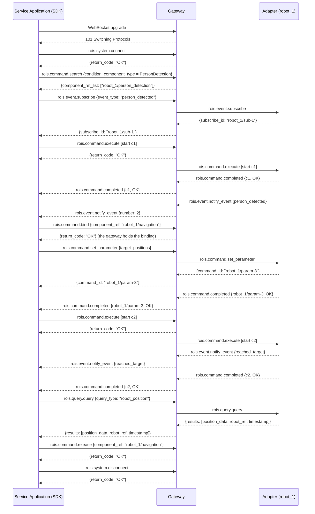
```mermaid
sequenceDiagram
    participant Client as Service Application (SDK)
    participant GW as Gateway
    participant Robot as Adapter (robot_1)

    Client->>GW: WebSocket upgrade
    GW-->>Client: 101 Switching Protocols

    Client->>GW: rois.system.connect
    GW-->>Client: {return_code: "OK"}

    Client->>GW: rois.command.search {condition: component_type = PersonDetection}
    GW-->>Client: {component_ref_list: ["robot_1/person_detection"]}

    Client->>GW: rois.event.subscribe {event_type: "person_detected"}
    GW->>Robot: rois.event.subscribe
    Robot-->>GW: {subscribe_id: "robot_1/sub-1"}
    GW-->>Client: {subscribe_id: "robot_1/sub-1"}

    Client->>GW: rois.command.execute [start c1]
    GW-->>Client: {return_code: "OK"}
    GW->>Robot: rois.command.execute [start c1]
    Robot-->>GW: rois.command.completed {c1, OK}
    GW-->>Client: rois.command.completed {c1, OK}

    Robot-->>GW: rois.event.notify_event {person_detected}
    GW-->>Client: rois.event.notify_event {number: 2}

    Client->>GW: rois.command.bind {component_ref: "robot_1/navigation"}
    GW-->>Client: {return_code: "OK"} (the gateway holds the binding)

    Client->>GW: rois.command.set_parameter {target_positions}
    GW->>Robot: rois.command.set_parameter
    Robot-->>GW: {command_id: "robot_1/param-3"}
    GW-->>Client: {command_id: "robot_1/param-3"}
    Robot-->>GW: rois.command.completed {robot_1/param-3, OK}
    GW-->>Client: rois.command.completed {robot_1/param-3, OK}

    Client->>GW: rois.command.execute [start c2]
    GW-->>Client: {return_code: "OK"}
    GW->>Robot: rois.command.execute [start c2]
    Robot-->>GW: rois.event.notify_event {reached_target}
    GW-->>Client: rois.event.notify_event {reached_target}
    Robot-->>GW: rois.command.completed {c2, OK}
    GW-->>Client: rois.command.completed {c2, OK}

    Client->>GW: rois.query.query {query_type: "robot_position"}
    GW->>Robot: rois.query.query
    Robot-->>GW: {results: [position_data, robot_ref, timestamp]}
    GW-->>Client: {results: [position_data, robot_ref, timestamp]}

    Client->>GW: rois.command.release {component_ref: "robot_1/navigation"}
    GW-->>Client: {return_code: "OK"}

    Client->>GW: rois.system.disconnect
    GW-->>Client: {return_code: "OK"}
```

---

## 10. Deployment Topologies

The control plane is always WebSocket + JSON-RPC 2.0, regardless of topology. Each
adapter's data-plane transport (gRPC, DDS, WebRTC, WHEP/WHIP, RTSP, IPC, or any
other) is an implementation detail of the adapter, not a topology choice. Topologies
differ by **where processes run**: on a single host, across a LAN, across the
internet, or with components offloaded to the cloud.

### 10.1 Topology A: Single Host (Local)

Everything runs on one machine: the service application, the gateway, the adapter,
and the robot. The service application talks to the gateway over localhost WebSocket.
The adapter connects to the gateway over localhost WebSocket. This is the simplest
deployment, useful for development, testing, and single-robot scenarios where the
robot's onboard computer runs everything.

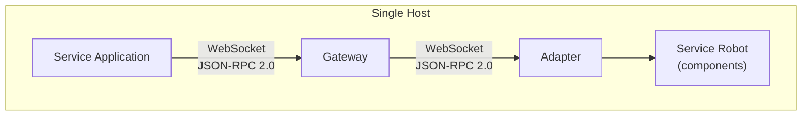
```mermaid
flowchart TB
    subgraph Host["Single Host"]
        App["Service Application"]
        GW["Gateway"]
        Adapter["Adapter"]
        Robot["Service Robot<br/>(components)"]
        App -->|"WebSocket<br/>JSON-RPC 2.0"| GW
        GW -->|"WebSocket<br/>JSON-RPC 2.0"| Adapter
        Adapter --> Robot
    end
```

### 10.2 Topology B: LAN, Multiple Service Robots

The gateway runs on one host. Multiple service robots run on the same LAN, each
with its own adapter. The service application connects to the gateway, which routes
calls to the correct robot's adapter. This is the fleet scenario: one gateway
serves multiple robots on a local network.

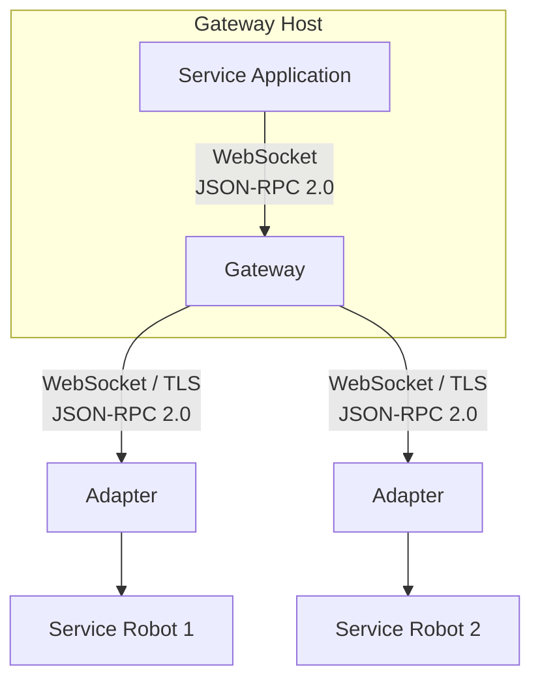
```mermaid
flowchart TB
    subgraph GatewayHost["Gateway Host"]
        App["Service Application"]
        GW["Gateway"]
        App -->|"WebSocket<br/>JSON-RPC 2.0"| GW
    end

    GW -->|"WebSocket / TLS<br/>JSON-RPC 2.0"| Adapter1["Adapter"]
    Adapter1 --> Robot1["Service Robot 1"]

    GW -->|"WebSocket / TLS<br/>JSON-RPC 2.0"| Adapter2["Adapter"]
    Adapter2 --> Robot2["Service Robot 2"]
```

### 10.3 Topology C: Distributed Hosts (Internet)

The service application runs on a remote host (operator's laptop, cloud service).
The gateway runs on a server or in the cloud. Each service robot runs on its own
host, connecting to the gateway over the internet. This is the full teleoperation
scenario: the operator is in one location, the gateway is in another, and the
robots are in a third.

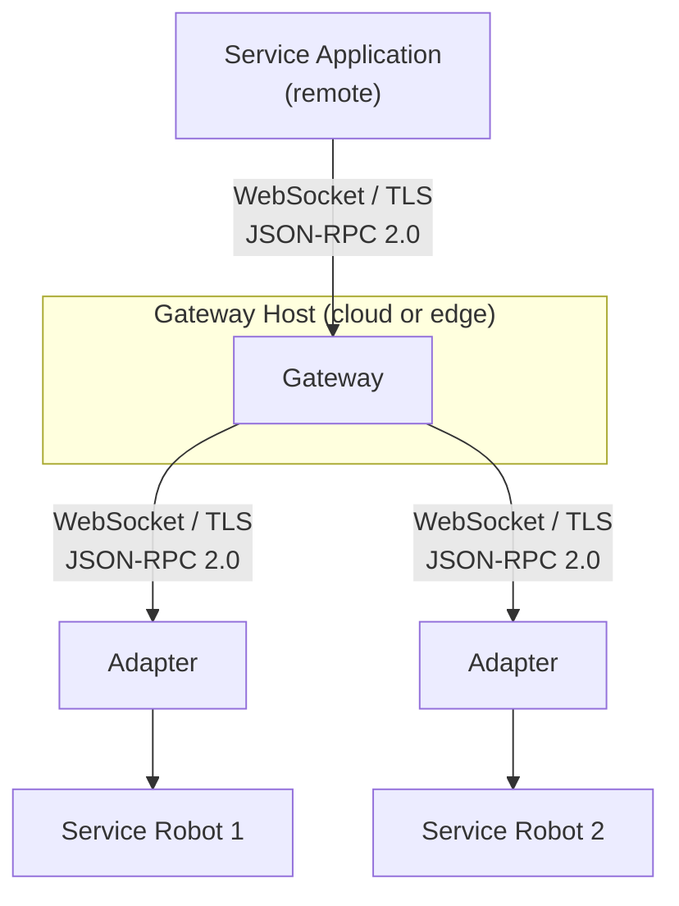
```mermaid
flowchart TB
    App["Service Application<br/>(remote)"]
    App -->|"WebSocket / TLS<br/>JSON-RPC 2.0"| GW

    subgraph Cloud["Gateway Host (cloud or edge)"]
        GW["Gateway"]
    end

    GW -->|"WebSocket / TLS<br/>JSON-RPC 2.0"| Adapter1["Adapter"]
    Adapter1 --> Robot1["Service Robot 1"]

    GW -->|"WebSocket / TLS<br/>JSON-RPC 2.0"| Adapter2["Adapter"]
    Adapter2 --> Robot2["Service Robot 2"]
```

### 10.4 Topology D: Cloud Perception (Separate Adapter or Local Components)

Perception components (PersonDetection, SpeechRecognition) may need more compute
than the robot has. These can run in two ways:

1. **As a separate adapter process** with its own profile, connecting to the
   gateway over WebSocket like any other adapter. The components run on the
   adapter (the translation layer) and connect to cloud-based implementations
   (GPU inference services, TTS/STT APIs).
2. **As local components in the gateway process**. The main engine hosts the
   perception components itself, added with `Engine.add_component`. No separate
   process is needed. This is simpler for small deployments.

In both cases, the gateway routes RoIS calls to the right component.

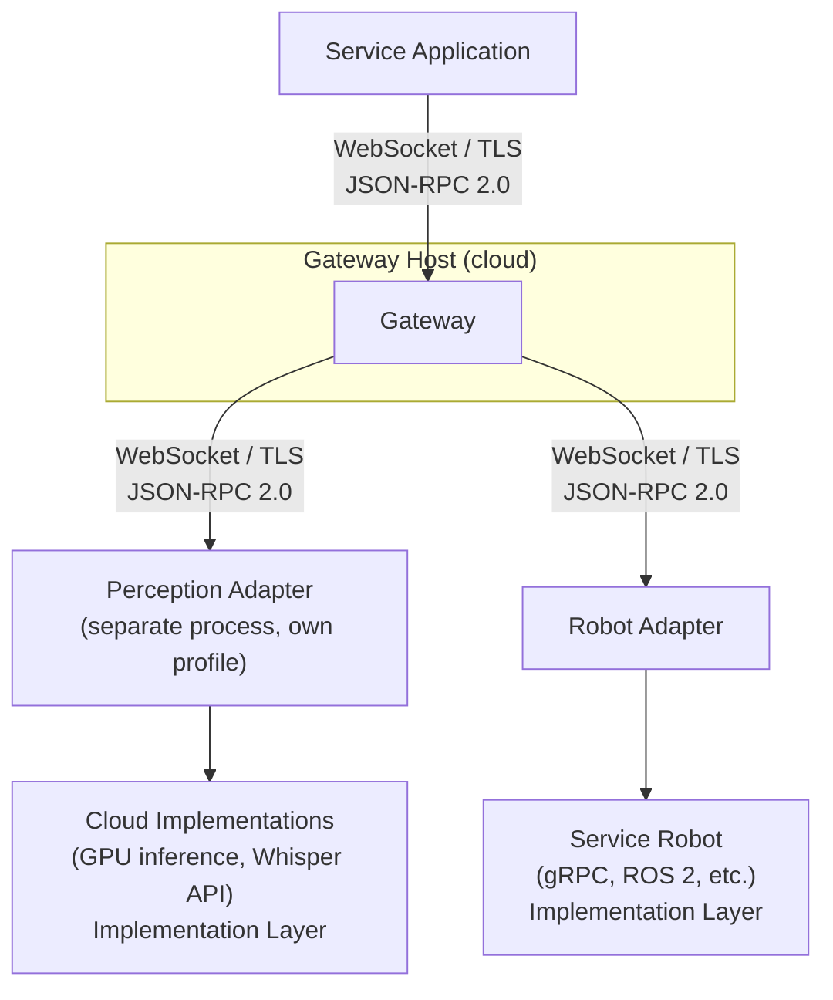
```mermaid
flowchart TB
    App["Service Application"]
    App -->|"WebSocket / TLS<br/>JSON-RPC 2.0"| GW

    subgraph Cloud["Gateway Host (cloud)"]
        GW["Gateway"]
    end

    GW -->|"WebSocket / TLS<br/>JSON-RPC 2.0"| PerceptionAdapter["Perception Adapter<br/>(separate process, own profile)"]
    PerceptionAdapter --> CloudImpl["Cloud Implementations<br/>(GPU inference, Whisper API)<br/>Implementation Layer"]

    GW -->|"WebSocket / TLS<br/>JSON-RPC 2.0"| RobotAdapter["Robot Adapter"]
    RobotAdapter --> Robot["Service Robot<br/>(gRPC, ROS 2, etc.)<br/>Implementation Layer"]
```

The gateway routes RoIS calls in all topologies. Cloud perception can be a
separate adapter process or local components in the gateway, not a `runtime`
field in a robot's profile. The service application does not know or care where
a component's implementation lives: `search()` returns components from all
adapters and local components, and `bind()` / `execute()` work identically.

---

## 11. Transport Strategy

OpenRoIS deliberately separates messages from transport, so the right transport is
used at each boundary rather than forcing one everywhere.

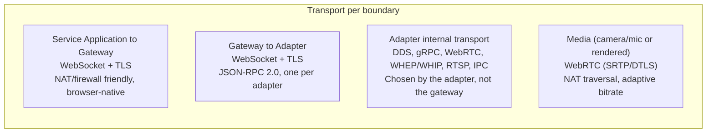
```mermaid
flowchart LR
    subgraph Boundaries["Transport per boundary"]
        direction TB
        B1["Service Application to Gateway<br/>WebSocket + TLS<br/>NAT/firewall friendly, browser-native"]
        B2["Gateway to Adapter<br/>WebSocket + TLS<br/>JSON-RPC 2.0, one per adapter"]
        B3["Adapter internal transport<br/>DDS, gRPC, WebRTC, WHEP/WHIP, RTSP, IPC<br/>Chosen by the adapter, not the gateway"]
        B4["Media (camera/mic or rendered)<br/>WebRTC (SRTP/DTLS)<br/>NAT traversal, adaptive bitrate"]
    end
```

| Boundary | Transport | Rationale |
|----------|-----------|-----------|
| Service Application to Gateway | WebSocket + TLS | NAT/firewall friendly, browser-native, easy auth, async events. Matches the spec's Annex F.2.3 WebSocket example. |
| Gateway to Adapter | WebSocket + TLS | JSON-RPC 2.0, one connection per adapter. The gateway-to-adapter boundary is always the same transport. |
| Adapter internal transport | DDS, gRPC, WebRTC, WHEP/WHIP, RTSP, IPC | Chosen by the adapter based on what its backend requires. The gateway does not know or care. |
| Media (camera/mic or rendered) | WebRTC (SRTP/DTLS) | Built-in NAT traversal (ICE/STUN/TURN), adaptive bitrate, encrypted, browser-native. |

All middleware boundaries use WebSocket + JSON-RPC 2.0. Each adapter's internal
transport (DDS, gRPC, WebRTC, WHEP/WHIP, RTSP, IPC) is chosen by the adapter, not
the gateway. WebSocket solves the remote control boundary. WebRTC solves real-time
media. The gateway never touches media data.

---

## 12. Control Plane vs. Data Plane

RoIS defines only the streaming **control plane**. The media **data plane** is out
of scope, which makes WebRTC a natural fit.

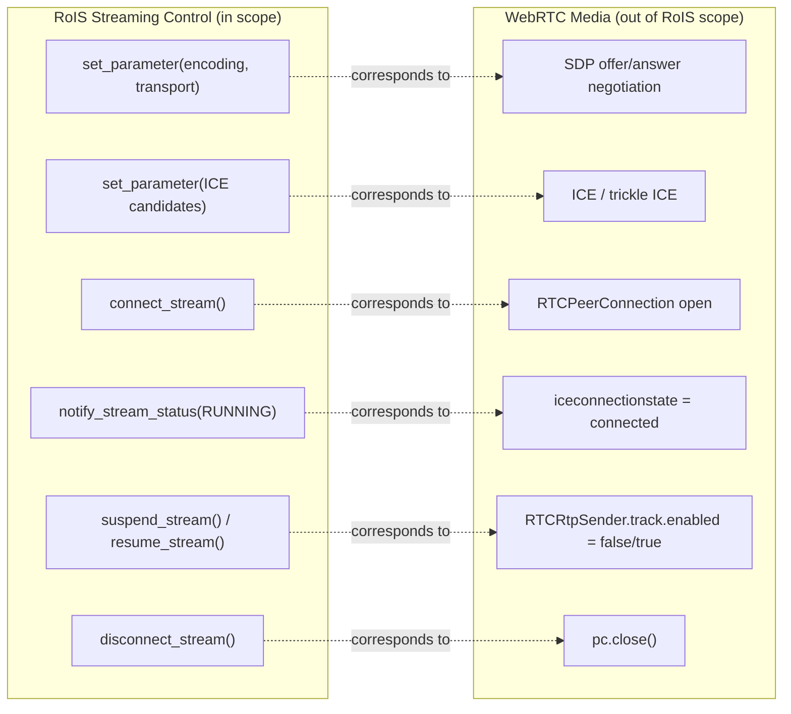
```mermaid
flowchart LR
    subgraph Control["RoIS Streaming Control (in scope)"]
        direction TB
        C1["set_parameter(encoding, transport)"]
        C2["set_parameter(ICE candidates)"]
        C3["connect_stream()"]
        C4["notify_stream_status(RUNNING)"]
        C5["suspend_stream() / resume_stream()"]
        C6["disconnect_stream()"]
    end

    subgraph Data["WebRTC Media (out of RoIS scope)"]
        direction TB
        D1["SDP offer/answer negotiation"]
        D2["ICE / trickle ICE"]
        D3["RTCPeerConnection open"]
        D4["iceconnectionstate = connected"]
        D5["RTCRtpSender.track.enabled = false/true"]
        D6["pc.close()"]
    end

    C1 -.->|"corresponds to"| D1
    C2 -.->|"corresponds to"| D2
    C3 -.->|"corresponds to"| D3
    C4 -.->|"corresponds to"| D4
    C5 -.->|"corresponds to"| D5
    C6 -.->|"corresponds to"| D6
```

WebRTC signaling is handled by the application layer. The gateway brokers media
descriptor exchange via the RoIS streaming interface but never touches media data.

An important distinction the specification preserves: Speech Synthesis is a
**command** component (text to robot speaker locally), not a stream. Audio and Video
Streaming are **stream-control** components (live media robot to operator), using
WebRTC.

### 12.1 P2P vs. SFU

- **Fleet of 1 to 3 robots**: peer-to-peer WebRTC is sufficient.
- **Larger fleets**: route media through a Selective Forwarding Unit (mediasoup,
  LiveKit). The RoIS streaming control interface is identical either way. The SFU is
  an implementation detail of the gateway, not the engine.

---

## 13. Security Architecture

> **Status:** planned. The alpha releases do not authenticate or authorize
> connections. Run the gateway only on trusted networks until Phase 9 of the
> roadmap delivers the mechanisms below.

### 13.1 Authentication Flow

The specification's `connect()` takes no parameters (it assumes a trusted LAN). For
remote access, OpenRoIS authenticates before any RoIS message is processed, at the
WebSocket upgrade.

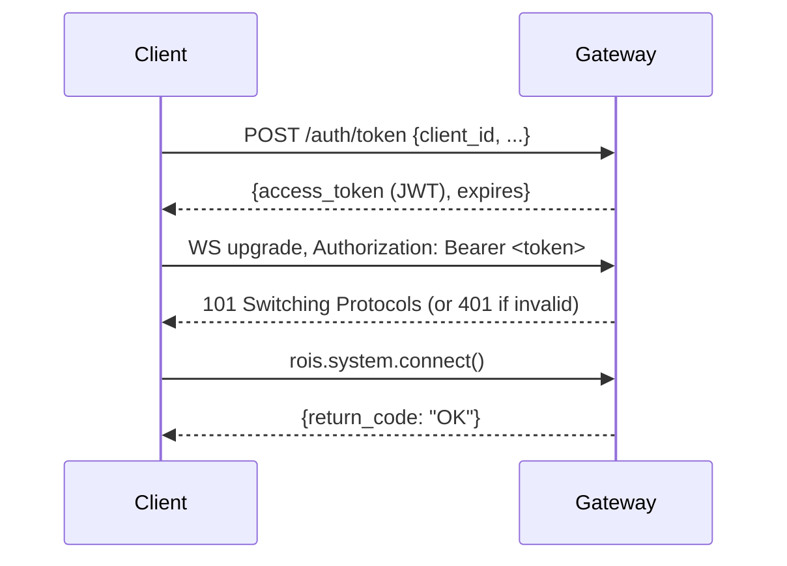
```mermaid
sequenceDiagram
    participant Client
    participant Gateway

    Client->>Gateway: POST /auth/token {client_id, ...}
    Gateway-->>Client: {access_token (JWT), expires}

    Client->>Gateway: WS upgrade, Authorization: Bearer <token>
    Gateway-->>Client: 101 Switching Protocols (or 401 if invalid)

    Client->>Gateway: rois.system.connect()
    Gateway-->>Client: {return_code: "OK"}
```

Example JWT claims used downstream for authorization:

```json
{
  "sub": "operator-alice",
  "roles": ["operator"],
  "fleet_scope": ["warehouse-north", "lab-b"],
  "components": ["person_detection", "navigation", "video_streaming"],
  "iat": 1749500000,
  "exp": 1749503600
}
```

### 13.2 Authorization Model (RBAC)

Authorization is enforced per RoIS operation inside the gateway. The spec's
`Condition_t` (an ISO 19143 filter expression) and `component_ref` are the natural
enforcement points.

| Role | Fleet scope | Component scope |
|------|-------------|-----------------|
| admin | all | all |
| operator | assigned | assigned (including actuation) |
| viewer | assigned | detection + streaming only |
| maintenance | assigned | system_information |

### 13.3 Enforcement Points

| Interface / operation | Enforcement |
|-----------------------|-------------|
| `connect()` | Verify JWT. Expose only adapters within `fleet_scope`. |
| `search(condition)` | Filter `component_ref_list` to authorized fleet and components. |
| `bind(component_ref)` | Reject refs outside scope. |
| `execute(command_unit_list)` | Validate every `component_ref` in the sequence. |
| `query(query_type, condition)` | Filter results to authorized fleets. |
| `subscribe(event_type, condition)` | Deliver `notify_event` only for authorized sources. |
| `connect_stream()` | Require streaming scope. SFU enforces per-stream ACL. |

Because the gateway filters at `search()`, robots outside a caller's scope are
invisible. The caller cannot discover or address them.

### 13.4 Defense in Depth

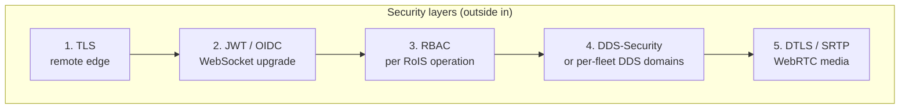
```mermaid
flowchart LR
    subgraph Layers["Security layers (outside in)"]
        direction LR
        L1["1. TLS<br/>remote edge"]
        L2["2. JWT / OIDC<br/>WebSocket upgrade"]
        L3["3. RBAC<br/>per RoIS operation"]
        L4["4. DDS-Security<br/>or per-fleet DDS domains"]
        L5["5. DTLS / SRTP<br/>WebRTC media"]
        L1 --> L2 --> L3 --> L4 --> L5
    end
```

---

## 14. Component Library and Package Management

### 14.1 The 17 Basic Components

RoIS defines 17 basic HRI components. Every component (except System Information)
shares the `RoIS_Common` interface: `start`, `stop`, `suspend`, `resume`, and
`component_status`. Of the 17 components, 13 keep the same interface and the same
underlying models across paradigms, and 7 of those are identical. The perception and
speech components run the same ML models whether the input is a robot camera or a
webcam. Only actuation, world model, and stream source differ.

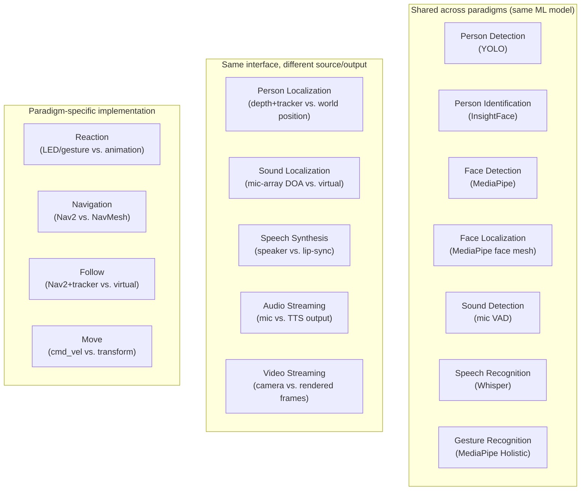
```mermaid
flowchart TB
    subgraph Shared["Shared across paradigms (same ML model)"]
        direction LR
        PD["Person Detection<br/>(YOLO)"]
        PID["Person Identification<br/>(InsightFace)"]
        FD["Face Detection<br/>(MediaPipe)"]
        FL["Face Localization<br/>(MediaPipe face mesh)"]
        SD["Sound Detection<br/>(mic VAD)"]
        SR["Speech Recognition<br/>(Whisper)"]
        GR["Gesture Recognition<br/>(MediaPipe Holistic)"]
    end

    subgraph Diff["Same interface, different source/output"]
        direction LR
        PL["Person Localization<br/>(depth+tracker vs. world position)"]
        SL["Sound Localization<br/>(mic-array DOA vs. virtual)"]
        SS["Speech Synthesis<br/>(speaker vs. lip-sync)"]
        AS["Audio Streaming<br/>(mic vs. TTS output)"]
        VS["Video Streaming<br/>(camera vs. rendered frames)"]
    end

    subgraph Specific["Paradigm-specific implementation"]
        direction LR
        React["Reaction<br/>(LED/gesture vs. animation)"]
        Nav["Navigation<br/>(Nav2 vs. NavMesh)"]
        Follow["Follow<br/>(Nav2+tracker vs. virtual)"]
        Move["Move<br/>(cmd_vel vs. transform)"]
    end
```

| Component | Robot backend | Avatar backend | Shared? |
|-----------|---------------|----------------|---------|
| Person Detection | YOLO on camera | YOLO on webcam | yes |
| Person Localization | depth + tracker | world position | diff coord system |
| Person Identification | InsightFace | InsightFace | yes |
| Face Detection | MediaPipe | MediaPipe | yes |
| Face Localization | MediaPipe face mesh | MediaPipe face mesh | yes |
| Sound Detection | mic VAD | mic VAD | yes |
| Sound Localization | mic-array DOA | mic-array DOA / virtual | diff |
| Speech Recognition | Whisper | Whisper | yes |
| Gesture Recognition | MediaPipe Holistic | MediaPipe Holistic | yes |
| Speech Synthesis | TTS to speaker | TTS to lip-sync | diff output |
| Reaction | LED / gesture | animation / expression | paradigm-specific |
| Navigation | Nav2 (physical) | NavMesh (virtual) | paradigm-specific |
| Follow | Nav2 + tracker | virtual follow | paradigm-specific |
| Move | `cmd_vel` to motors | transform to avatar | paradigm-specific |
| Audio Streaming | mic to WebRTC | TTS output to WebRTC | diff source |
| Video Streaming | camera to WebRTC | rendered frames to WebRTC | diff source |
| System Information | battery, CPU, joints | FPS, memory, avatar state | diff state |

The component's logic is the same across adapters. Only the binding differs.

### 14.2 User-Defined and Non-Canonical Components

The spec supports user-defined components beyond the basic 17, reusing
`RoIS_Common` and the profile mechanism (spec section 12). An HRI Component Profile
can include another profile via `sub_component`, so an extended component can reuse
a base component's messages and add new ones.

OpenRoIS uses this mechanism for robot-specific components that are not in the 17
basic components. For example, a `NavigationInformation` component provides
destination lists and map data for a specific robot. It is user-defined,
non-canonical, and valid per the spec.

### 14.3 Component Packages and Multiple Backends

Components are distributed as packages (e.g., `openrois.components.kachaka`). When a
component supports multiple backends (e.g., gRPC and ROS 2), the package ships one
class per backend: `GrpcNavigation` and `Ros2Navigation`. Both declare
`@component(NAVIGATION_PROFILE)`. The adapter imports the one it needs. Selection happens
at import time, not at runtime. No factory, no Protocol, no runtime selection.

### 14.4 Package Management Boundary

The engine stays pure. It routes, aggregates profiles, tracks binds. It never
installs packages, resolves dependencies, or manages component lifecycle setup.
Package management is a process feature (planned, roadmap Phase 5):

- The gateway `Api` exposes management endpoints: list installed component
  packages, enable or disable a package for a fleet, configure a package,
  health-check. This is the foundation for the management surface.
- A package loader in the adapter process loads component packages from a configured
  source (local path, git URL, or a registry endpoint), creates the components, and
  adds them to the adapter's engine, which serves them to the gateway. Dependency setup
  (Python venv, ROS 2 workspace, model weights) is the adapter's job, not the engine's.

The exact mechanism is undecided, but the boundary is decided: package management
lives in the `Api` (gateway) and the package loader (adapter), never in the `Engine`.

---

## 15. Roadmap and Maturity

OpenRoIS is built in phases. Each phase delivers a coherent architectural shift or
a working end-to-end capability. See [roadmap.md](roadmap.md) for the full phase
details and open decisions.

| Phase | Theme | Exit criteria | Status |
|-------|-------|---------------|--------|
| 0 | Paradigm-Neutral Interfaces | type pipeline, tests against the normative files | done |
| 1 | Engine and Sub HRI Engine | TypeScript proof of concept, child engines, mock components | done |
| 2 | Adapter Framework and Components | component framework, reference components, real robot adapter | done |
| 3 | Client SDKs and First Demonstration | TypeScript SDK and web client done, C# SDK in progress, exit tag `v0.1.0` | in progress |
| 4 | Recursive Engine in Python | the Python engine on the RoIS method catalog is the only dispatch implementation | in progress |
| 5 | Hardening the Engine | graceful shutdown, reconnection, package loading, health endpoints | planned |
| 6 | Gateway Process | `openrois-gateway` from `Engine` + `WsServer`, Docker Compose quickstart | in progress |
| 7 | Adapter Process | a packaged adapter process that builds its components from a configuration | planned |
| 8 | Open Reference Platform and Mixed Paradigm | reference platform on open hardware, paradigm-neutrality proof | planned |
| 9 | Auth, Security, Media | parallelizable after Phase 7 | planned |
| 10 | Full Component Library | all 17 basic components, packages published, `v1.0` | planned |
| 11 | Component Registry and Hub | post-1.0, adoption-gated | after 1.0 |

The **first end-to-end demonstration is Phase 3**: the minimum that lets a service
application clone, build, and control a real robot from a web application over
WebSocket. The
**paradigm-neutrality proof is Phase 8** (mixed robot and avatar on one gateway).
The **foundation migration trigger fires after Phase 8, before Phase 10**: the
paradigm-neutrality proof is the governance milestone that initiates migration to a
neutral foundation home. The **1.0 release is Phase 10**.

### 15.1 Versioning

- During the alpha, each package is tagged on its own, for example
  `interfaces-v0.1.0-alpha.3`, and all packages converge on `0.1.0`.
- `v0.1.0` (Phase 3): first pre-release. MVP demonstration. Unstable API, breaking
  changes may occur without notice.
- `v0.x` (Phases 4 to 9): incremental pre-releases. Unstable API.
- `v1.0` (Phase 10): first stable release with semantic versioning guarantees.
  All 17 basic components implemented across both paradigms.
- Phase 11: post-1.0. No version tag until the Hub and marketplace are feature
  complete and adoption-gated.

Pre-1.0 releases are Alpha, unstable API. Do not use in production until v1.0.

### 15.2 Current State

The type pipeline with the RoIS method catalog, the recursive Python engine
(`openrois-engine`), the gateway process (`openrois-gateway`), the component SDK
(`openrois-components-core`), reference components, and the TypeScript SDK are built. A
Docker Compose stack runs the gateway with a mock adapter behind it, and the TypeScript
SDK runs full sessions against it. The first end-to-end demonstration, a web application
driving a physical robot over gRPC, ran on the earlier TypeScript proof of concept. The
next one, a physical robot and a virtual agent behind one gateway on the Reachy Mini
reference platform, is Phase 8. The C# client SDK is in progress.

---

## 16. Long-Term Vision: Hub and Marketplace

The Hub and component marketplace are long-term, post-1.0 goals. They build on the
package management mechanism from Phase 5, not on a monolithic engine. They are
parked until the core is solid and has real adoption.

### 16.1 Hub

The Hub is a management web app that connects to the gateway `Api` over WebSocket
and REST. It visualizes adapters, components, status, and fleet health. It is a
consumer of the gateway's management surface, not part of the engine. A
richer Hub (audit trail, OTA, compliance) can be built on top of the open
gateway `Api` later.

### 16.2 Component Marketplace

The component marketplace is a registry of certified components. Component vendors
publish to the registry. Adapters deploy packages through the gateway `Api` or
directly. The marketplace is a different source for the adapter's package loader and
a different backend for the gateway `Api`, not new engine logic.

### 16.3 Gating Principle

The core must be solid and have real adoption before the Hub and marketplace are
built. They are features on top of the management `Api`, not prerequisites.

---

## 17. Related Work and Positioning

### 17.1 RoIS and Other HRI Standards

RoIS is not the only standard addressing human-robot interaction. However, it is
unique in defining a **platform-independent model** at the symbolic level, separate
from any transport. Other approaches tend to couple the interface to a specific
middleware (for example, ROS actions, gRPC services, or CORBA operations). RoIS
defines the messages and lets the implementation choose the transport, which is the
property OpenRoIS builds on: one transport for the control plane, and the transport
each component needs for its data plane.

### 17.2 OpenRoIS and ROS 2

ROS 2 is the dominant research robotics middleware and one of the spec's approved
transports. OpenRoIS does not compete with ROS 2. It uses ROS 2 as a data-plane
transport for robot adapters. RoIS operations map to ROS 2 primitives: synchronous
operations to services, long-running operations to actions, async push to topics.
The value OpenRoIS adds is a **standardized symbolic interface** above ROS 2, so
that the same service application can also drive a virtual avatar or a distributed
service without rewriting the scenario logic.

### 17.3 OpenRoIS and Unity

Unity is a primary client platform for service applications. The C# SDK targets
Unity 6.5 and later through UPM, and the C# interfaces package targets `netstandard2.1`,
which runs on both Mono (Unity 6.3 and later) and CoreCLR (Unity 6.8). The same types
also work outside Unity (any .NET runtime). The gateway runs as a separate process. A
Unity application connects to the gateway over WebSocket using the C# SDK (in
progress). Adapters run as separate processes on the robot or in the cloud.

### 17.4 Conformance

An implementation claiming RoIS conformance shall:

- Provide the interfaces described in the RoIS specification section 8.2.
- Support the message data structures described in section 8.3 (RoIS Profiles).
- Support the Common Messages of section 8.4 for the basic components it implements
  (it need not implement every basic component).
- Handle component profiles described as XML files and the messages defined therein.

OpenRoIS targets full conformance. When the normative files are available, the test
suite cross-checks the method catalog against the IDL and the profiles against the XML
profiles and `XML-Profiles.xsd`. A
conformance test suite that asserts behavior against the specification's interfaces
and profiles, run against every adapter, is planned.

---

## 18. Conclusion

OpenRoIS demonstrates that the OMG RoIS Framework 2.0 can be implemented as a
practical, paradigm-neutral middleware with clean developer experience. The key
insight is that the spec's separation of message from transport lets one engine answer
the RoIS operations for every paradigm. Inside the engine, a single component contract
keeps ROS 2, virtual avatars, AI services, and any future paradigm in components. Adding
a new paradigm is an additive adapter, never a rewrite.

The recursive engine model uses one `Engine` class for the gateway, the adapters, and
any tier between them, eliminating duplicate dispatch implementations across languages.
The single-source-of-truth type pipeline (Python Pydantic to JSON Schema to C# and
TypeScript) keeps three language stacks consistent without manual synchronization. The
JSON-RPC 2.0 binding of the RoIS method catalog over WebSocket provides a
browser-native, NAT-friendly control plane with full async event support. The client
SDKs (TypeScript for web, and C# for Unity, in progress) expose identical behavior
regardless of the host paradigm behind the gateway.

The project is in alpha. The type pipeline, the recursive engine, the gateway process,
the component SDK, reference components, and the TypeScript SDK are built. A Docker
Compose stack runs the gateway with the mock adapter, and the TypeScript SDK runs full
sessions against it. The C# SDK, authentication, media streaming, and the
full component library follow the roadmap. Researchers and engineers evaluating RoIS
2.0 can use OpenRoIS as a reference implementation, contribute reference components, or
build applications against the SDK today.

### 18.1 Getting Involved

- **Website**: [openrois.org](https://openrois.org/)
- **Repository**: [github.com/openrois/openrois](https://github.com/openrois/openrois)
- **License**: Apache-2.0
- **Specification**: [OMG RoIS Framework 2.0](https://www.omg.org/spec/RoIS/2.0)
- **Roadmap**: [roadmap.md](roadmap.md)
- **Architecture**: [architecture.md](architecture.md)
- **Specification reference**: [rois-reference.md](rois-reference.md)

Contributions are welcome. The phase roadmap defines clear, parallelizable work
items. Reference components are the natural entry point for new contributors.

---

*OpenRoIS is an open-source middleware for the OMG RoIS Framework 2.0. Control
physical robots, virtual avatars, and AI services from one paradigm-neutral SDK.
Apache-2.0. Alpha, pre-1.0, unstable API.*