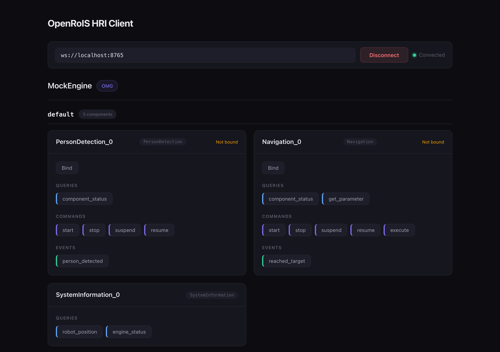

# HRI Client

A browser-based component inspector for any RoIS engine, and the reference RoIS HRI Client
in this repository.

It connects over WebSocket, reads the engine profile with `rois.system.get_profile`, and
builds a panel for every component it finds, with its queries, commands, and events. It
knows nothing about any specific robot: everything on screen comes from the profile.



## Run It Against the Mock Engine

```bash
# Once, from the repository root: build the types and the SDK.
(cd interfaces/typescript && npm install && npm run build)
(cd sdk/typescript && npm install && npm run build)

# Terminal 1: the mock engine, on ws://127.0.0.1:8765.
(cd examples/mock-engine && npm install && npm start)

# Terminal 2: the client.
cd examples/hri-client
npm install
npm run dev
```

Open the address Vite prints, enter `ws://localhost:8765`, and click Connect.

## Run It Against a Real Engine

Enter that engine's WebSocket URL instead. The engine must answer
`rois.system.get_profile` with `component_profiles` for the client to render panels.
Anything conformant works, including a Python gateway with adapters connected to it.

## Where It Fits

| Example | RoIS role |
|---------|-----------|
| `hri-client` | HRI Client, the application side |
| `mock-engine` | HRI Engine, a test double |
| `mock-adapter` | Sub HRI Engine, a working adapter with no robot |
| `adapter-template` | Sub HRI Engine, a blank starting point |

The client uses `RoISClient` from [`@openrois/sdk`](../../sdk/typescript/README.md) for the
transport and the JSON-RPC protocol.

## License

Apache-2.0.
